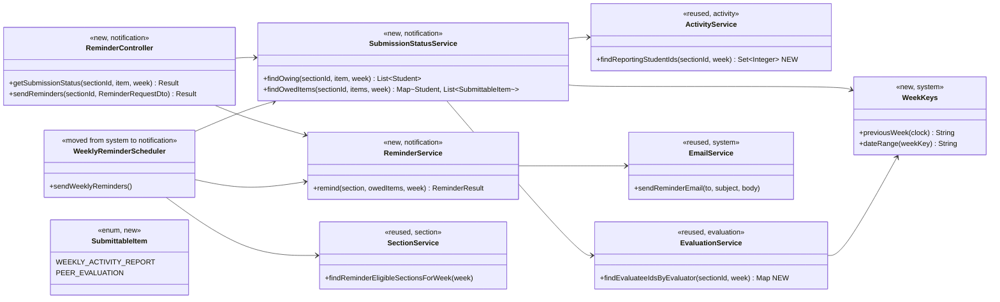
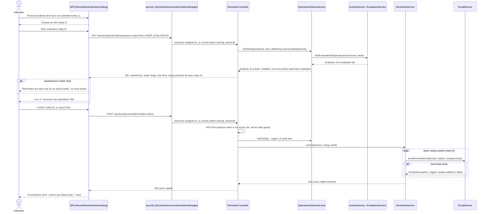
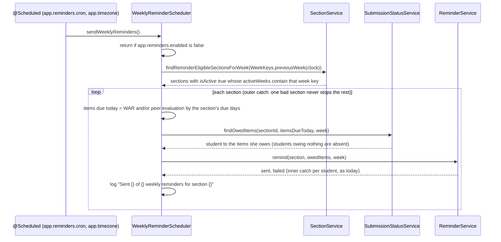

# Notifications (NOT) Design

> Realizes: UC-NOT-remind-non-submitters, FR-NOT-weekly-reminder (amended 2026-10-03)
> Depends on: BR-submission-owed (the one definition of "has not submitted"), BR-active-weeks, BR-evaluation-submission-window, BR-section-scoped-access, BR-role-based-access, BR-team-assignment-required, BR-student-lifecycle, CO-ferpa, DE-gmail-smtp
> See: [use cases](../requirements/use-cases.md#notifications), [SRS non-use-case FRs](../requirements/software-requirements-specification.md#notification-requirements), [architectural-design.md](architectural-design.md#performance-tracking-components) (performance-tracking component view, Crosscutting Concepts)
> Designed against `main` at `cf0beee` (2026-09-30).

## Overview

This area answers one question, *which students still owe which item for a week*, and sends reminders to exactly those students: on a schedule (FR-NOT-weekly-reminder) and on an instructor's demand (UC-NOT-remind-non-submitters). It is a new feature slice, `notification`, in the REST API container. It reads submissions through the `activity` and `evaluation` service layers, reads course sections, teams, and students from the foundation, and sends mail through the foundation's `EmailService`. The two instructor report pages (WAR and peer evaluation) also take their "has not submitted" lists from it, so the definition has one implementation.

Before this design the definition existed twice and disagreed: `SectionsActivities.vue` computed missing WARs in the browser from the first 200 activities and 100 students, so at 77 students it listed people who had submitted; `EvaluationService.generateWeeklyPeerEvaluationReportForSection` counted a student as done after evaluating anyone. The scheduler, in `system`, emailed every student in the course section.

## Components & classes

- **New package** `backend/src/main/java/team/projectpulse/notification/`: `ReminderController`, `SubmissionStatusService`, `ReminderService`, `SubmittableItem`, `WeeklyReminderScheduler` (moved from `system/`), and DTOs `SubmissionStatusDto`, `ReminderRequestDto`, `ReminderResultDto` with their `Converter`s.
- **Sibling service methods (new):** `ActivityService.findReportingStudentIds` backed by an `ActivityRepository` query (`select distinct a.student.id … where a.week = :week and a.team.section.sectionId = :sectionId`); `EvaluationService.findEvaluateeIdsByEvaluator` backed by a `PeerEvaluationRepository` query scoped the same way. `notification` calls these, never the repositories.
- **Foundation (new):** `system/WeekKeys`, the one place that turns the injected `Clock` into an ISO week key (`"2026-W40"`) and a key into a date range. `EvaluationService.previousWeek()` delegates to it.
- **Foundation (reused):** `SectionService.findReminderEligibleSectionsForWeek` (unchanged query, now called with the previous week), `StudentRepository.findBySectionSectionId`, `EmailService.sendReminderEmail`, `SectionInstructorAuthorizationManager`.
- **Removed:** `WeeklyPeerEvaluationReport.studentsMissingPeerEvaluations` and its computation in `EvaluationService`; the missing-student filter in `SectionsActivities.vue`.
- **Frontend:** `src/apis/notification/` (index and types) on the shared `request` instance; `components/RemindNonSubmittersDialog.vue`, opened from a "Remind students who have not submitted" button on `pages/activities/admin/SectionsActivities.vue` and `pages/evaluations/admin/SectionsEvaluations.vue`; both pages read their "has not submitted" lists from `getSubmissionStatus`. The WAR page's default week changes from the current week to the previous week, matching the item's week.

## Sequence

### UC-NOT-remind-non-submitters: the on-demand reminder

### FR-NOT-weekly-reminder: the scheduled reminder

## API contract

| Endpoint or job | Caller (who may) | Request | Success | Errors, by extension |
|---|---|---|---|---|
| `GET /api/v1/sections/{sectionId}/submission-status` | An instructor assigned to the course section, or the course admin who owns its course (BR-section-scoped-access, BR-role-based-access): `AuthorizationManagers.anyOf(sectionInstructorAuthorizationManager, sectionOwnershipAuthorizationManager)`; route rule added before the `denyAll()` catch-all | `item` (`WEEKLY_ACTIVITY_REPORT` or `PEER_EVALUATION`), `week` (ISO key matching `^\d{4}-W\d{2}$`, optional; default the previous week, server-computed) | `200`: `item`, `week`, `weekActive` (whether the week is in the course section's active weeks), week date range, the item's due day and time (either may be null if not configured), owing students (id, first and last name, team id and name), grouped by team. The list applies BR-submission-owed whether or not the week is active, so the report pages show who owes a WAR in any week; only the dialog reads `weekActive`, and shows 4a when it is false | Neither assigned nor owning, or a student: `403`. Unknown `item` or malformed `week`: `400` `INVALID_ARGUMENT` |
| `POST /api/v1/sections/{sectionId}/reminders` | Same | Body `{ item }`, `@Valid`. **No week**: always the previous week, server-computed | `200`: `item`, `week`, `sent` (count), `failed` (students not reached: id, first and last name). `sent: 0` and empty `failed` is 4b | Neither assigned nor owning, or a student: `403`. Unknown `item`: `400`. Previous week not active: `400` `INVALID_ARGUMENT`, message "Reminders are sent only for an active week." (4a; the dialog already prevents it, this guards the route) |
| `WeeklyReminderScheduler.sendWeeklyReminders` | The clock: `@Scheduled(cron = "${app.reminders.cron}", zone = "${app.timezone}")`, daily at 08:00 America/Chicago (`0 0 8 * * *`; enabled in `prod` only); "due today" is the day of week in `app.timezone` | None | Each student who owes an item due today gets one email listing only what she owes; log line per section. A section with no due day configured for an item is never reminded of it | Disabled by `app.reminders.enabled`; per-student and per-section failures logged and skipped, as today |

The email itself: subject "ProjectPulse Submission Reminder"; body greets the student by first name, names the course section, and lists each owed item with its week range and due time. Every interpolated value is HTML-escaped.

## Key decisions

**Where "has not submitted" lives.** `SubmissionStatusService` in `notification` owns it, and the scheduler, the on-demand reminder, and both report pages use it. Rejected: each page computing its own list, which is how the WAR page came to truncate at 200 activities and the peer evaluation report came to mean "evaluated anyone". Rejected: the `evaluation` report calling into `notification` on the server, because `notification` already depends on `evaluation` and the call would make a cycle (`MNT-feature-locality`); the page fetches the list from the `notification` endpoint instead.

**A new feature slice, not `system`.** The scheduler moves out of `system`, because deciding who owes a report needs `activity` and `evaluation`, and the foundation may depend on no feature. Rejected: leaving it in `system` and recording the violation under TD-feature-locality. Rejected: splitting reminders between `activity` and `evaluation`, which would send a student owing both items two emails instead of one. This changes the architecture-of-record's performance-tracking component view and the two subsystems tables, in this same pull request.

**Which week, and when to remind.** Both items are about the previous week, computed from the injected `Clock` by `WeekKeys` (calendar time, per Crosscutting Concepts). An item is reminded only when that week is active, which is the existing eligibility query called with the previous week instead of the current one. Rejected: keeping the current-week gate, which skips the reminder for the last active week's evaluation and sends one in the first active week for an evaluation that cannot yet be submitted.

**Who owes a peer evaluation.** A student owes it until her evaluations for the week cover every member of her current team, herself included (BR-submission-owed), computed from one query of evaluator to evaluatee ids and one load of the section's students. Rejected: "any row", the old report's rule, because `addPeerEvaluation` accepts one evaluatee at a time and a half-finished set is real. Accepted consequence: a teammate added mid-window makes the others owe him an evaluation.

**The request never carries a week to send for.** `POST /reminders` takes only the item; the server computes the week. Rejected: a client-supplied week, which would let a nudge ask for a peer evaluation whose window has closed and puts a scope-setting value in a caller-controlled body.

**Send inside the request.** `ReminderService` sends synchronously, isolating each failure as the scheduler already does, and returns sent and failed counts, so the instructor sees exactly who was not reached (step 7, 6a2, POST-2). `EmailService.sendReminderEmail` is synchronous and throws `RuntimeException` when the send fails, so a student counts as sent only when the mail server accepted the message. Rejected: sending in the background with no result shown, which would hide failures in the log and break POST-2. The worst case is under Open questions.

**Store nothing.** A reminder leaves no row. Rejected: a reminder log table showing "last reminded at", which would add a table, a Flyway migration, and `DataInitializer` rows to guard against a double send that the confirmation step already guards.

**Authorization.** Both routes admit an instructor assigned to the course section or the course admin who owns its course, composing the existing `SectionInstructorAuthorizationManager` and `SectionOwnershipAuthorizationManager` with `AuthorizationManagers.anyOf` (point 1), and the service loads students by the `sectionId` the route rule verified, never from the body (point 2). Students receive nothing about other students (CO-ferpa). Rejected: `SectionInstructorAuthorizationManager` alone, which checks only the course section's assigned instructors and so denies a course admin that BR-section-scoped-access and BR-role-based-access let in.

## Data model

No delta. The area reads `Activity`, `PeerEvaluation`, `Student`, `Team`, and `Section` as the SRS's [Business Domain Model](../requirements/software-requirements-specification.md#business-domain-model) defines them, and stores nothing (see *Store nothing*). Weeks are stored as ISO-8601 week key strings (`"2026-W40"`: week-based year, Monday start) in `Activity.week`, `PeerEvaluation.week`, and `Section.activeWeeks`; `WeekKeys` computes them with `WeekFields.ISO.weekBasedYear()`, as `EvaluationService.previousWeek()` does today, so the week of January 1 can belong to the previous year (W52 or W53). The two new repository queries add no column or index; at course scale (about 80 students, a few hundred activities a week) the existing keys suffice.

## Reuse & cross-cutting

- Email: `EmailService.sendReminderEmail` unchanged; Gmail over SMTP (DE-gmail-smtp). It wraps `body` in HTML without escaping it, so `ReminderService` escapes every interpolated value before calling it.
- Authorization: `SectionInstructorAuthorizationManager` and `SectionOwnershipAuthorizationManager`, composed with `anyOf`.
- Time: the injected `Clock`; the `dev` profile's fixed clock (2023-08-20) makes the previous week `2023-W33`, which the seed data must cover for local runs.
- Error envelope: `IllegalArgumentException` maps to `400` / `INVALID_ARGUMENT` through `ExceptionHandlerAdvice`.

## Tests

| Use case, flow | Level | Asserts |
|---|---|---|
| UC-NOT main, WAR | integration | An assigned instructor's `POST /reminders` emails only students with no activity in the previous week; response `sent` matches; students who reported are not emailed |
| UC-NOT main, peer evaluation | integration | A student who evaluated two of three teammates is listed and emailed; one who evaluated all, self included, is not |
| UC-NOT 4a | integration | Previous week inactive: `POST` returns `400` with the inactive-week message; no email sent |
| UC-NOT 4b | integration | Everyone has submitted: `sent: 0`, `failed` empty, no email sent |
| UC-NOT 5a | frontend | Cancelling the dialog sends no `POST` |
| UC-NOT 6a | unit | `EmailService` throws for one student: the others are still sent; that student is in `failed` |
| UC-NOT authorization | integration | An instructor not assigned to the section, and a student, get `403` on both routes; the course admin who owns the course but is not assigned to the section gets `200` |
| UC-NOT 4a, status | integration | Previous week inactive: `GET` returns `200` with `weekActive: false` and still lists students who owe a WAR |
| UC-NOT invalid item | integration | Unknown `item`: `400` |
| BR-submission-owed recipients | unit | A student on no team and a deactivated student are never listed; a student who evaluated every active teammate but not a deactivated one does not owe the peer evaluation; deleting a student's last activity for the week makes her owe the WAR again |
| Status endpoint at scale | integration | With more than 200 activities in the week, no student who reported is listed (the old truncation) |
| FR-NOT due day | unit | On the WAR due day only students owing the WAR are emailed, and the email lists only the WAR |
| FR-NOT both items, one day | unit | A student owing both gets one email listing both; a student owing one gets one email listing that one |
| FR-NOT last active week | unit | In the inactive week after the last active week, the peer evaluation reminder for the last active week is sent |
| FR-NOT first active week | unit | In the first active week (previous week inactive), no reminder is sent |
| FR-NOT existing | unit | Disabled, nothing due today, one student's send failing, one section failing: kept from `WeeklyReminderSchedulerTest`, adapted |
| UC-EVA-section-evaluation-report | integration | The report no longer carries `studentsMissingPeerEvaluations`; the page's list comes from the status endpoint |
| Email content | unit | A first name containing `<b>` is escaped in the body |

## Open questions / risks

- **Latency of a whole-section reminder.** Synchronous sending of up to about 80 emails over Gmail SMTP may take tens of seconds, beyond a comfortable request time. Measure on staging at build time; if the worst case exceeds about 10 seconds, send in the background and have the dialog poll for the result, so step 7 and 6a2 still report in the dialog. Usually only a handful of students owe an item, so the common case is fast.
- **Course admins on the existing report.** `UC-EVA-section-evaluation-report` is guarded by `SectionInstructorAuthorizationManager` alone, so a course admin who owns the course but is not assigned to the section is denied there today. This design does not change that route.
- **Mid-window team changes.** A student moved onto a team owes evaluations to her new teammates for a week she was not on the team. Accepted as the rule's consequence; revisit if instructors report confusion.
- **Duplicate scheduled runs.** The job fires on every instance, as recorded in [TD-duplicate-scheduler](architectural-design.md#risks-and-technical-debt); this design neither creates nor worsens that. While production runs one instance it is harmless, but scaling out would send each owing student one reminder per instance and so break FR-NOT-weekly-reminder's "one submission reminder" until the debt is paid.
- **WAR page default week** moves from the current to the previous week. Instructors who looked at the current week on that page will see a different default.
