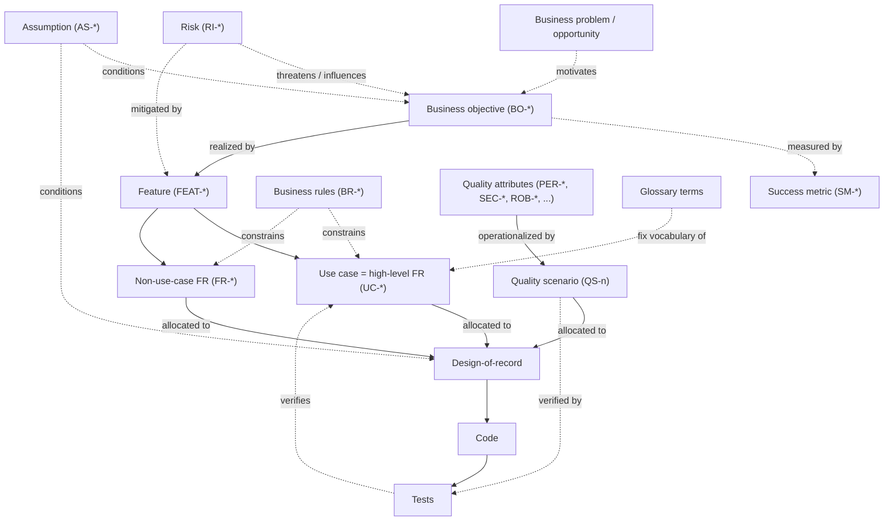

# Spec-Driven, Agent-Assisted Development — A Methodology

> **Status:** working methodology document. It captures the development process Project Pulse (and its RAM module in particular) is built with, written so it can serve three audiences at once: practitioners applying it, students learning it (senior design, Fall 2026), and a research write-up (target venues: SIGCSE, CSEET or ICSE, RE, ASE's educational track). Names and framing here are deliberately open — see [Open questions](#open-questions-and-where-this-is-still-provisional).
>
> **Working name:** *Spec-Driven, Agent-Assisted Development* (SDAAD). A shorter handle for the central loop is **breadth-first, slice-proven, fan-out** (below). The name is a placeholder; the method is the point.

## The one-sentence version

> **Breadth-complete architecture + requirements → prove with one vertical slice → fan out per use case, looping fixes back into both the requirements and the architecture.**

That is "big design up front" with its two classic failure modes filed off: the architecture is complete in **breadth** but shallow in **depth** (so you don't over-commit), and it is **validated by a working slice** before you build on it (so you don't build on a guess). An AI coding agent does the per-use-case design and implementation against a human-authored, version-controlled contract.

## Motivation

LLM coding agents are fast, but unguided they **drift**: ad-hoc prompting produces code with no durable contract, no shared vocabulary, and no record of *why*. "Vibe coding" scales poorly past a toy — there is nothing to review the code *against*, nothing to keep two features consistent, and nothing to hand to the next contributor (human or agent).

The two traditional answers each fail differently for agent-driven work:

- **Big Design Up Front (waterfall-ish).** Specifying everything to full depth before building is wasteful and brittle — most of the detail is invalidated on contact with code, and the agent will happily implement a design that reality already contradicts.
- **Pure agile / emergent design.** Under-specifies. An agent has no stable contract to build toward, so each prompt re-derives intent and the result diverges run to run.

The methodology here is the middle path tuned specifically for a **human + coding-agent** team: give the agent a **stable, reviewable contract** (the spec) and a **complete-but-shallow map** (the architecture), validate the map early with a real slice, then let the agent realize one use case at a time — with an explicit duty to **challenge the contract** when it's wrong, and a traceability ledger that keeps spec and code honest with each other.

## Core principles

1. **The spec is the source of truth — and a durable artifact.** Requirements live as version-controlled Markdown in the repo (glossary, vision & scope, use cases, business rules, SRS), not as throwaway prompts. The code implements the spec; when they disagree, one of them is a defect.
2. **Breadth-complete, depth-shallow architecture — structures decomposed, decisions driven by quality attributes.** Architecture is two things at once: the *structures* (components and cross-cutting subsystems and their relationships) and the *significant, hard-to-change decisions* that determine the system's quality attributes. The structures come from **functional decomposition** — the use-case areas map to bounded contexts — and the architecture-of-record names *every* one (so the map is whole) but stops at responsibilities and relationships (so nothing is over-committed). The significant decisions come from the **other direction**: the **architecturally significant requirements (ASRs)** — the prioritized quality attributes plus the hard constraints, reusing the existing `PER-*` / `SEC-*` / `CO-*` / … handles rather than a new ID space — drive them, because functionality can be satisfied by many structures and it is the quality attributes that pick among them. What to commit up front follows a **reversibility litmus** (the architecture sibling of Principle 8): decide the hard-to-reverse, system-wide, ASR-driven things early; defer the reversible, local ones to per-area design, against real code, just-in-time.
3. **The use case is the unit of work, citation, and test.** Each use case is a high-level functional requirement; its steps + associated information are its acceptance criteria; traceability and tests are tagged to it. Use cases are kept small enough that "UC-X passes" is a meaningful statement.
4. **The spec is authoritative but not infallible — the challenge loop.** The agent is not a stenographer. When a step is ambiguous, an assumption breaks against the code, requirements contradict, or the spec suggests something that isn't best practice, the agent **surfaces it** — asks or pushes back — rather than silently complying or silently inventing. Fixes go back into the spec, then the design is re-derived.
5. **Bidirectional traceability and co-evolution.** Traceability is a two-direction graph, not a one-way chain (see [The traceability model](#the-traceability-model)): a matrix maps requirements → design → code → tests on a functional and a non-functional axis, checked *forward* (is every objective built?) and *backward* (does every artifact justify itself?). It is the connective tissue: changes loop *back* into the requirements and architecture, not just forward into code.
6. **Stable identifiers decoupled from position.** Requirements carry position-independent IDs (`FEAT-<slug>`, `UC-<AREA>-<slug>`, `FR-<AREA>-<slug>`, `BR-<slug>`) so the spec can be reorganized without breaking citations — essential when many documents and the code all reference the same handles.
7. **Human-owned levels, agent-built levels.** Humans own requirements quality and the high-level architectural decisions; the agent owns turning an approved use case into a design-of-record and then into code + tests, behind explicit approval gates.
8. **Specify requirements, derive implementation.** The spec pins down what is a *requirement* — business-meaningful, testable, and unsafe to guess — to full depth, but deliberately leaves *incidental implementation detail* for the agent to derive at build time. The data model is the exemplar: the domain model names entities, fields, coarse types, and relationships, and the business rules and use cases fix the constraints that carry meaning (key formats, status transitions, validation rules); but storage types, column lengths, nullability, indexing, and cross-cutting persistence mechanisms (audit metadata, optimistic-lock version, soft-delete markers) are derived when the code is generated, not enumerated field-by-field in the spec. This is why the SRS keeps no exhaustive data dictionary — a parallel field table would either restate constraints already owned elsewhere or pin implementation choices the method exists to delegate, manufacturing two definitions that drift. The litmus test mirrors the architecture's depth-shallow rule (Principle 2): if guessing it wrong would violate a requirement, the spec pins it; otherwise the agent derives it. A corollary for a fully spec-first build (no code yet at authoring time): the spec must never point *down* at an implementation as the source of truth for a requirement-bearing fact — the spec is upstream of all code.

## The artifacts — a spec→design→trace chain

The methodology is realized as a layered set of documents. The shape (realized in this repo under `docs/`, doctype-first — one spec set for the whole product):

- **Requirements (`requirements/`)** — the *what*, authored by humans:
  - `project-glossary.md` — canonical domain vocabulary. Fixes the words used everywhere else (and in code identifiers and UI text). No synonyms.
  - `vision-and-scope.md` — business objectives, risks, assumptions, major features.
  - `use-cases.md` — behavioral specs as use cases, grouped by area, each a high-level FR.
  - `business-rules.md` — cross-cutting policies/constraints (`BR-*`), cited by use cases and the SRS.
  - `software-requirements-specification.md` — non-use-case functional requirements (`FR-*`), domain model, quality attributes, constraints, operating environment.
- **Design (`design/`)** — the *how*, generated from the spec, in **two levels**:
  - **Level 1 — architecture-of-record.** The breadth-complete, depth-shallow map: a single arc42/C4 architecture-of-record for the whole product (`docs/design/architectural-design.md`) — the platform context/container views and conventions every module inherits, plus each module's component view. Component boundaries for not-yet-designed areas are explicitly **provisional**.
  - **Level 2 — design-of-record, one per use-case area.** Component/class design, sequence diagrams, API contracts, schema deltas. Cites the use cases/FRs it realizes; never restates them. Lean: diagrams + non-obvious decisions + pointers to real files.
- **Traceability (`traceability.md`)** — the spec→code map on two axes (see [The traceability model](#the-traceability-model)): a *functional* matrix (one row per use case, carrying FR IDs, design doc, frontend/backend modules, tests, status) and a *non-functional* matrix (one row per quality attribute → quality scenario → verifying test).

A companion **product/guides** split keeps shipped default content and build-guidance distinct from the spec itself, and an **OPEN-ISSUES** backlog (`OI-n`) tracks gaps still needed to make the spec implementation-ready.

### Documentation standards

The artifacts above follow **recognized industry templates** rather than bespoke structures — a deliberate choice, since the method targets teaching and publication: a known template is what students should learn, and it lowers the cost of peer review (reviewers recognize the structure instead of decoding a custom one).

- **Requirements** follow **Wiegers & Beatty** (*Software Requirements*, 3rd ed.) — the SRS, use-case, vision-and-scope, and glossary shapes.
- The **architecture-of-record** follows **arc42** (Starke & Hruschka), using **C4** (Brown) for the context and building-block views.

Adopt the canonical sections and ordering; *drop or merge* sections that genuinely don't apply (arc42 explicitly allows this) rather than padding with filler. Fidelity to the standard beats local optimization here.

### Features and use case areas — different views, not different fragments

Two listings sit close to each other in the requirements docs and look like they should be the same list — and aren't. Conflating them flattens both, so it's worth naming the distinction once.

- In `vision-and-scope.md`, the **Major Features** are stakeholder-visible *capability themes* — "what does the product do for the user?" A handful per product (Project Pulse has six), named and written in value terms, no behavioral detail.
- In `use-cases.md`, **use case areas** (`UC-<AREA>-*`) are *behavioral groupings* — "which actor-task interactions belong together?" Usually aligned with a bounded context in the code, so they double as the spine of the design and the traceability matrix. The area is also the stable namespace baked into every `UC-<AREA>-<slug>` ID.

The relationship between them is **many-to-many**, and a feature is deliberately **coarser** than an area and **never one-to-one** with one. A single feature is usually realized by use cases across several areas (Administration & Course Setup spans course-section, team, student, instructor, account, and rubric); a single area can serve more than one feature (the glossary area lives under *Requirements Authoring*, but its terms also feed *Requirements Traceability and Navigation* and *AI-Assisted Guidance and Feedback*). The coarseness is load-bearing in two directions: forcing a 1:1 list either flattens features into a CRUD enumeration (down to substrate like account-setup and section-CRUD) or inflates UC areas into marketing buckets; and because the area is welded into every UC ID, coupling a feature 1:1 to an area would make every vision re-pitch threaten a UC-ID renumber — the exact thing the name-based ID scheme exists to prevent. Keep the two granularities visibly distinct: when a feature would land 1:1 on an area, pull it *up* to the theme that area belongs to.

Two health checks keep the two lists honest:

- **Coverage.** Every UC area should be reachable from at least one feature; otherwise there are use cases without a stakeholder-visible reason, and the spec has work the vision doesn't justify. (When we first ran this check on Project Pulse, the glossary and document-authoring areas had no feature pointing at them — both real gaps, now covered by *Requirements Authoring*.)
- **Right altitude — and never 1:1.** A feature should describe a capability theme spanning several areas, not enumerate use cases or shadow a single area; a UC area should reflect the domain, not the marketing pitch. If a feature reads like "create / edit / delete X", it's a UC list mis-cast as a feature. If a feature names exactly one area, it's an area mis-cast as a feature — coarsen it. If an area name reads like a tagline, it's a feature mis-cast as an area.

A deliberate consequence: **the Major Features keep no inline UC IDs.** Each feature *does* carry its own position-independent `FEAT-<slug>` ID (so it is a first-class, citable node and the BO→feature→use-case edges are keyed by handle, not by prose name), but it does **not** enumerate the use cases under it — the feature → use-case-area map lives in `traceability.md`, keyed to the `FEAT-<slug>` ID and verified there. That separation keeps the features at value-altitude and frees the use-case catalog to organize by domain rather than by the marketing brochure.

## The traceability model

**The spine at a glance.** A business objective is *realized by* a feature, which decomposes into use cases and cross-cutting FRs that are built and verified. The objective attaches **once**, at the feature; the use cases and FRs below **inherit** it (so the realization matrices carry no per-UC or per-FR objective column). Four layers hang *off* this spine, each on a single node:

```text
BO ──served by──▶ Feature ──realized by──▶ Use Case ───▶ design → code → test
                     │                   └─▶ non-UC FR ─▶ design → code → test
                     │
                     └─ the objective attaches ONCE, here at the feature; UC / FR below inherit it

off-spine overlays — each hangs off one node, a different question than "is it built?":
   Business problem / opportunity ──motivates──▶ BO             (why this objective exists)
   BO ──measured by──▶ Success Metric ──▶ evaluation route   (was it ACHIEVED? — post-deployment, not a code test)
   Use Case / FR ──honors──▶ Business Rule                   (what policy bounds it? — cited, never restated)
   Quality Attribute ──▶ Quality Scenario (QS) ──▶ test      (NFRs verified in parallel, never via a use case)
   Risk ──threatens / is mitigated by──▶ BO / requirement / decision
   Assumption ──conditions──▶ BO / scope / design
```

The rest of this section is the full picture behind this sketch; the Mermaid diagram below renders the same graph with every edge labeled.

Principle 5 calls traceability "bidirectional" and points at "a single matrix." This section makes the model *behind* that matrix explicit, because the intuitive picture most people carry — a linear chain `business objective → feature → use case → design → code` — is incomplete in three ways that matter for keeping a fallible spec and generated code honest with each other. The chain is the right **spine**; it just isn't the whole shape.

**1. It is a graph, not a chain.** Every edge is many-to-many: one objective spawns several features, one feature decomposes into use cases across several areas (the many-to-many feature ↔ area relation above is one slice of this), one use case touches several code modules, and one cross-cutting module serves many use cases. So an edge reads "realized by **one or more**," and the structure is a directed acyclic graph, not a line.

**2. It runs in two directions, and both are load-bearing.** *Forward* (objective → code) answers **coverage**: is every objective actually built? *Backward* (code → objective) answers **justification**: why does this artifact exist? A requirement nothing traces up to is gold-plating; a feature nothing traces down from is unimplemented promised scope. Bidirectionality is not decoration — ISO/IEC/IEEE 29148 requires it — and `/spec-build` enforces both: its forward check flags orphan scope, its backward check flags unjustified requirements.

**3. It has a vertical spine and orthogonal layers.** Not every planning artifact sits on the objective→code line. Business problems motivate the objectives; risks and assumptions frame them; business rules and quality attributes cross-cut them; and glossary terms underpin all of it:



**Reading the edges:** a **solid** edge is the forward build/realization spine — "X is realized by / allocated to / built into Y" (objective → feature → use case/FR → design → code → tests, plus the parallel NFR chain attribute → scenario → design). A **dotted** edge is everything *off* that spine: the backward verification edges that close the loop (test → use case, scenario → test), and the contextual, constraint, and measurement relations from the off-spine nodes (problems *motivate*, risks *threaten* / are *mitigated by*, assumptions *condition*, business rules *constrain*, success metrics *measure*, glossary terms *fix vocabulary*). Solid answers "is every objective built?"; dotted carries the loop-back, the "why," and the constraints around it.

The nodes, grounded in this repo's identifier spaces:

- **Business problems / opportunities** — *motivate* business objectives: they explain the pain, opportunity, or stakeholder value that makes an objective worth pursuing. They are the primary source of the "why."
- **Risks** (`RI-*`) — *threaten or influence* objectives and project success; they are handled through mitigation requirements, design decisions, process controls, or explicit acceptance. They are not "realized by" code, so they sit off the build spine.
- **Assumptions** (`AS-*`) — *condition* objectives, scope, and design choices: they state what must remain true for the plan to hold. If an assumption fails, the objective, scope boundary, or architecture may need to be revisited.
- **Business objective** (`BO-<AREA>-*`) — the *why*. Its achievement is made checkable by a **success metric** (`SM-<slug>`) — a baseline, target, and evaluation route — the *outcome → objective backward edge* that answers "was it achieved?", not just "was it built?". Most routes are empirical (survey, logs, rubric), validated post-deployment rather than by a code test; the BO measurement matrix records them.
- **Feature** (`FEAT-<slug>`) — the stakeholder-visible *capability*, and the **single anchor for the business objective**: a `BO-*` attaches to the feature(s) that serve it, and the use cases and FRs below *inherit* their objective through the feature rather than each re-declaring it. Anchoring the `BO → feature` edge once — in `traceability.md`'s *Feature → use case area* map — and composing it with feature → UC/FR is what keeps the spine clean.
- **Use case = high-level FR** (`UC-<AREA>-*`) — observable behavior. Collapsing the textbook user-requirement / system-requirement split into one node (a use case *is* its detailed functional requirement — its steps + associated information) deliberately **removes a whole traceability hop and its drift**; this is the single biggest simplification the method buys.
- **Non-use-case FR** (`FR-<AREA>-*`) — the cross-cutting subsystems (autosave, validation, AI orchestration, notifications, security) that no single use case owns. They sit *beside* the use-case layer, not below it.
- **Design-of-record → code → tests** — the realization tail. Requirements are *allocated to* design, design is built as code, code is *verified by* tests. The verification edge is what closes the loop: a requirement with no test verifying it is not actually traced.
- **Business rules** (`BR-*`) — an orthogonal **constraint** layer, and a *source* of requirements rather than a built artifact. A rule ("only a course admin may create a course section") exists independently of any system — it could be enforced by software, by manual process, or by training — so it is not a *type* of requirement but an *origin* of them, sitting on the spine's input side alongside business objectives. Two consequences for the model: a rule is **cited, never restated** as a parallel FR (the same word in the use-case step that enforces it, not a duplicated "shall" to drift), and it is **traced transitively** — verified through the use case or FR that enforces it, with **no realization row of its own**. This is the sharp contrast with a non-use-case `FR-*`, which *is* a built node and *does* get its own design→code→test row: the question "what enforces a given `BR-*`?" is a different relation ("constrains") than "what realizes a given `BO-*`?". The rule-to-requirement map is **many-to-many** (one rule constrains many use cases; one use case honors many rules), which is itself why folding rules into FRs loses information. Coverage is still checked **both ways**: every enforceable rule must be cited by at least one requirement — an orphan rule is either dead policy or a missing requirement — with a carve-out for rules deliberately left to manual process or advisory guidance rather than software (e.g. `BR-active-weeks`, which says so in its own text).
- **Quality attributes** (`USE-*`, `PER-*`, `SEC-*`, `AVL-*`, `ROB-*`, …) — the **NFR spine runs in parallel**, never through a use case: a quality attribute is *operationalized by* a quality scenario (`QS-n`) and *verified by* a test. This is the spine most projects let float; naming it as its own axis is what keeps it honest. Quality attributes carry a **second** edge besides this verification one: as **architecturally significant requirements** they *drive* the architecture-of-record's key decisions (`KD-*`), each of which cites the ASR that forced it — the derivation edge that makes "quality attributes drive architecture" (Principle 2) checkable rather than merely asserted.
- **Glossary terms** — the **consistency axis** underneath everything: the same word in objective, use case, code identifier, and UI label.

Three relation kinds, then, not one: requirements **derive from** higher needs (the spine), are **allocated to** design, and are **verified by** tests — plus the orthogonal **constrains** (rules) and **operationalizes** (attribute → scenario) edges. Keeping them distinct is what lets the matrix answer "is X built?", "why does X exist?", and "is X verified?" as separate questions.

This model is instantiated, not just described: `traceability.md` carries it on **two axes** — a functional matrix (use case → FR/design/code/tests), with a companion register giving each non-use-case `FR-*` its own realization row, and a non-functional matrix (quality attribute → `QS-n` → test) — the `QS-n` scenario definitions live in the architecture-of-record, the `BR-*` constraints in the business rules, and `/spec-build` mechanically checks that every edge resolves, every node is covered both ways, and — for the `QS-n` edge that spans three files — that the scenario's *substance* (which attribute it binds and the threshold it asserts) stays consistent across the architecture-of-record, the SRS attribute, and the matrix, not just that the ID resolves. The model is the picture; those documents and checks are its enforcement.

### *Quality attribute vs. quality scenario — the two-artifact NFR split*

Non-functional requirements are recorded in **two artifacts drawn from two traditions**, deliberately kept distinct rather than merged. A **quality attribute** (`PER-*`, `SEC-*`, `ROB-*`, …) is a Wiegers & Beatty SRS requirement — an atomic "shall" statement naming *what must hold and to what threshold* (`PER-validation-speed`: ReqLint results "within 3 seconds for 95% of runs"). A **quality scenario** (`QS-n`) is the SEI / arc42 construct — a six-part operational vignette (*source · stimulus · artifact · environment · response · response measure*) naming a concrete situation the architecture must withstand and the mechanism by which it does. The attribute lives in the SRS (the requirements spec, Wiegers); the scenario lives in the architecture-of-record (where the architecture is reasoned about and evaluated, ATAM-style, arc42). The split is not accidental — it follows the project's two-template structure (Wiegers for specs, arc42/C4 for architecture).

Keeping both is a **judgment call, not a law.** A pure-Wiegers SRS with no scenarios is perfectly valid, and in this project most quality attributes carry **no** scenario at all — they trace directly to a verification route in the non-functional matrix's *unpinned tail* (`SEC-https` → deployment config; `USE-first-session-success` → usability testing). A `QS-n` is added only when it earns its place by carrying something the attribute cannot:

- **operating context** the bare requirement omits — "within 3 s" is untestable without "at course scale: ~1,000 artifacts, ≤ 100 concurrent editors";
- an **architecture commitment** — the scenario's *response* names the tactic (deny at the `AuthorizationManager`; migrate + staging-slot smoke check before swap; add a bounded context in ≤ 2 person-days) — content with no home in a requirements "shall";
- **bundling** — one scenario ties several atomic attributes plus cross-cutting behavior (autosave cadence + edit-loss bound + lock collision) into one testable story, the unit a test actually exercises.

The division of labor is held in place by a single rule: **the attribute owns the number; the scenario cites it, never restates it.** A `QS-n` measure references the attribute by ID and must not introduce a requirement-level threshold that no attribute defines — a number found *only* in a scenario is a requirement hiding in the architecture doc, and is promoted to a real attribute first (the `PER-graph-load` case). This preserves a single source of truth for every threshold and confines the scenario to its proper job (operational context + architectural response), so the two artifacts complement rather than duplicate. The cost of two homes is drift: the same scenario is described across three files — the threshold in the SRS attribute, the scenario definition in the architecture-of-record, and the attribute → scenario → test binding in the matrix — so the *substance* can diverge while every ID still resolves. The build checks therefore verify not merely that the `QS-n` reference resolves, but that the **right attribute is bound to the right scenario** and that the **cited number matches the attribute's "shall" statement** — turning the cite-don't-restate rule from a convention into a checked invariant.

## The lifecycle

### Phase A — Author requirements and a breadth-complete architecture (human-led, often parallel)

Draft good-quality requirements first; develop the architecture-of-record alongside them — much of "architecture" (host constraints, operating environment, external integrations) is itself requirements-level, so the two co-evolve. Deriving the architecture runs in **two directions at once**: the **functional structure** comes from decomposition — use-case areas become bounded contexts and components — while the **significant decisions** are driven by the **architecturally significant requirements (ASRs)**. So the derivation step is: identify the quality attributes and hard constraints, prioritize them (importance × difficulty — a utility tree) to find the architecturally significant few, then let those drive each key decision, recording the decision with the ASR that forced it and the alternative it rejects (an architecture decision record). The exit criterion is **breadth, not depth**: every use-case area, component, cross-cutting subsystem, convention, and external integration is named and placed, and **every architecturally significant requirement is bound to a decision**; internals are deliberately deferred.

### Phase B — Prove the architecture with one vertical slice

Before fanning out, pick one **proving** use case — the one that exercises the **highest-risk ASRs** (the top of the utility tree), not merely a "typical" one, since the slice earns its keep by stressing the decisions most likely to be wrong — and take it all the way through: design-of-record → implementation → tests. This validates the architecture while corrections are still cheap — boundaries that looked clean on the diagram meet real code, and the architecture-of-record is corrected from what was learned. **Architecture proven by a working slice beats architecture proven by inspection.**

### Phase C — Fan out per use case

With the architecture validated, realize the remaining use cases one at a time:

1. **`/design <UC>`** — turn the use case into an approved Level-2 design-of-record (diagrams + decisions). A separately-reviewed stage that **stops before code**. If the area contradicts the provisional Level-1 map, the design revises Level 1 (module architecture) and records it; platform-level changes are confirmed separately.
2. **`/implement <UC>`** — build from that approved design: plan → code → tests, extending the existing packages rather than forking the architecture.
3. **Record** — update traceability; loop any spec/architecture fixes the work surfaced back into the docs.

### Phase D — Continuous co-evolution

During design or implementation, the team can always return to adjust **both** the requirements and the architecture. The challenge loop (Principle 4) plus traceability (Principle 5) make this the normal case, not an exception: the spec, the architecture, and the code are kept in agreement as a standing invariant.

## The human–agent division of labor

| Concern | Owner |
|---|---|
| Requirements quality, scope, vocabulary | Human |
| High-level architectural decisions (platform-wide) | Human (agent proposes, human confirms) |
| Turning an approved use case into a design-of-record | Agent, behind a design-review approval gate |
| Implementing an approved design into code + tests | Agent |
| Module-level architecture revision when an area contradicts the map | Agent, surfaced in the design review and recorded |
| Cross-document consistency checks | Agent (tooling) |
| Judgment calls, ambiguity resolution, "is this a good idea?" | Human — prompted by the agent's challenge loop |

The **approval gate** between design and code is load-bearing: design is reviewed as a deliberate stage (like requirements), so the *shape* is corrected while it is cheap, not reverse-engineered from code later.

## The tooling instance (this repository)

The methodology is tool-agnostic, but Project Pulse instantiates it with **[Claude Code](https://claude.com/claude-code)** and a small set of repository-local slash commands plus a machine-and-human conventions file:

- **`CLAUDE.md`** (root and per-subtree) — the conventions, the binding architecture-of-record pointer, and the authoring rules, read by both humans and the agent on every session. This is how the contract stays enforced rather than aspirational.
- **`/design`** — Phase C step 1 (use case → design-of-record; may revise the module architecture).
- **`/implement`** — Phase C step 2 (design → code + tests).
- **`/spec-build`** — mechanically verifies and resyncs cross-document consistency (anchors, ID resolution, UC↔traceability coupling, terminology).

The running case study is the **RAM (Requirements Authoring & Management) module** — itself a tool for *authoring* requirements — developed spec-first inside the larger Project Pulse platform. (A pleasing reflexivity for a paper: a spec-driven methodology, applied to build a requirements-authoring tool, documented by its own specs.)

## Educational deployment (senior design, Fall 2026)

The intended classroom use: student teams **author the spec** (glossary, vision & scope, use cases, business rules, SRS) for their capstone project, then use an AI coding agent under this methodology to produce good-quality software quickly — *without* the agent running away from them.

Learning outcomes it targets:

- **Requirements-engineering discipline** — students must write atomic, testable, vocabulary-consistent requirements, because the agent builds *exactly* what the spec says (a fast, unforgiving feedback loop on spec quality).
- **Architectural thinking** — breadth-complete-but-shallow forces students to decompose a system without drowning in premature detail.
- **Reviewing AI output** — the design-review gate and traceability make "read and judge what the agent produced" a first-class, gradeable activity.
- **Engineering judgment** — the challenge loop teaches students to treat the agent as a skeptical collaborator, not an oracle.

Guardrails to design into the assignment: insist on the approval gates (no `/implement` without a reviewed design), require the traceability matrix to be kept current, and grade the *spec* and the *review*, not only the running code.

## Research framing (toward ICSE / RE / ASE / CSEET)

> This section is a **starting scaffold**, not claims of results. It is meant to help shape a submission; fill in the empirical parts before asserting them.

**Candidate contributions to argue:**

1. A concrete, tool-supported methodology for **human-in-the-loop, spec-driven development with LLM coding agents**, with the use case as the unit of design, implementation, traceability, and test.
2. The **breadth-complete / depth-shallow + thin-slice-validation** discipline as a specific answer to "how much design up front" for agentic development.
3. The **challenge loop** — an explicit obligation on the agent to contest the spec — as a mechanism for keeping a fallible human spec and generated code in co-evolving agreement, mediated by traceability.
4. (CSEET angle) An **educational instantiation** and its effect on student requirements-engineering and AI-review competencies.

**Candidate research questions:**

- RQ1. Does anchoring an LLM coding agent to a version-controlled spec (vs. ad-hoc prompting) measurably reduce drift / inconsistency and improve traceability coverage?
- RQ2. Does breadth-complete/depth-shallow architecture + thin-slice validation reduce rework compared to either full up-front design or emergent design, in agent-driven projects?
- RQ3. Does the challenge loop catch spec defects earlier, and what classes of defect does it surface?
- RQ4. (Education) How does the methodology affect students' requirements quality, architectural decomposition, and ability to critically review AI-generated code?

**Evaluation strategies to consider:** a longitudinal **case study** on Project Pulse/RAM (defect-escape, rework, traceability completeness, spec/code divergence over time); a **controlled or quasi-experimental student study** in the Fall 2026 cohort (methodology vs. control, with rubric-scored specs and reviews); **artifact-quality metrics** (atomicity/testability of requirements, traceability matrix completeness, consistency-check pass rates from `/spec-build`).

**Positioning vs. prior art (to be written honestly):** relate to model-driven development, behavior-driven development and executable specifications, requirements traceability research, and the recent wave of agentic / "spec-driven" AI development tooling — and state precisely what is novel here (the specific *discipline* and the human-agent *division of labor with a challenge loop*, not merely "use a spec"). On the **architecture** side, the method stands on three established ideas rather than claiming them: **Twin Peaks** (Nuseibeh, 2001) for requirements↔architecture co-evolution (Principle 5; Phases A and D); **quality-attribute-driven design** (Bass, Clements & Kazman, *Software Architecture in Practice*; the SEI's Attribute-Driven Design and utility tree) for letting the architecturally significant quality attributes drive the key decisions (Principle 2; Phase A); and **agile architecture** (Bellomo, Kruchten, Nord & Ozkaya, 2014) for just-enough architectural runway, decision reversibility, and technical-debt-as-a-managed-artifact. The novelty is the **agent-assisted instantiation** of these — the ASR→decision derivation and the traceability made into a *checked* contract an LLM coding agent builds within — not the co-evolution or quality-attribute-driven ideas themselves.

**Threats to validity to pre-empt:** single-project / single-instructor case study (external validity); author-as-evaluator bias; rapidly changing agent capabilities (construct/temporal validity); Hawthorne effects in the student study.

## Open questions and where this is still provisional

- **Naming.** "Spec-Driven, Agent-Assisted Development" is a working title; the loop ("breadth-first, slice-proven, fan-out") may be the more memorable handle. A sharper name will help the paper.
- **Slice selection.** The working rule is now *the slice that exercises the highest-risk ASRs* (top of the utility tree; Phase B). Whether "highest quality-attribute risk" reliably beats "most cross-cutting" or "most representative" as the selection criterion is still worth studying.
- **Where Level-1 revision is allowed.** Currently the module architecture is agent-revisable (with review); the platform architecture is confirm-first. Whether that boundary is the right one is itself worth studying.
- **Metrics.** The evaluation metrics above need operational definitions before they can be reported.

## Publication-readiness gaps to close

These are gaps surfaced by comparing this methodology write-up against the rest of the `docs/` set. They are recorded here so the paper effort does not lose them.

1. **Prospective evidence is thin.** Much of the current traceability map for the foundation and performance-tracking features is retrospective "design-as-built code archaeology," not code produced through this method. A paper needs at least one clean prospective case: requirements → architecture → proving slice → design-of-record → agent implementation → tests → trace update.
2. **No Level-2 design example exists yet.** `design/README.md` defines per-use-case-area design docs, but `docs/design/` currently has only the architecture-of-record and the design README. The `/design` → `/implement` workflow needs at least one concrete design-of-record artifact.
3. **The challenge loop is not yet captured as evidence.** The method says the agent should challenge ambiguity, contradictions, and poor practice, but the repo does not yet preserve challenge events as data: what was challenged, what decision was made, what changed in the spec, and whether rework was avoided.
4. **Research metrics are not operationalized.** Candidate metrics are named, but not defined precisely enough to report. Define drift, inconsistency, traceability completeness, requirements quality, rework, implementation time, review effort, defect classes, and learning gains.
5. **Educational study design is missing.** The senior-design deployment needs a protocol: assignment structure, control or comparison condition, grading rubrics, pre/post assessment, artifact sampling, IRB/consent handling, and AI-agent-use constraints.
6. **Tool generality needs a clearer contract.** The method is intended to work with agents such as Claude Code or Codex, but the repository instance is Claude Code-specific. Define the agent capability contract independent of tool: repo reading, spec adherence, approval gates, test execution, trace updates, and challenge-loop behavior.
7. **Several RAM capabilities are not built or verified yet.** ReqLint, AI assistants, export, real-time collaboration, and AI configuration remain mostly unbuilt in `traceability.md`; RAM also lacks frontend automated tests. Claims should be bounded until more slices are implemented and verified.
8. **Requirements-quality rubrics are not tied into the research evaluation.** The product docs define per-destination and whole-project review criteria, including ISO/IEC/IEEE 29148-derived quality checks, but the methodology does not yet use them as formal measurement instruments for the research questions.
9. **The reproducibility package is undefined.** A paper artifact should include doc snapshots before/after, command specs or prompts, generated diffs, test results, traceability states, challenge-loop logs, open-issue logs, and anonymized student artifacts where applicable.
10. **Open product/code gaps must be framed carefully.** `OPEN-ISSUES.md` shows many remaining code/template gaps and some spec completeness issues. That is acceptable for an in-progress case study, but the paper must distinguish validated method evidence from unfinished product scope.

---

*This document is itself maintained spec-first: it describes the process the repository is built with. When the process changes, change it here.*
