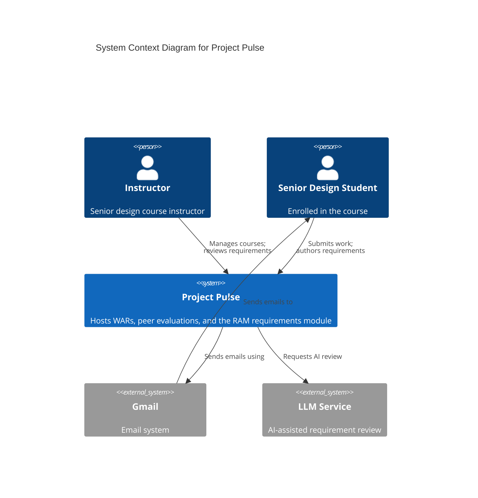
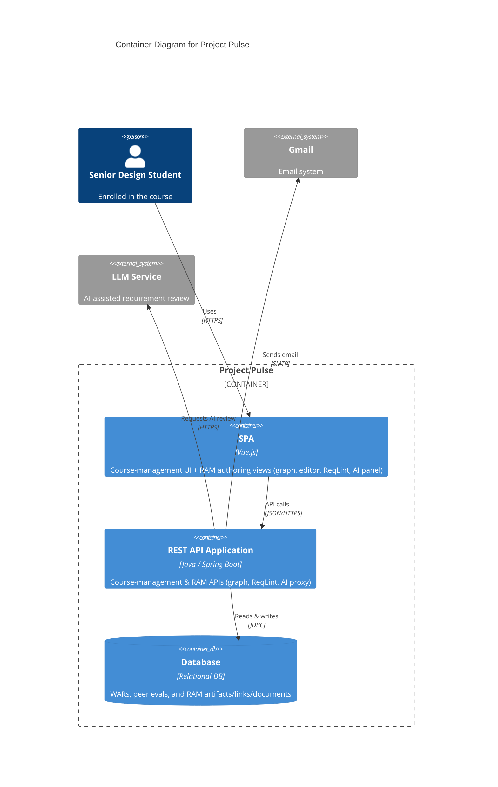
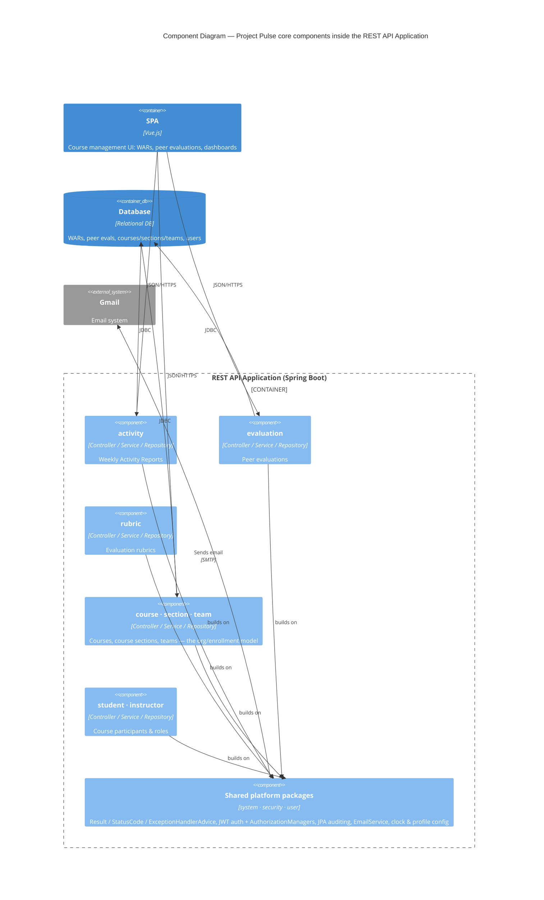

# **Architectural Design — Project Pulse Platform**

> **Design-of-record for the Project Pulse platform** — the host both the core features (weekly activity reports, peer evaluations, courses/course sections/teams) and the RAM module run on.
>
> Scope: the platform's C4 context, container, and core component views; the platform conventions and cross-cutting subsystems every module inherits; and how the whole platform is deployed.
>
> Note: the pulse-core **requirements** specs (Vision & Scope, Project Glossary, Business Rules, Use Cases, SRS) exist in Google Docs and are pending conversion to `docs/pulse-core/requirements/`; this design doc is authored in Markdown and does not wait on that conversion.
>
> See: [`../README.md`](../README.md), [`../../ram/design/architectural-design.md`](../../ram/design/architectural-design.md) (the RAM module's Level-1 doc, which **cites this one** for the platform context/container views and conventions).

Project Pulse was built **core-first**: the weekly-activity-report, peer-evaluation, and course/course-section/team functionality — together with security, the API conventions, and the deployment pipeline — came first as the working application. **RAM was a separate project, merged in later** to reuse this same course/section/team/security/auth infrastructure. So this platform is the host, RAM is a module on top, and **the conventions below belong to the platform** — RAM (and the future core specs) cite them rather than restate them.

This doc is the platform's **architecture-of-record**: the structure, conventions, and deployment every module inherits. It is **not** named after a use-case area and does not change when one feature is added — it changes when the host architecture does. The C4 context and container views below are platform-wide; the RAM doc cites them rather than redrawing them.

## **Quality Goals**

> The architecturally significant quality attributes that drive the design, in priority order. The full quality-attribute *requirements* live in the requirements specs (the SRS for RAM; the pending pulse-core requirements for the core); this section states the architecture's **response** to the ones that most shape the structure, and the [Quality Requirements](#quality-requirements) section below makes them measurable.

| # | Quality goal | Why it drives the architecture | How the architecture meets it |
|---|---|---|---|
| 1 | **Security & privacy (FERPA)** | The platform holds student educational records (WARs, peer evaluations, scores, requirements). Unauthorized disclosure is the top risk and a regulatory (FERPA) constraint. | JWT auth (RSA keypair); URL-level rules in `SecurityConfiguration` **plus** fine-grained `AuthorizationManager` beans enforcing ownership/membership (a student sees only their team's data; an instructor only their assigned course sections); role hierarchy `admin > instructor > student`; JPA auditing stamps created/modified-by for accountability; `prod` secrets in Azure Key Vault; single-tenant deployment boundary. |
| 2 | **Maintainability & extensibility** | The codebase is extended continuously — RAM was merged in, senior-design students will extend it, and features are added spec-first via `/design`→`/implement`. New code must stay safe and consistent. | DDD one-bounded-context-per-package vertical slices isolate change; uniform conventions (the `Result` envelope, `Converter<S,T>` DTOs, no Lombok/MapStruct, `/api/v1`) make every slice look alike so a contributor pattern-matches; cross-cutting machinery is centralized in `system`/`security`/`user` so features don't reinvent it; Flyway makes schema change auditable. |
| 3 | **Usability / low friction** | Non-expert students must submit WARs and peer evaluations and author requirements quickly — friction directly reduces the frequent participation the platform exists to encourage. | SPA (Vue) for a responsive single-page UX; the uniform `Result` envelope + shared Axios instance give consistent client-side error handling and transparent auth/`401` redirect; RAM autosave + section-level locking prevent lost work and edit collisions; `WeeklyReminderScheduler` emails nudge timely submission. |
| 4 | **Reliability & low operational burden** | A single instructor runs a course section with no dev/ops team; the system must deploy and run simply and behave predictably. | One deployable unit (SPA bundled into the Spring Boot jar → one container → one Azure Web App) with nothing to orchestrate; staging slot for safe deploys; Flyway migrations applied at deploy for predictable schema; profile-scoped clocks for testable time; Testcontainers integration tests + `maven-build` PR checks guard regressions; Prometheus/Grafana/Zipkin for monitoring. **Accepted trade-off:** the single-instance simplicity (and the per-startup RSA key) caps horizontal scaling — deliberately traded for low ops at the current scale. |

## **System Context Diagram**

The Level 1: Context Diagram for the Project Pulse system provides a high-level overview of its interactions with users and external systems. Project Pulse is the central platform for senior-design course delivery: instructors create courses, author Weekly Activity Report (WAR) and peer evaluation templates, and review submissions, while students submit WARs, complete peer evaluations, and view scores and feedback. The Requirements Authoring & Management (RAM) module runs inside this same platform, where students and instructors author, link, and validate requirements as a connected graph of atomic artifacts. Project Pulse integrates with two external systems: the Gmail system, which delivers automated email notifications (reminders, updates) to students and instructors — the context diagram shows the student notification path as representative — and an external LLM service (e.g., OpenAI), which the RAM module calls for AI-assisted requirement review. This diagram highlights the instructor and student as primary users, the central functionality of Project Pulse including the RAM module, and the platform's reliance on Gmail for communication and the LLM service for AI assistance, offering a clear picture of the system's operational scope and interactions.

## **Container Diagram**

The Level 2: Container Diagram for the Project Pulse system provides a detailed view of its internal architecture, illustrating how the system components interact. The system is composed of three key containers — the **SPA (Single Page Application)**, the **REST API Application**, and the **Database** — supported by integration with the **Gmail System** for email communication and an external **LLM Service** (e.g., OpenAI) for AI-assisted requirement review. The **SPA**, built with Vue.js, is delivered to users' browsers and provides the interface for both the course-management workflows (submitting WARs and peer evaluations) and the RAM module's requirements authoring views: graph navigation, document editing, the ReqLint validation sidebar, and the AI assistant panel. The **REST API Application**, implemented using Java and Spring Boot, delivers the SPA, processes REST API calls, and manages interactions with the **Database**; for the RAM module it exposes endpoints for the requirements graph, ReqLint validation, and an AI proxy to the LLM service. The **Database**, a relational database, stores course-management data (WARs and peer evaluation submissions) alongside the RAM module's requirement artifacts, links, documents, and document sections, with CRUD operations executed through the REST API. The REST API integrates with the **Gmail System** over SMTP to send automated notifications and with the external **LLM Service** to support AI-assisted review. The steps below trace the WAR submission flow as a representative example:

1. Visit the Project Pulse Website: The Senior Design student begins by accessing the Project Pulse system through their browser at the URL https://projectpulse.team.
2. Deliver the SPA to the student's Browser: The REST API Application (built using Java and Spring Boot) serves the Single Page Application (SPA, built with Vue.js) to the student's browser. This provides the user interface that students interact with.
3. Submit WARs and Peer Evaluations: The student uses the SPA to complete and submit Weekly Activity Reports (WARs) and peer evaluations through the interface.
4. Make REST API Calls to the Backend: The SPA communicates with the REST API Application by making REST API calls to process and handle the submissions from the student. These calls allow the backend to manage the application's logic and facilitate data processing.
5. CRUD Operations with the Database: The REST API Application performs CRUD (Create, Read, Update, Delete) operations on the Database, which is a relational database. The database securely stores the submitted WARs and peer evaluations.
6. Send Emails via SMTP: The REST API Application interacts with the Gmail system using SMTP to send automated email notifications (e.g., reminders, submission confirmations) to the student or instructor, as necessary.
7. Receive Emails: Finally, the student (or instructor) receives email notifications generated by the Gmail system, completing the interaction loop.

This sequence of actions outlines how the Project Pulse system components collaborate to facilitate functionality for the student while ensuring efficient data management and communication. RAM-specific flows (graph navigation, document editing, ReqLint validation, and AI-assisted review) follow the same SPA → REST API → Database path, with the REST API additionally proxying requests to the external LLM service.

## **Component Diagram**

This Level 3 view zooms into the **REST API Application** to show the core platform's internal structure: one component per DDD bounded context, on top of the shared cross-cutting packages. Each maps to a package under `backend/src/main/java/team/projectpulse/`. RAM adds its own components (`ram/*`) beside these on the same shared base — see the RAM doc's [Component Diagram](../../ram/design/architectural-design.md#component-diagram).

On the **SPA** side the layering is uniform across the app: feature pages call a per-domain API client (`frontend/src/apis/<feature>/`) over a shared Axios instance that attaches the JWT Bearer token, unwraps the `Result` envelope, and redirects to login on `401`. Pinia stores (`token`, `userInfo`, …) hold cross-cutting state; the router enforces `requiresAuth` / role guards.

## **Architectural Conventions**

These are the **canonical** platform conventions — the normative source the RAM doc and the root [`CLAUDE.md`](../../../CLAUDE.md) point to. Every module follows them.

- **API shape** — all endpoints under `/api/v1` (`api.endpoint.base-url`); every controller method returns the `Result` envelope (`flag`, `code`, `message`, `data`) — never a raw entity; errors are translated centrally by a global `@RestControllerAdvice` (`ExceptionHandlerAdvice`) into the same envelope with `StatusCode` constants.
- **Domain structure** — Domain-Driven Design: one bounded context per package, each owning its full vertical slice (entity → repository → service → controller → DTOs → `Converter<S,T>` → a `*SecurityService` or `*Specs` for dynamic queries). **No Lombok** — explicit getters/setters/constructors. **No MapStruct** — bidirectional DTO conversion via Spring `Converter<S,T>` beans.
- **Authorization** — JWT-based auth (RSA key pair generated at startup); URL-level rules in `SecurityConfiguration`'s filter chain **plus** fine-grained `AuthorizationManager` beans for ownership/membership checks. Role hierarchy `admin > instructor > student`.
- **Persistence & migrations** — relational DB via JPA. Schema is delivered as **Flyway** migrations (`backend/src/main/resources/db/migration/`). The `dev` profile uses `ddl-auto: create` + `DataInitializer` seed data; `staging`/`prod` use Flyway only (`prod` pulls secrets from Azure Key Vault).
- **SPA serving** — in production the Spring Boot app serves both the API and the built SPA from `static/`; `WebConfig` forwards non-API routes to `index.html` for client-side routing.

## **Cross-Cutting Platform Subsystems**

Shared machinery every module reuses rather than reimplements — owned by the cross-cutting packages, not any one domain.

| Subsystem | Owner | Notes |
|---|---|---|
| Standard API envelope & error handling | `system` (`Result`, `StatusCode`, `ExceptionHandlerAdvice`) | Every controller returns `Result`; all exceptions funnel through the global advice |
| Authentication & RBAC | `security` (`SecurityConfiguration`, `authorizationmanagers/`) | JWT (RSA keypair at startup); URL rules + ownership/membership managers |
| Shared user model | `user` (`PeerEvaluationUser` base, password reset, invitation) | Common identity base for students/instructors; the auth subject for both modules |
| Authorship & auditing | `system` (JPA auditing, `PeerEvaluationUserAuditorAware`) | Created/modified-by metadata applied automatically across entities |
| Email / notifications | `system` (`EmailService`, `WeeklyReminderScheduler`) | Gmail over SMTP; scheduled reminders |
| Time & profiles | `system` (`DevClockConfig` / `StagingClockConfig` / `ProdClockConfig`) | Profile-scoped clocks for testable time |
| Dev seed data | `system` (`DataInitializer`) | `dev`-profile fixtures (the dev credentials) |

## **Quality Requirements**

> Refines the [Quality Goals](#quality-goals) into a prioritized quality tree and concrete, measurable scenarios. Each scenario is ATAM-style (source · stimulus · environment → response → **measure**); the measures are the testable targets the architecture must hold. Targets marked 🔢 are placeholders (`TBD`) to be set by the team.

### *Quality tree*

- **Security** *(High)* — confidentiality of student records; authorization correctness; auditability → QS-1, QS-2
- **Maintainability** *(High)* — modifiability (add a bounded context), convention consistency, testability → QS-3
- **Usability** *(High)* — low-friction submission, error clarity, no lost work → QS-4
- **Reliability** *(High)* — availability under external-dependency failure, data integrity, predictable deploys → QS-5, QS-6
- **Performance efficiency** *(Medium)* — responsive interactions at course scale → QS-7
- **Scalability / portability** *(Low — accepted)* — single-instance topology; horizontal scaling deliberately out of scope at current scale → see Key Decisions (forthcoming)

### *Quality scenarios*

| ID | Goal | Scenario (source · stimulus · environment) | Response | Response measure |
|---|---|---|---|---|
| QS-1 | Security | An authenticated student requests another team's WAR/peer-eval via the API · normal op | Denied at the `AuthorizationManager` | 100% of cross-team/owner-mismatch attempts return `403`; no record fields leak; attempt is auditable |
| QS-2 | Security | An unauthenticated client calls a protected `/api/v1` endpoint · normal op | Rejected before controller logic | `401` returned; no business logic executes; covered by integration tests |
| QS-3 | Maintainability *(change)* | A contributor adds a new bounded context · development | Added as a vertical slice using standard conventions, no edits to existing slices | Zero changes to other bounded-context packages; new endpoints return the `Result` envelope and pass convention checks; delivered in ≤ `TBD` person-days 🔢 |
| QS-4 | Usability | A student is mid-edit in a RAM document section · normal op | Edits autosave; the section is locked against collisions | No lost edits on navigate/refresh; a second editor is blocked with a clear message; autosave within `TBD` s 🔢 |
| QS-5 | Reliability *(availability)* | The LLM service times out or is down · degraded | AI features degrade gracefully; authoring/saving unaffected | Authoring + save unaffected; AI request fails within `TBD` s 🔢 and offers retry; no data loss |
| QS-6 | Reliability | A new release is deployed · deploy-time | Schema migrates; one container serves API + SPA | Flyway migrations apply cleanly; staging-slot smoke check passes before swap; **note:** new RSA key invalidates live JWTs → users re-login (see Key Decisions) |
| QS-7 | Performance | A student loads a team's requirements graph at course scale (~`TBD` users, ~`TBD` artifacts) · normal op | Page responds within target | p95 API response < `TBD` ms at `TBD` artifacts 🔢 |

## **Technology Stack**

- **Backend** — Java 21, Spring Boot 4.0, Maven; Spring Security, Spring Data JPA, Flyway.
- **Frontend** — Vue 3 + Vite + TypeScript SPA; Element Plus, SCSS, Pinia, Chart.js (vue-chartjs), TipTap (rich text, used by RAM); Cypress for E2E.
- **Data & infra** — relational DB (MySQL 8 in dev via Docker Compose, alongside Mailpit, Prometheus, Grafana, Zipkin).

## **Deployment**

The whole platform deploys as one unit, RAM included. The CI pipeline (`azure-webapps-deploy.yml`, on push to `main`) builds the Vue frontend, copies the `dist` into `backend/src/main/resources/static/`, builds the Spring Boot jar, packages a Docker image, pushes it to GHCR, and deploys to an Azure Web App staging slot. PR checks (`maven-build.yml`) run `mvn package` (backend build + tests) on PRs to `main`. In production the single Spring Boot container serves both the REST API and the SPA. Schema changes ship as versioned Flyway migrations applied at deploy time.
