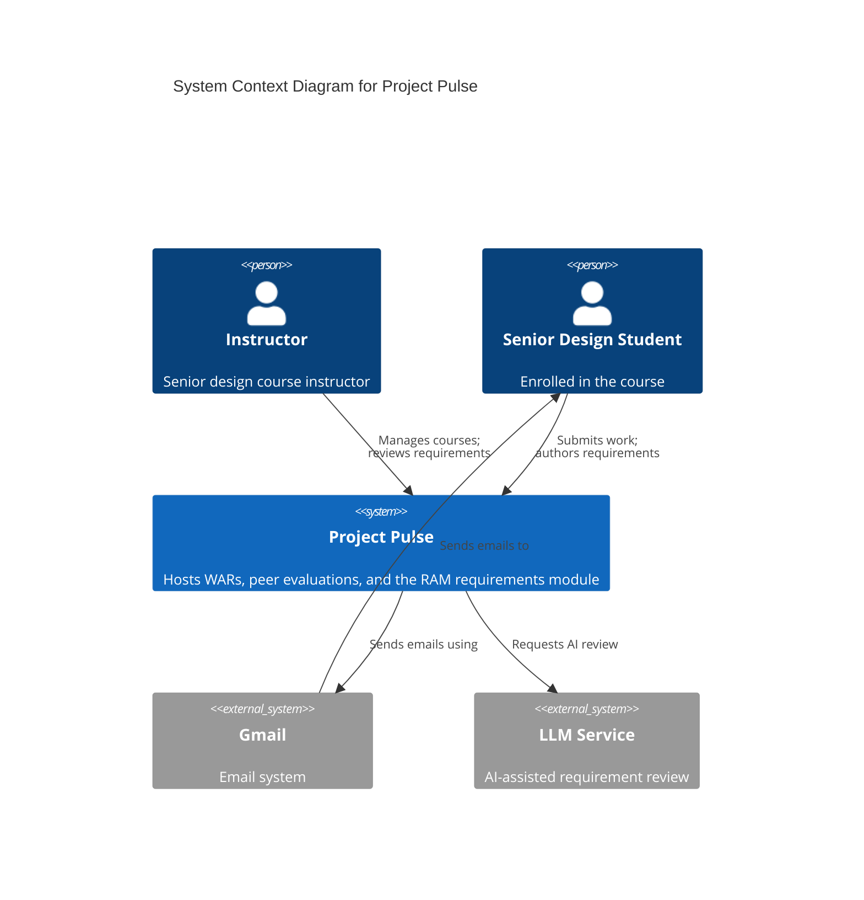
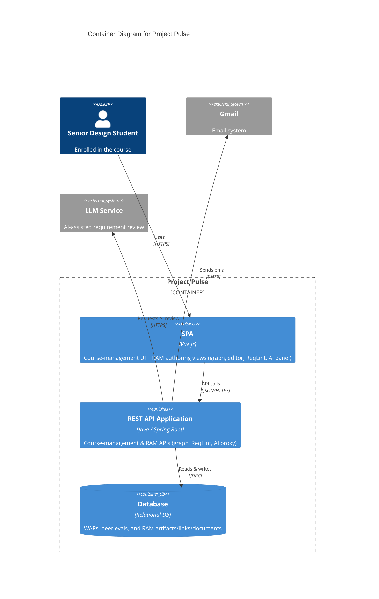
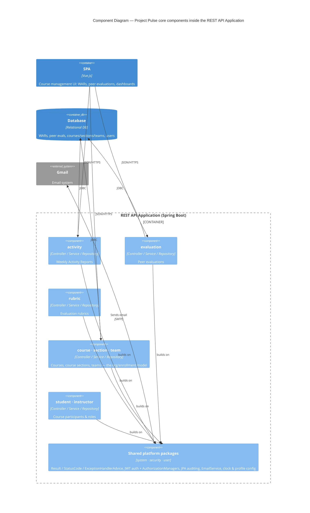
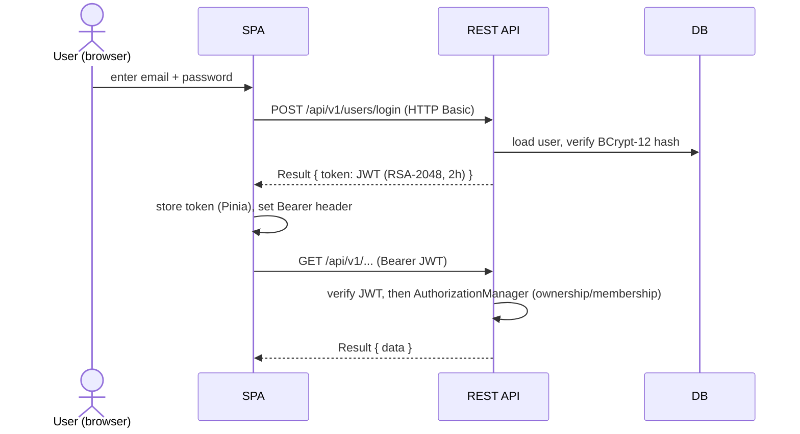
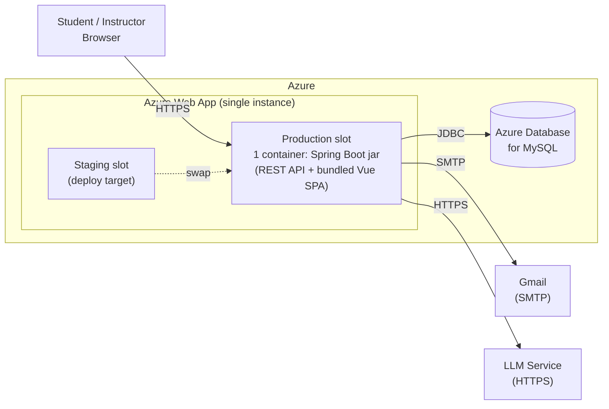

# **Architectural Design — Project Pulse Platform**

> **Design-of-record for the Project Pulse platform** — the host that both the core features (weekly activity reports, peer evaluations, courses/course sections/teams) and the RAM module run on.
>
> Structure: this document follows the **arc42** template (Starke & Hruschka), using **C4** for the context and building-block views. The section names and order are arc42's; numbering is applied at export.
>
> Note: the pulse-core **requirements** specs (Vision & Scope, Project Glossary, Business Rules, Use Cases, SRS) exist in Google Docs and are pending conversion to `docs/pulse-core/requirements/`; this design doc is authored in Markdown and does not wait on that conversion.
>
> See: [`../README.md`](../README.md), [`../../ram/design/architectural-design.md`](../../ram/design/architectural-design.md) (the RAM module's Level-1 doc, which **cites this one** for the platform context/container views and conventions).

## **Introduction and Goals**

Project Pulse was built **core-first**: the weekly-activity-report, peer-evaluation, and course/course-section/team functionality — together with security, the API conventions, and the deployment pipeline — came first as the working application. **RAM was a separate project, merged in later** to reuse this same course/section/team/security/auth infrastructure. So this platform is the host, RAM is a module on top, and **the conventions here belong to the platform** — RAM (and the future core specs) cite them rather than restate them.

This doc is the platform's **architecture-of-record**: the structure, conventions, decisions, cross-cutting concerns, runtime/deployment, and known risks every module inherits or is bounded by. It is **not** named after a use-case area and does not change when one feature is added — it changes when the host architecture does.

### *Requirements Overview*

The platform's functional requirements live in the **requirements specs**, not here: RAM's in [`../../ram/requirements/`](../../ram/requirements/) (a Wiegers/Beatty-style SRS plus use cases, glossary, and business rules); the core's in Google Docs, pending conversion to `docs/pulse-core/requirements/`. This document realizes those requirements and does not restate them. In brief, the platform delivers weekly activity reporting, peer evaluation, instructor dashboards, and course/section/team management, and — through the RAM module — collaborative requirements authoring (documents, use cases, glossary, traceability, validation, and AI-assisted review).

### *Quality Goals*

> The architecturally significant quality attributes that drive the design, in priority order. The full quality-attribute *requirements* live in the requirements specs; this states the architecture's **response** to the ones that most shape the structure, and [Quality Requirements](#quality-requirements) makes them measurable.

| # | Quality goal | Why it drives the architecture | How the architecture meets it |
|---|---|---|---|
| 1 | **Security & privacy (FERPA)** | The platform holds student educational records (WARs, peer evaluations, scores, requirements). Unauthorized disclosure is the top risk and a regulatory (FERPA) constraint. | JWT auth (RSA keypair); URL-level rules in `SecurityConfiguration` **plus** fine-grained `AuthorizationManager` beans enforcing ownership/membership (a student sees only their team's data; an instructor only their assigned course sections); role hierarchy `admin > instructor > student`; JPA auditing stamps created/modified-by for accountability; `prod` secrets in Azure Key Vault; single-tenant deployment boundary. |
| 2 | **Maintainability & extensibility** | The codebase is extended continuously — RAM was merged in, senior-design students will extend it, and features are added spec-first via `/design`→`/implement`. New code must stay safe and consistent. | DDD one-bounded-context-per-package vertical slices isolate change; uniform conventions (the `Result` envelope, `Converter<S,T>` DTOs, no Lombok/MapStruct, `/api/v1`) make every slice look alike so a contributor pattern-matches; cross-cutting machinery is centralized in `system`/`security`/`user` so features don't reinvent it; Flyway makes schema change auditable. |
| 3 | **Usability / low friction** | Non-expert students must submit WARs and peer evaluations and author requirements quickly — friction directly reduces the frequent participation the platform exists to encourage. | SPA (Vue) for a responsive single-page UX; the uniform `Result` envelope + shared Axios instance give consistent client-side error handling and transparent auth/`401` redirect; RAM autosave + section-level locking prevent lost work and edit collisions; `WeeklyReminderScheduler` emails nudge timely submission. |
| 4 | **Reliability & low operational burden** | A single instructor runs a course section with no dev/ops team; the system must deploy and run simply and behave predictably. | One deployable unit (SPA bundled into the Spring Boot jar → one container → one Azure Web App) with nothing to orchestrate; staging slot for safe deploys; Flyway migrations applied at deploy for predictable schema; profile-scoped clocks for testable time; Testcontainers integration tests + `maven-build` PR checks guard regressions; Prometheus/Grafana/Zipkin for monitoring (local dev today; production telemetry is a gap — [TD-9](#risks-and-technical-debt)). **Accepted trade-off:** the single-instance simplicity (and the per-startup RSA key) caps horizontal scaling — deliberately traded for low ops at the current scale. |

### *Stakeholders*

| Stakeholder | Concern |
|---|---|
| **Students** | Submit WARs and peer evaluations, author requirements; expect low-friction workflows, fair evaluation, and privacy of their records. |
| **Instructors / course admins** | Monitor team progress, review submissions and requirements, manage courses/sections/teams; the primary operators. |
| **Department / institution** | FERPA compliance and stewardship of student educational records. |
| **Developers & maintainers** (incl. senior-design students who extend the codebase) | Clear conventions and maintainability so features can be added safely. |
| **Educator / researcher** (the author) | Use the platform and its docs as a teaching exemplar and research artifact. |

## **Architecture Constraints**

Constraints the architecture must honor, gathered from the requirements, the institution, and the existing platform:

- **Regulatory** — the system holds student educational records, so **FERPA** governs access, disclosure, and retention (Quality Goal #1).
- **Organizational** — a single instructor operates a course with **no dedicated dev/ops team**; deployment is **single-tenant** (one institution per deployment).
- **Platform-given** — RAM is a **module inside a fixed host**: it must reuse the existing course/section/team/auth/email infrastructure and the platform conventions, not fork or duplicate them. The platform was built **core-first**, so those conventions predate and bind RAM.
- **Process** — requirements are authored as durable specs (RAM in Markdown under `docs/ram/`; pulse-core pending in Google Docs) and drive the design.
- **Technology stack (prescribed):**
  - **Backend** — Java 21, Spring Boot 4.0, Maven; Spring Security, Spring Data JPA, Flyway.
  - **Frontend** — Vue 3 + Vite + TypeScript SPA; Element Plus, SCSS, Pinia, Chart.js (vue-chartjs), TipTap (rich text, used by RAM); Cypress for E2E.
  - **Data & infra** — relational DB (MySQL 8 in dev via Docker Compose, alongside Mailpit, Prometheus, Grafana, Zipkin); deployed on Azure.

## **Context and Scope**

The Level 1: Context Diagram for the Project Pulse system provides a high-level overview of its interactions with users and external systems. Project Pulse is the central platform for senior-design course delivery: instructors create courses, author Weekly Activity Report (WAR) and peer evaluation templates, and review submissions, while students submit WARs, complete peer evaluations, and view scores and feedback. The Requirements Authoring & Management (RAM) module runs inside this same platform, where students and instructors author, link, and validate requirements as a connected graph of atomic artifacts. Project Pulse integrates with two external systems: the Gmail system, which delivers automated email notifications (reminders, updates) to students and instructors — the context diagram shows the student notification path as representative — and an external LLM service (e.g., OpenAI), which the RAM module calls for AI-assisted requirement review. This diagram highlights the instructor and student as primary users, the central functionality of Project Pulse including the RAM module, and the platform's reliance on Gmail for communication and the LLM service for AI assistance, offering a clear picture of the system's operational scope and interactions.

## **Solution Strategy**

The platform's strategy in a few load-bearing moves — each elaborated in [Architecture Decisions](#architecture-decisions) and serving the Quality Goals:

- **One deployable, modular monolith** (KD-1) — the SPA bundled into the Spring Boot jar, one container — for low operational burden (Quality Goal #4).
- **DDD vertical slices + uniform conventions** (the `Result` envelope, `Converter` DTOs, no Lombok — KD-5) — for maintainability and a low learning curve (Quality Goal #2).
- **RAM as a module on the shared platform** (KD-2) — reuse identity, RBAC, the org model, and email rather than build a second system.
- **One relational store** for both modules (KD-3) — a single backup/migration/compliance surface.
- **Stateless, self-issued JWT** (KD-4) **+ fine-grained `AuthorizationManager`s** — least-privilege access to regulated data (Quality Goal #1).
- **Documented per arc42 + C4** — a recognized structure for teaching and review.

## **Building Block View**

The platform's building blocks at two levels: the **containers**, and the **core components** inside the REST API container.

### *Containers*

The Level 2: Container Diagram for the Project Pulse system provides a detailed view of its internal architecture, illustrating how the system components interact. The system is composed of three key containers — the **SPA (Single Page Application)**, the **REST API Application**, and the **Database** — supported by integration with the **Gmail System** for email communication and an external **LLM Service** (e.g., OpenAI) for AI-assisted requirement review. The **SPA**, built with Vue.js, is delivered to users' browsers and provides the interface for both the course-management workflows (submitting WARs and peer evaluations) and the RAM module's requirements authoring views: graph navigation, document editing, the ReqLint validation sidebar, and the AI assistant panel. The **REST API Application**, implemented using Java and Spring Boot, delivers the SPA, processes REST API calls, and manages interactions with the **Database**; for the RAM module it exposes endpoints for the requirements graph, ReqLint validation, and an AI proxy to the LLM service. The **Database**, a relational database, stores course-management data (WARs and peer evaluation submissions) alongside the RAM module's requirement artifacts, links, documents, and document sections, with CRUD operations executed through the REST API. The REST API integrates with the **Gmail System** over SMTP to send automated notifications and with the external **LLM Service** to support AI-assisted review.

### *Components*

This view zooms into the **REST API Application** to show the core platform's internal structure: one component per DDD bounded context, on top of the shared cross-cutting packages. Each maps to a package under `backend/src/main/java/team/projectpulse/`. RAM adds its own components (`ram/*`) beside these on the same shared base — see the RAM doc's [Component Diagram](../../ram/design/architectural-design.md#component-diagram).

On the **SPA** side the layering is uniform across the app: feature pages call a per-domain API client (`frontend/src/apis/<feature>/`) over a shared Axios instance that attaches the JWT Bearer token, unwraps the `Result` envelope, and redirects to login on `401`. Pinia stores (`token`, `userInfo`, …) hold cross-cutting state; the router enforces `requiresAuth` / role guards.

## **Runtime View**

> Key runtime scenarios — how the building blocks interact at run time. The physical topology is in [Deployment View](#deployment-view).

### *Authentication and an authorized request*

### *WAR submission (representative course-management flow)*

1. Visit the Project Pulse Website: The Senior Design student begins by accessing the Project Pulse system through their browser at the URL https://projectpulse.team.
2. Deliver the SPA to the student's Browser: The REST API Application (built using Java and Spring Boot) serves the Single Page Application (SPA, built with Vue.js) to the student's browser. This provides the user interface that students interact with.
3. Submit WARs and Peer Evaluations: The student uses the SPA to complete and submit Weekly Activity Reports (WARs) and peer evaluations through the interface.
4. Make REST API Calls to the Backend: The SPA communicates with the REST API Application by making REST API calls to process and handle the submissions from the student. These calls allow the backend to manage the application's logic and facilitate data processing.
5. CRUD Operations with the Database: The REST API Application performs CRUD (Create, Read, Update, Delete) operations on the Database, which is a relational database. The database securely stores the submitted WARs and peer evaluations.
6. Send Emails via SMTP: The REST API Application interacts with the Gmail system using SMTP to send automated email notifications (e.g., reminders, submission confirmations) to the student or instructor, as necessary.
7. Receive Emails: Finally, the student (or instructor) receives email notifications generated by the Gmail system, completing the interaction loop.

RAM-specific flows (graph navigation, document editing, ReqLint validation, and AI-assisted review) follow the same SPA → REST API → Database path, with the REST API additionally proxying requests to the external LLM service; the LLM round-trip degrades gracefully when the service is unavailable (QS-5).

## **Deployment View**

> The physical runtime topology, the build/release pipeline, and the scaling posture. The logical structure is in the views above; this is where the system actually runs, and why it is currently single-instance.

### *Topology*

- One **Azure Web App** runs a **single container** — the Spring Boot jar serving both the REST API and the bundled Vue SPA (KD-1). It talks to one **Azure Database for MySQL** over JDBC, **Gmail** over SMTP, and the external **LLM** over HTTPS. Releases deploy to a **staging slot** and swap into production (pipeline below).

### *Build & release pipeline*

The whole platform deploys as one unit, RAM included. The CI pipeline (`azure-webapps-deploy.yml`, on push to `main`) builds the Vue frontend, copies the `dist` into `backend/src/main/resources/static/`, builds the Spring Boot jar, packages a Docker image, pushes it to GHCR, and deploys to an Azure Web App staging slot. PR checks (`maven-build.yml`) run `mvn package` (backend build + tests) on PRs to `main`. In production the single Spring Boot container serves both the REST API and the SPA. Schema changes ship as versioned Flyway migrations applied at deploy time.

### *Statefulness*

- The app is largely **stateless**: JWT auth with no server session (`STATELESS`), authoring locks persisted in the DB (not memory), and no application cache. The only per-instance in-memory state is the **RSA signing keypair** (generated at startup, KD-4).

### *Scaling model & path to multi-instance*

- Today the platform scales **vertically only** — one instance (Quality Goal #4; the accepted Scalability trade-off). It is close to horizontally scalable, but three things block it today:
  1. **Per-startup RSA key (KD-4):** each instance signs with its own key, so instances can't verify each other's tokens. *Fix:* externalize/persist the keypair (or a shared JWKS).
  2. **Scheduled jobs duplicate:** `WeeklyReminderScheduler` (`@Scheduled` cron) fires on every instance, so N instances send N reminder emails. *Fix:* single-execution coordination (ShedLock / leader election / a dedicated scheduler instance).
  3. **Otherwise stateless:** beyond (1)–(2) there is no sticky-session or in-memory-cache barrier — DB-backed locks and stateless auth already support multiple instances.
- Until those are addressed, run a single instance (tracked in Risks and Technical Debt).

### *Availability*

- Single instance ⇒ a single point of failure, with brief downtime on restart/deploy (mitigated by the staging-slot swap). External-dependency failures degrade gracefully (LLM down ⇒ authoring continues, QS-5; email is best-effort).

## **Crosscutting Concepts**

Conventions, shared machinery, and platform-wide concerns that cut across all building blocks.

### *Architectural conventions*

These are the **canonical** platform conventions — the normative source the RAM doc and the root [`CLAUDE.md`](../../../CLAUDE.md) point to. Every module follows them.

- **API shape** — all endpoints under `/api/v1` (`api.endpoint.base-url`); every controller method returns the `Result` envelope (`flag`, `code`, `message`, `data`) — never a raw entity; errors are translated centrally by a global `@RestControllerAdvice` (`ExceptionHandlerAdvice`) into the same envelope with `StatusCode` constants.
- **Domain structure** — Domain-Driven Design: one bounded context per package, each owning its full vertical slice (entity → repository → service → controller → DTOs → `Converter<S,T>` → a `*SecurityService` or `*Specs` for dynamic queries). **No Lombok** — explicit getters/setters/constructors. **No MapStruct** — bidirectional DTO conversion via Spring `Converter<S,T>` beans.
- **Authorization** — JWT-based auth (RSA key pair generated at startup); URL-level rules in `SecurityConfiguration`'s filter chain **plus** fine-grained `AuthorizationManager` beans for ownership/membership checks. Role hierarchy `admin > instructor > student`.
- **Persistence & migrations** — relational DB via JPA. Schema is delivered as **Flyway** migrations (`backend/src/main/resources/db/migration/`). The `dev` profile uses `ddl-auto: create` + `DataInitializer` seed data; `staging`/`prod` use Flyway only (`prod` pulls secrets from Azure Key Vault).
- **SPA serving** — in production the Spring Boot app serves both the API and the built SPA from `static/`; `WebConfig` forwards non-API UI routes (registered for one-, two-, and three-segment paths) to `index.html` for client-side routing.

### *Cross-cutting subsystems*

Shared machinery every module reuses rather than reimplements — owned by the cross-cutting packages, not any one domain.

| Subsystem | Owner | Notes |
|---|---|---|
| Standard API envelope & error handling | `system` (`Result`, `StatusCode`, `ExceptionHandlerAdvice`) | Every controller returns `Result`; all exceptions funnel through the global advice |
| Authentication & RBAC | `security` (`SecurityConfiguration`, `authorizationmanagers/`) | JWT (RSA keypair at startup); URL rules + ownership/membership managers |
| Shared user model | `user` (`PeerEvaluationUser` base, password reset, invitation) | Common identity base for students/instructors; the auth subject for both modules |
| Authorship & auditing | `system` (JPA auditing, `PeerEvaluationUserAuditorAware`) | Created/modified-by metadata applied automatically across entities |
| Email / notifications | `system` (`EmailService`, `WeeklyReminderScheduler`) | Gmail over SMTP; scheduled reminders |
| Time & profiles | `system` (`DevClockConfig` / `StagingClockConfig` / `ProdClockConfig`) | Profile-scoped clocks for testable time |
| Dev seed data | `system` (`DataInitializer`) | `dev`-profile fixtures (the dev credentials) |

### *Security & Compliance*

> Security is Quality Goal #1: the platform holds student educational records regulated under **FERPA**. This is the consolidated security view — authentication, authorization, data protection, threat boundary — recording both the **controls in place** and the **known gaps** a production deployment must close. Mechanics live in `security/` and `user/`; this explains the design, it doesn't restate every rule.

#### **Trust boundary**

Single-tenant: one deployment serves one institution. The trust boundary is the Azure Web App — the Vue SPA and REST API are one origin (SPA served from the API jar), so there's no cross-origin trust in production. TLS terminates at the Azure edge; the app trusts the platform for transport encryption (it does not enforce HTTPS itself).

#### **Authentication**

- **Login:** HTTP Basic (email + password) → server issues a JWT (`AuthController` / `JwtProvider`). Passwords hashed with **BCrypt (strength 12)**.
- **Tokens:** self-issued JWTs, **RSA-2048** signature, **2-hour** expiry, claims `sub`, `userId`, space-delimited `authorities`. Stateless OAuth2 resource server (`SessionCreationPolicy.STATELESS`).
- **Provisioning:** invitation flow (`user/userinvitation`) plus self-registration; password reset via a one-time token valid **5 minutes**.
- **Known gaps:** no token **refresh** or **revocation/blocklist** — a token is valid for its full 2h (a leaked token can't be revoked; logout is client-side only). The RSA key regenerates per startup (KD-4). **`POST /students` and `POST /instructors` are `permitAll()` — open self-registration, including instructor accounts** (which grant cross-section visibility of student data); for production FERPA this should be invitation- or approval-gated.

#### **Authorization**

- **Role hierarchy** `admin > instructor > student` (`RoleHierarchyImpl`); method security enabled (`@EnableMethodSecurity`).
- **Two layers:** coarse URL rules in `SecurityConfiguration` (`hasAuthority`, `.authenticated()`) **plus** fine-grained `.access(…AuthorizationManager)` enforcing **ownership** (the user created the resource) or **membership** (the user belongs to the same course/section/team). The logic lives in per-domain `*SecurityService` classes; the `*AuthorizationManager` is a thin URL-to-logic wrapper.
- **Effect:** a student reaches only their own team's data — all RAM artifacts are gated by `teamMembership`/`teamOwnership`; an instructor only their assigned sections. This is the architectural realization of least privilege (QS-1).

#### **Data protection & FERPA**

- **Records handled:** WARs (student contributions), peer evaluations (sensitive peer judgments), scores/feedback, requirements artifacts, identity (names/emails).
- **Least privilege:** the ownership/membership model above — the primary FERPA control.
- **Accountability:** JPA auditing (`PeerEvaluationUserAuditorAware`) stamps created/modified-by + timestamps.
- **Secrets:** `staging`/`prod` load secrets from **Azure Key Vault**; none in source.
- **Encryption:** in transit via Azure-edge TLS; at rest via Azure-managed database encryption — both platform-provided, not app-configured.
- **Known gaps (FERPA obligations not yet designed):** no **retention / deletion / end-of-course purge** policy and no student data **access/correction** workflow (structural cascade deletes exist but are not a retention policy); no documented audit-log retention or data-minimization review. **Wide-open CORS** (`allowedOrigins("*")`) — low risk given bearer-token (non-cookie) auth and same-origin prod serving, but should be allowlisted to the SPA origin. No **rate limiting** on auth endpoints (brute-force exposure; `/users/exists/{email}` also enables email enumeration).

#### **Threat model (scope)**

- **In scope (addressed):** cross-team / cross-section data access (AuthorizationManagers), credential theft (BCrypt-12, short-lived JWT), unauthorized role escalation (role hierarchy + ownership).
- **Out of scope / accepted at current scale:** DDoS and rate-limiting, multi-tenant isolation (single-tenant by design), advanced persistent threats — revisited if scale or deployment model changes.

### *Data architecture*

> The platform's persistence strategy and the decisions behind it — strategy and pointers, not a table-by-table schema (the conceptual model is owned by the requirements specs' domain models; the code owns the physical detail). RAM's requirements-graph persistence is a module-level concern documented in the [RAM architecture doc](../../ram/design/architectural-design.md).

#### **Store & schema**

- One relational store: a single **MySQL 8** schema shared by both modules (KD-2, KD-3). Core tables (WARs, evaluations, courses/sections/teams, users) and RAM tables (documents, artifacts, links, comments) live side by side — one backup, one migration history, one FERPA surface.
- ORM is **JPA/Hibernate**; entities use IDENTITY-generated primary keys (`@GeneratedValue(strategy = IDENTITY)`), no Lombok.

#### **Domain & aggregate model**

- `Course` is the aggregate root; ownership cascades downward (`Course` → `Criterion`/`Rubric`/`Section` → `Team` → …, `CascadeType.ALL`) — see the domain model in [`backend/CLAUDE.md`](../../../backend/CLAUDE.md) (and the pending pulse-core requirements' domain model). `Activity` and `PeerEvaluation` are independent entities referencing `Student`/`Team`.
- `Student` and `Instructor` extend the abstract `@Entity` `PeerEvaluationUser`, mapped with JPA **single-table inheritance** (the default) — one users table, the shared auth subject for both modules.
- RAM entities (documents, document sections, requirement artifacts, artifact links, use cases, glossary, comments) are **scoped to a Team**; their physical mapping (the artifact table, the typed edge/link table, per-team key sequences) is the RAM module's data architecture, documented in the [RAM architecture doc](../../ram/design/architectural-design.md).

#### **Transactions & consistency**

- The **transaction boundary is the service method** — services are `@Service @Transactional`, so a controller call commits or rolls back as a unit.
- **Concurrency:** core entities rely on transactional consistency without row versioning. RAM, which has concurrent multi-author editing, adds **optimistic locking** (`@Version`) on its mutable content aggregates (`RequirementDocument`, `DocumentSection`, `UseCase`, `ArtifactKeySequence`) to prevent lost updates — and above that, the **pessimistic section-level locks** (`DocumentSectionLock`/`UseCaseLock`, whose own rows are likewise `@Version`-guarded) that serialize human editing (KD-6). The `@Version` on `ArtifactKeySequence` keeps per-team key generation (`UC-1`, `FR-1`, …) collision-free under concurrency.

#### **Schema management**

- Schema ships as **Flyway** migrations (`db/migration/V*.sql`) in `staging`/`prod` (`ddl-auto: none`); `dev` uses `ddl-auto: create` + `DataInitializer` seed data (the *Architectural conventions* above). Schema changes are versioned migrations applied at deploy time.

#### **Retention**

- No data **retention / deletion / archival** policy is implemented today (structural cascade deletes are not a retention policy) — a known FERPA gap tracked in [Security & Compliance](#security--compliance) and Risks and Technical Debt.

### *Observability & operations*

> How the running platform is monitored — metrics, tracing, health. Telemetry is wired via Spring Boot **Actuator** + **Micrometer**; the collectors and dashboards run in Docker for local development.

#### **Metrics**

- Actuator + Micrometer expose JVM / HTTP / application metrics; `micrometer-registry-prometheus` publishes them at `/actuator/prometheus` for **Prometheus** to scrape, visualized in **Grafana** (both via `docker-compose`, local dev).

#### **Tracing**

- Distributed tracing via **Micrometer Tracing (Brave)** + `zipkin-reporter-brave`, exported to **Zipkin**; sampling probability **0.1** (10%).

#### **Health & info**

- Actuator `health` with **liveness/readiness probes** enabled, `info` (build/git/java/os), runtime `loggers`, `httpexchanges`, `mappings`, `metrics`.

#### **Logging**

- Spring Boot default (Logback) to stdout; no structured or aggregated log store.

#### **Operations**

- One container on one Azure Web App; releases flow through the CI pipeline to a staging slot (see [Deployment View](#deployment-view)), with Flyway migrations applied at deploy.

#### **Known gaps / operational risks**

- **CRITICAL ([TD-1](#risks-and-technical-debt), P0) — `/actuator/**` is publicly exposed and unauthenticated.** It falls outside the `/api/v1` security rules and hits `anyRequest().permitAll()`; the exposed set includes `env`/`configprops` (`show-values: always`) and `heapdump`, so **environment variables, resolved secrets (DB credentials, Key-Vault values), and full memory dumps are reachable without authentication in production**. Must be locked down — secure `/actuator/**` (admin-only), drop `env`/`heapdump`/`configprops` from web exposure, or bind management to a private port. See [Security & Compliance](#security--compliance).
- **No production observability backend** — Prometheus/Grafana/Zipkin run only in local dev (`docker-compose`); production telemetry is **not collected** anywhere yet. A prod path (e.g. Azure Monitor / Application Insights / Managed Grafana scraping Actuator) is an open item.
- No **alerting** rules or **SLOs**, and no centralized log aggregation. The tracing-sampling property also carries a contradictory comment to clean up.

## **Architecture Decisions**

> The architecturally significant decisions and their rationale (context → decision → consequences, including the alternative rejected). Status is *Accepted* unless noted.

**KD-1 — Single deployable (modular monolith).** *Accepted.*
- **Context:** Instructor-scale deployment, no dedicated ops team; delivery speed and operational simplicity matter more than scaling parts independently.
- **Decision:** Build the Vue SPA into the Spring Boot jar (served from `static/`), ship one Docker image to one Azure Web App — API + SPA in one process.
- **Consequences:** Simplest possible deploy/run (Quality Goal #4); one artifact, one pipeline. *Rejected* microservices / separate SPA hosting — network + ops complexity unjustified at this scale. *Trade-off:* the app scales only as a whole.

**KD-2 — RAM as a module inside the platform.** *Accepted.*
- **Context:** RAM began as a separate project but needs the same course/section/team/student/auth/email infrastructure Project Pulse already had.
- **Decision:** Merge RAM in as `ram/*` bounded contexts on the shared base, not a separate system.
- **Consequences:** Reuses identity, RBAC, org model, email; one deployment; uniform conventions. *Rejected* a standalone RAM service — would duplicate the org/auth model and add cross-service integration. *Trade-off:* RAM's lifecycle is coupled to the platform's.

**KD-3 — Relational DB for the requirements graph.** *Accepted.*
- **Context:** RAM's data is a graph (artifacts + typed links + traceability), which hints at a graph DB — but the platform already runs MySQL with relational tooling/ops.
- **Decision:** Store the graph relationally (artifacts as rows, links as an edge table) in the existing DB.
- **Consequences:** One datastore, one backup/migration/FERPA surface, reuses JPA + conventions. *Rejected* Neo4j/graph DB — a second datastore and new ops, unjustified at typical per-team graph size. *Trade-off:* deep traversals are SQL joins / recursive queries, not native graph ops.

**KD-4 — Self-issued, stateless JWT (RSA keypair generated at startup).** *Accepted; key handling incidental — revisit.*
- **Context:** Wanted stateless auth (no server-side session store); no external identity provider in scope.
- **Decision:** Self-issue and verify JWTs rather than use sessions or an external IdP. The current implementation generates the RSA keypair at application startup.
- **Consequences:** No session store; simple. *Rejected* external IdP/SSO (integration cost) and sessions (server state). **Known limitation (incidental, not by design):** because the keypair is generated per startup and not persisted, every restart/redeploy invalidates all live tokens (users re-login) and a second instance can't verify the first's tokens — effectively capping the app at one instance. Externalizing/persisting the keys would lift this. (Drives the Scalability "accepted" trade-off and QS-6; revisit when multi-instance is needed.)

**KD-5 — No Lombok / no MapStruct (pedagogical).** *Accepted.*
- **Context:** The codebase is read and extended by students learning Spring/Java; annotation-processor "magic" can obscure what the code actually does.
- **Decision:** Explicit getters/setters/constructors and explicit `Converter<S,T>` beans — no Lombok, no MapStruct.
- **Consequences:** Fully explicit, debuggable code with no build-time codegen, so students see exactly what runs — a deliberate teaching choice. *Rejected* Lombok/MapStruct — less boilerplate but hidden behavior and extra tooling to learn. *Trade-off:* more verbose, hand-written conversion code.

**KD-6 — Pessimistic section-level locking for collaborative editing.** *Accepted.*
- **Context:** Teammates edit the same requirement document concurrently; lost updates on authored content are unacceptable, and a predictable model beats complex merge.
- **Decision:** Lock at document-section (and use-case) granularity — one editor holds a section; others are blocked.
- **Consequences:** No lost updates, simple mental model, fine-grained enough for parallel work on different sections. *Rejected* optimistic concurrency / OT / CRDT real-time co-editing — far more complex; real-time presence/broadcast (UC-COL-1) is specified as a *future layer on top*, not a replacement. *Trade-off:* two people can't edit the same section at once.

## **Quality Requirements**

> Refines the [Quality Goals](#quality-goals) into a prioritized quality tree and concrete, measurable scenarios. Each scenario is ATAM-style (source · stimulus · environment → response → **measure**); the measures are the testable targets the architecture must hold. Targets marked 🔢 are placeholders (`TBD`) to be set by the team.

### *Quality tree*

- **Security** *(High)* — confidentiality of student records; authorization correctness; auditability → QS-1, QS-2
- **Maintainability** *(High)* — modifiability (add a bounded context), convention consistency, testability → QS-3
- **Usability** *(High)* — low-friction submission, error clarity, no lost work → QS-4
- **Reliability** *(High)* — availability under external-dependency failure, data integrity, predictable deploys → QS-5, QS-6
- **Performance efficiency** *(Medium)* — responsive interactions at course scale → QS-7
- **Scalability / portability** *(Low — accepted)* — single-instance topology; horizontal scaling out of scope at current scale (see KD-4 for the JWT-key limitation that currently enforces it)

### *Quality scenarios*

| ID | Goal | Scenario (source · stimulus · environment) | Response | Response measure |
|---|---|---|---|---|
| QS-1 | Security | An authenticated student requests another team's WAR/peer-eval via the API · normal op | Denied at the `AuthorizationManager` | 100% of cross-team/owner-mismatch attempts return `403`; no record fields leak; attempt is auditable |
| QS-2 | Security | An unauthenticated client calls a protected `/api/v1` endpoint · normal op | Rejected before controller logic | `401` returned; no business logic executes; covered by integration tests |
| QS-3 | Maintainability *(change)* | A contributor adds a new bounded context · development | Added as a vertical slice using standard conventions, no edits to existing slices | Zero changes to other bounded-context packages; new endpoints return the `Result` envelope and pass convention checks; delivered in ≤ `TBD` person-days 🔢 |
| QS-4 | Usability | A student is mid-edit in a RAM document section · normal op | Edits autosave; the section is locked against collisions | No lost edits on navigate/refresh; a second editor is blocked with a clear message; autosave within `TBD` s 🔢 |
| QS-5 | Reliability *(availability)* | The LLM service times out or is down · degraded | AI features degrade gracefully; authoring/saving unaffected | Authoring + save unaffected; AI request fails within `TBD` s 🔢 and offers retry; no data loss |
| QS-6 | Reliability | A new release is deployed · deploy-time | Schema migrates; one container serves API + SPA | Flyway migrations apply cleanly; staging-slot smoke check passes before swap; **note:** new RSA key invalidates live JWTs → users re-login (see KD-4) |
| QS-7 | Performance | A student loads a team's requirements graph at course scale (~`TBD` users, ~`TBD` artifacts) · normal op | Page responds within target | p95 API response < `TBD` ms at `TBD` artifacts 🔢 |

## **Risks and Technical Debt**

> The consolidated, honest backlog of architecturally significant **risks** (uncertain/external) and **technical debt** (known deficiencies the architecture currently carries) surfaced across this document, prioritized **P0** (fix now) to **P3** (low). Each row cross-references the section that describes it. All items are open unless noted. **TD-1 is an active production exposure and should be fixed first.**

| ID | Pri | Type | Item & impact | Mitigation / fix | Refs |
|---|---|---|---|---|---|
| TD-1 | **P0** | Debt (config) | `/actuator/**` is public & unauthenticated; `env`/`configprops` (`show-values: always`) + `heapdump` leak secrets (DB creds, Key-Vault values) and memory/PII in production | Secure `/actuator/**` (admin-only) + trim the web-exposed set, or bind management to a private port | Observability, Security |
| TD-2 | P1 | Debt (FERPA) | No retention / deletion / end-of-course purge, and no student data access/correction workflow for education records | Define a retention schedule + deletion/anonymization + data-subject workflows | Security, Data |
| TD-3 | P1 | Debt (security) | Open self-registration of instructor accounts (`POST /instructors` is `permitAll`) → cross-section student-data access | Invitation- or approval-gate account creation | Security |
| TD-4 | P2 | Debt (security) | No JWT revocation/refresh; a leaked token is valid its full 2-hour life (logout is client-side only) | Short-lived access + refresh tokens, or a revocation list / token version | Security |
| TD-5 | P2 | Debt (security) | Wildcard CORS (`allowedOrigins("*")`) — low risk given bearer (non-cookie) auth, but not best practice | Allowlist the SPA origin per profile | Security |
| TD-6 | P2 | Debt (security) | No rate limiting on auth endpoints; `/users/exists/{email}` enables email enumeration | Add throttling/rate limits; restrict the exists endpoint | Security |
| TD-7 | P2 | Debt (scaling) | Per-startup RSA key: redeploy forces re-login and blocks multi-instance token verification | Externalize/persist the keypair (shared JWKS) | KD-4, Deployment |
| TD-8 | P2 | Debt (scaling) | `@Scheduled` reminder job fires on every instance → duplicate emails if scaled out | Single-execution coordination (ShedLock / leader election / dedicated scheduler) | Deployment |
| TD-9 | P2 | Debt (ops) | No production observability backend — the Prometheus/Grafana/Zipkin stack is dev-only | Wire prod telemetry (Azure Monitor / App Insights / Managed Grafana) | Observability |
| RISK-1 | P2 | Risk | Single instance = single point of failure; downtime on failure/restart | Move to multi-instance once TD-7/TD-8 clear; rely on staging-slot swap meanwhile | Deployment |
| RISK-2 | P3 | Risk | External LLM dependency (availability, cost, latency, vendor change) | Timeouts + graceful degradation (QS-5); a provider abstraction | Runtime, QS-5 |
| TD-10 | P3 | Debt (ops) | No alerting/SLOs and no centralized log aggregation | Define SLOs + alerts + ship logs to an aggregator | Observability |

## **Glossary**

The domain vocabulary is defined in the project glossaries — RAM's canonical terms in [`../../ram/requirements/project-glossary.md`](../../ram/requirements/project-glossary.md); the pulse-core glossary is pending (Google Docs). Architecture terms used in this document:

- **Architecture-of-record** — the single canonical architecture description this doc *is*; changes only when the host architecture changes, not per feature.
- **Bounded context / vertical slice** — one DDD domain per package owning its entity → repository → service → controller → DTO/converter stack.
- **`Result` envelope** — the standard response wrapper (`flag`/`code`/`message`/`data`) every controller returns.
- **Ownership vs membership** — the two fine-grained authorization checks: *ownership* = the user created the resource; *membership* = the user belongs to the same course/section/team.
- **Module / host platform** — RAM is a *module* inside the Project Pulse *host platform*; the platform owns the conventions, RAM cites them.
