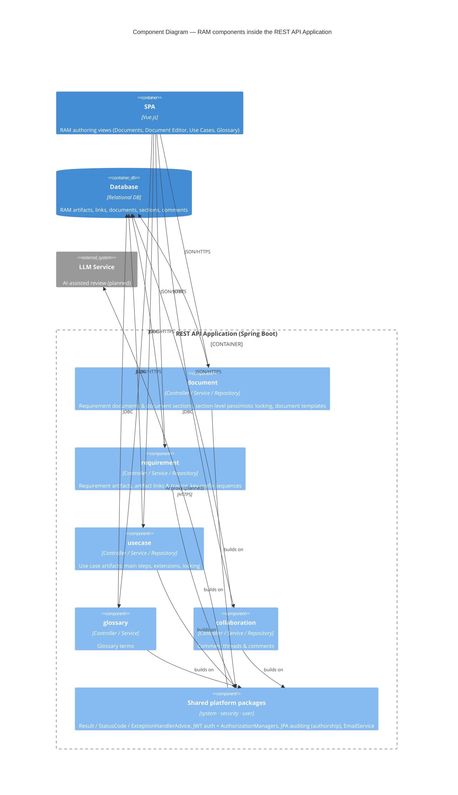

# Architectural Design

> Scope: RAM's place in the platform — the RAM **component view** and the **cross-cutting subsystems** every RAM area builds on. The platform-wide C4 context/container views and the platform conventions are owned by [`../../pulse-core/design/architectural-design.md`](../../pulse-core/design/architectural-design.md) and cited here, not redrawn.
> See: ../../pulse-core/design/architectural-design.md (platform architecture-of-record), ../requirements/software-requirements-specification.md (which owns RAM's operating environment, constraints, and assumptions/dependencies), ../requirements/vision-and-scope.md

This is a **cross-cutting** design doc, not a per-UC-area one. It is the design-of-record for how the RAM module sits inside the Project Pulse host platform — the RAM component view and the cross-cutting subsystems every RAM area builds on. The platform-wide context and container views, the platform conventions, and the deployment pipeline are owned by the platform architecture-of-record ([`../../pulse-core/design/architectural-design.md`](../../pulse-core/design/architectural-design.md)) and cited here. The operating environment, design and implementation constraints, and architecture-level assumptions and dependencies that frame this architecture are requirements-level concerns specified in the SRS's Overall Description ([../requirements/software-requirements-specification.md](../requirements/software-requirements-specification.md#overall-description)); this doc cites them by their stable IDs (`OE-*`, `CO-*`, `AS-*`, `DE-*`). The cross-area domain model is owned by the SRS's Business Domain Model and cited, not redrawn, here. The per-area design docs (`doc.md`, `art.md`, …) cite the platform **Container** diagram (in pulse-core) and the RAM **Component** diagram here rather than redrawing them.

The architecture RAM is **given** (a module inside a fixed host, per `CO-1` / `OE-4`) is not decided here — the platform context and container views live in the platform architecture-of-record and are cited below; this doc draws only the RAM-specific component view and cross-cutting subsystems.

## Platform context

RAM runs inside the Project Pulse platform, so its host architecture — the C4 **System Context** and **Container** views (SPA, REST API, relational DB, plus the Gmail and LLM integrations) — is the platform's, not RAM's. It is owned by the platform architecture-of-record, [`../../pulse-core/design/architectural-design.md`](../../pulse-core/design/architectural-design.md#system-context-diagram); RAM cites it rather than redrawing it.

What RAM contributes to each shared container:

- **SPA** — the requirements authoring views (documents, document editor, use cases, glossary; graph, ReqLint, and AI panels as they ship).
- **REST API** — the `ram/*` bounded contexts (see the Component Diagram below) plus an AI proxy to the external LLM service.
- **Database** — the requirement artifacts, artifact links, requirement documents, document sections, and comment threads.

## Component Diagram

This Level 3 view zooms into the **REST API Application** to show the RAM module's internal structure: one component per DDD bounded context, sitting on the shared platform packages. Each maps to a package under `backend/src/main/java/team/projectpulse/ram/` — a Level-2 area doc designs the inside of one of these boxes, this diagram fixes the boxes and how they relate.

The five RAM components are the bounded contexts that exist today; the areas still specified but not yet packaged (validation/ReqLint, AI assistants, export/import) will add their own components beside these as they are built — see Cross-Cutting Subsystems below. On the **SPA** side the layering mirrors the rest of Project Pulse: RAM pages (`frontend/src/pages/ram/`) call a per-domain API client (`frontend/src/apis/ram/`) over the shared Axios instance that attaches the Bearer token and unwraps the `Result` envelope; that layering is a platform convention (next section), not redrawn per area.

## Architectural Conventions

RAM **inherits the Project Pulse platform conventions rather than defining its own** — they are platform-wide facts that predate RAM (a module inside a fixed host, per `CO-1` / `OE-4`). In brief: REST endpoints under `/api/v1` returning the `Result` envelope (`flag`/`code`/`message`/`data`) with errors via a global `ExceptionHandlerAdvice`; one DDD bounded context per package owning its full vertical slice (entity → repository → service → controller → DTO + `Converter<S,T>`, no Lombok); JWT auth via URL rules in `SecurityConfiguration` plus `AuthorizationManager` beans for ownership/membership, role hierarchy `admin > instructor > student`; relational persistence with schema delivered as Flyway migrations (dev `ddl-auto: create` + `DataInitializer`, prod Flyway only).

The **canonical statement of these conventions is the platform architecture-of-record, [`../../pulse-core/design/architectural-design.md`](../../pulse-core/design/architectural-design.md#architectural-conventions)** (its Architectural Conventions section) — this doc deliberately does **not** restate the full normative list, only enough to orient a reader of the exported design. RAM code follows them verbatim; a Level-2 area doc records only where it *deviates*.

## Cross-Cutting Subsystems

Each RAM area builds on a small set of **shared subsystems** rather than reinventing them; a Level-2 area design should *plug into* the relevant row, not redesign it. The FR families are specified in the SRS's Non-Use Case Functional Requirements; "owner" is the package that provides the machine. Build status is the per-subsystem view of what `../traceability.md` tracks per use case.

| Subsystem | FR family | Owner | Status | How an area plugs in |
|---|---|---|---|---|
| Section locking | `FR-LOCK-*` | `ram/document` (`DocumentSectionLock`), `ram/usecase` (`UseCaseLock`) | ✅ built | Acquire/release a lock on the authoring destination before edit (UC-DOC-2 / UC-DOC-6) |
| Document templates | `FR-TPL-*` | `ram/document/template` (`DocumentTemplateRegistry`) | ✅ built | Provision a document's sections from its `DocumentType` template |
| Collaboration | `FR-COL-*` | `ram/collaboration` | ✅ threads built; real-time presence/broadcast planned (UC-COL-1) | Attach comment threads to an artifact / destination |
| Glossary | `FR-GLO-*` | `ram/glossary` | ✅ built | Terminology lookups and invariants |
| Authorship & history | `FR-HIS-*` | `system` (JPA auditing, `PeerEvaluationUserAuditorAware`) | ✅ built (platform) | Inherited via JPA auditing — no per-area work |
| Notifications | `FR-NOT-*` | `system` (`EmailService`, `WeeklyReminderScheduler`) | ✅ built (platform) | Call `EmailService`; Gmail over SMTP |
| Security / RBAC | `FR-SEC-*` | `security` (`AuthorizationManager` beans) | ✅ built (platform) | Add a URL rule + an ownership/membership manager |
| Autosave | `FR-SAVE-*` | `ram/document` (section save) + client-side debounce | ◑ server persistence built | Persist edits through the document-section save endpoint |
| Validation (ReqLint) | `FR-VAL-*` | — (planned) | ⬜ specified, not built | Deterministic structural checks (UC-VAL-1) |
| AI assistants | `FR-AI-*` | — (LLM proxy, planned) | ⬜ specified, not built | Proxy to the external LLM service |
| Export / Import | `FR-EXP-*` / `FR-IMP-*` | — (planned) | ⬜ specified, not built | — |

## Operating Environment, Constraints, Assumptions, and Dependencies

RAM's operating environment (`OE-*`), design and implementation constraints (`CO-*`), and architecture-level assumptions and dependencies (`AS-6`…, `DE-*`) are requirements-level concerns owned by the SRS — see its Overall Description ([Operating Environment](../requirements/software-requirements-specification.md#operating-environment), [Design and Implementation Constraints](../requirements/software-requirements-specification.md#design-and-implementation-constraints), [Assumptions and Dependencies](../requirements/software-requirements-specification.md#assumptions-and-dependencies)). The architecture in this doc realizes them; it does not redefine them.

## Deployment

RAM ships as part of Project Pulse (`CO-1`, `INT-1`) — the same Vue.js SPA, Spring Boot REST API, and relational database, through the same pipeline and environments — so deployment is platform-owned: see the platform [Deployment](../../pulse-core/design/architectural-design.md#deployment) section. RAM's only delta is that schema changes for the requirements graph ship as versioned Flyway migrations applied during deployment, like the rest of the platform. The runtime integrations RAM relies on (the LLM service) are specified in the SRS's Operating Environment and External Interface Requirements sections.
