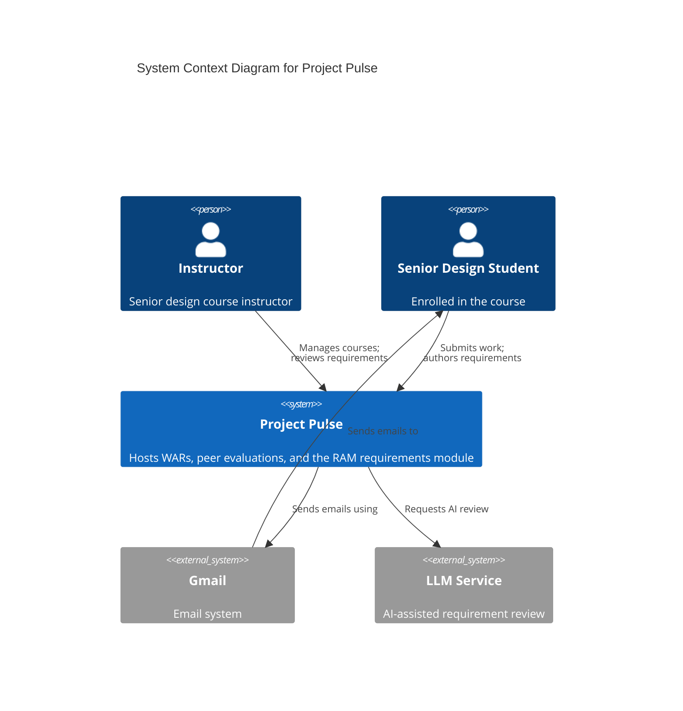
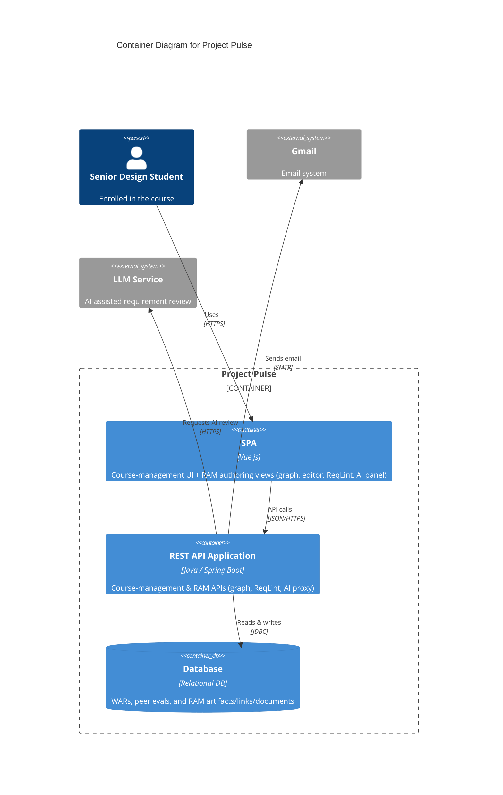

# Architectural Design

> Scope: the host architecture RAM is constrained to — the system context and container views — and how RAM is deployed.
> See: ../requirements/software-requirements-specification.md (which owns RAM's operating environment, constraints, and assumptions/dependencies, and references this doc for architecture and deployment), ../requirements/vision-and-scope.md

This is a **cross-cutting** design doc, not a per-UC-area one. It is the design-of-record for how the RAM module sits inside the Project Pulse host platform — the system context and container views and how RAM is deployed. The operating environment, design and implementation constraints, and architecture-level assumptions and dependencies that frame this architecture are requirements-level concerns and are specified in the SRS's Overall Description ([../requirements/software-requirements-specification.md](../requirements/software-requirements-specification.md#overall-description)); this doc cites them by their stable IDs (`OE-*`, `CO-*`, `AS-*`, `DE-*`). The per-area design docs (`doc.md`, `art.md`, …) cite the views here (especially the **Container Diagram**) rather than redrawing them.

The C4 diagrams depict architecture RAM is **given** (a module inside a fixed host, per `CO-1` / `OE-4`), not architecture decided here.

## System Context Diagram

The Level 1: Context Diagram for the Project Pulse system provides a high-level overview of its interactions with users and external systems. Project Pulse is the central platform for senior-design course delivery: instructors create courses, author Weekly Activity Report (WAR) and peer evaluation templates, and review submissions, while students submit WARs, complete peer evaluations, and view scores and feedback. The Requirements Authoring & Management (RAM) module runs inside this same platform, where students and instructors author, link, and validate requirements as a connected graph of atomic artifacts. Project Pulse integrates with two external systems: the Gmail system, which delivers automated email notifications (reminders, updates) to students and instructors — the context diagram shows the student notification path as representative — and an external LLM service (e.g., OpenAI), which the RAM module calls for AI-assisted requirement review. This diagram highlights the instructor and student as primary users, the central functionality of Project Pulse including the RAM module, and the platform's reliance on Gmail for communication and the LLM service for AI assistance, offering a clear picture of the system's operational scope and interactions.

## Container Diagram

The Level 2: Container Diagram for the Project Pulse system provides a detailed view of its internal architecture, illustrating how the system components interact. The system is composed of three key containers — the **SPA (Single Page Application)**, the **REST API Application**, and the **Database** — supported by integration with the **Gmail System** for email communication and an external **LLM Service** (e.g., OpenAI) for AI-assisted requirement review. The **SPA**, built with Vue.js, is delivered to users' browsers and provides the interface for both the course-management workflows (submitting WARs and peer evaluations) and the RAM module's requirements authoring views: graph navigation, document editing, the ReqLint validation sidebar, and the AI assistant panel. The **REST API Application**, implemented using Java and Spring Boot, delivers the SPA, processes REST API calls, and manages interactions with the **Database**; for the RAM module it exposes endpoints for the requirements graph, ReqLint validation, and an AI proxy to the LLM service. The **Database**, a relational database, stores course-management data (WARs and peer evaluation submissions) alongside the RAM module's requirement artifacts, links, documents, and document sections, with CRUD operations executed through the REST API. The REST API integrates with the **Gmail System** over SMTP to send automated notifications and with the external **LLM Service** to support AI-assisted review. The steps below trace the WAR submission flow as a representative example:

1. Visit the Project Pulse Website: The Senior Design student begins by accessing the Project Pulse system through their browser at the URL https://projectpulse.team.
2. Deliver the SPA to the student's Browser: The REST API Application (built using Java and Spring Boot) serves the Single Page Application (SPA, built with Vue.js) to the student's browser. This provides the user interface that students interact with.
3. Submit WARs and Peer Evaluations: The student uses the SPA to complete and submit Weekly Activity Reports (WARs) and peer evaluations through the interface.
4. Make REST API Calls to the Backend: The SPA communicates with the REST API Application by making REST API calls to process and handle the submissions from the student. These calls allow the backend to manage the application's logic and facilitate data processing.
5. CRUD Operations with the Database: The REST API Application performs CRUD (Create, Read, Update, Delete) operations on the Database, which is a relational database. The database securely stores the submitted WARs and peer evaluations.
6. Send Emails via SMTP: The REST API Application interacts with the Gmail system using SMTP to send automated email notifications (e.g., reminders, submission confirmations) to the student or instructor, as necessary.
7. Receive Emails: Finally, the student (or instructor) receives email notifications generated by the Gmail system, completing the interaction loop.

This sequence of actions outlines how the Project Pulse system components collaborate to facilitate functionality for the student while ensuring efficient data management and communication. RAM-specific flows (graph navigation, document editing, ReqLint validation, and AI-assisted review) follow the same SPA → REST API → Database path, with the REST API additionally proxying requests to the external LLM service.

## Operating Environment, Constraints, Assumptions, and Dependencies

RAM's operating environment (`OE-*`), design and implementation constraints (`CO-*`), and architecture-level assumptions and dependencies (`AS-6`…, `DE-*`) are requirements-level concerns owned by the SRS — see its Overall Description ([Operating Environment](../requirements/software-requirements-specification.md#operating-environment), [Design and Implementation Constraints](../requirements/software-requirements-specification.md#design-and-implementation-constraints), [Assumptions and Dependencies](../requirements/software-requirements-specification.md#assumptions-and-dependencies)). The architecture in this doc realizes them; it does not redefine them.

## Deployment

RAM is a module within the existing Project Pulse application (CO-1, INT-1), so it is deployed, operated, and maintained as part of Project Pulse rather than as a separate system — the same Vue.js single-page application, Spring Boot REST API, and relational database, through the same pipeline and environments. The target deployment environment and operational specifics — Microsoft Azure App Service, GitHub Actions CI/CD, the external OpenAI LLM integration, and load testing for peak usage — are given in Vision and Scope's Deployment Considerations and are not repeated here; the runtime integrations RAM relies on are specified in the SRS's Operating Environment and External Interface Requirements sections. Schema changes for the requirements graph are delivered as versioned database migrations applied during deployment.
