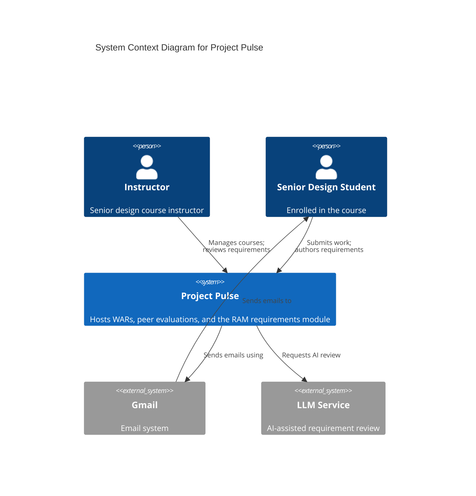
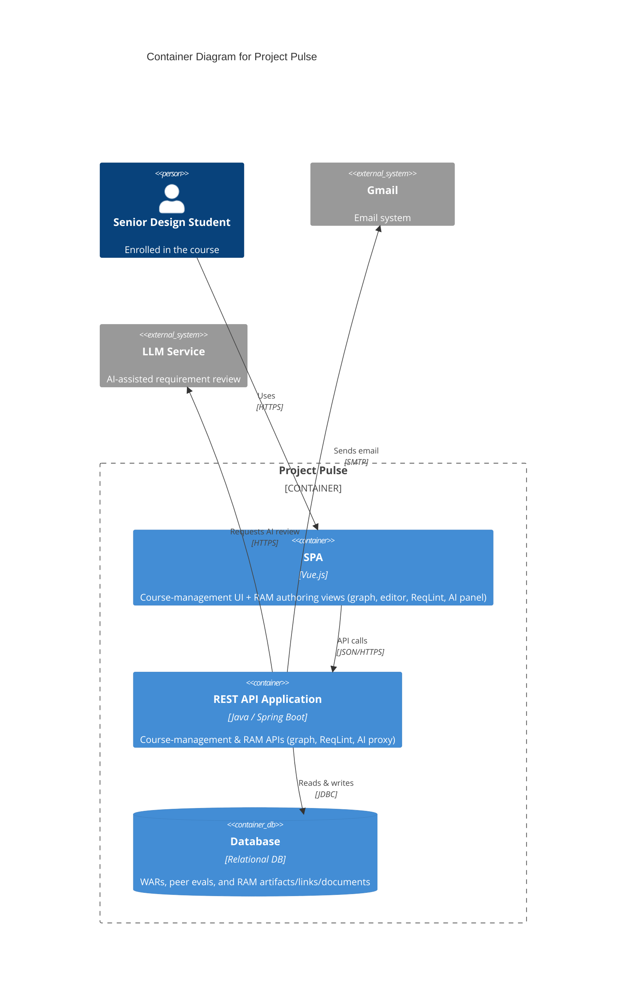
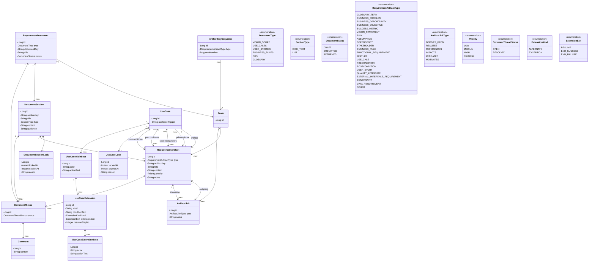

# **Requirements Authoring & Management (RAM) Tool**

# **Software Requirements Specification**

# **Version \<1.0\>**

# **Revision History**

| Date          | Version | Description | Author   |
| ------------- | ------- | ----------- | -------- |
| \<dd/mmm/yy\> | \<x.x\> | \<details\> | \<name\> |
|               |         |             |          |
|               |         |             |          |
|               |         |             |          |

# **Table of Contents**

- [1. Introduction](#1-introduction)
  - [1.1 The Purpose of the Project](#11-the-purpose-of-the-project)
  - [1.2 The Purpose of this Document](#12-the-purpose-of-this-document)
  - [1.3 Document Conventions](#13-document-conventions)
  - [1.4 References](#14-references)
- [2. Project Glossary](#2-project-glossary)
- [3. Vision and Scope](#3-vision-and-scope)
- [4. Software Architecture](#4-software-architecture)
  - [4.1 System Context Diagram](#41-system-context-diagram)
  - [4.2 Container Diagram](#42-container-diagram)
  - [4.3 Operating Environment](#43-operating-environment)
  - [4.4 Design and Implementation Constraints](#44-design-and-implementation-constraints)
  - [4.5 Assumptions and Dependencies](#45-assumptions-and-dependencies)
- [5. Functional Requirements](#5-functional-requirements)
  - [5.1 Use Cases](#51-use-cases)
  - [5.2 Non-Use Case Functional Requirements](#52-non-use-case-functional-requirements)
    - [5.2.1 Autosave and Persistence Requirements](#521-autosave-and-persistence-requirements)
    - [5.2.2 Authoring Destination Locking Requirements](#522-authoring-destination-locking-requirements)
    - [5.2.3 Real-Time Collaboration Requirements](#523-real-time-collaboration-requirements)
    - [5.2.4 Validation and Consistency Requirements (ReqLint)](#524-validation-and-consistency-requirements-reqlint)
    - [5.2.5 AI/LLM Integration Requirements](#525-aillm-integration-requirements)
    - [5.2.6 Template and Standards Enforcement Requirements](#526-template-and-standards-enforcement-requirements)
    - [5.2.7 Terminology and Glossary Requirements](#527-terminology-and-glossary-requirements)
    - [5.2.8 Authorship Metadata and Document Versioning Requirements](#528-authorship-metadata-and-document-versioning-requirements)
    - [5.2.9 Security and Authorization Requirements](#529-security-and-authorization-requirements)
    - [5.2.10 Export and Formatting Requirements](#5210-export-and-formatting-requirements)
    - [5.2.11 Project Source Material and Import Requirements](#5211-project-source-material-and-import-requirements)
    - [5.2.12 Performance and Reliability Requirements](#5212-performance-and-reliability-requirements)
    - [5.2.13 Notification Requirements](#5213-notification-requirements)
- [6. Business Rules](#6-business-rules)
- [7. Data Requirements](#7-data-requirements)
  - [7.1 Business Domain Model](#71-business-domain-model)
  - [7.2 Data Acquisition, Integrity, Retention, and Disposal](#72-data-acquisition-integrity-retention-and-disposal)
- [8. External Interface Requirements](#8-external-interface-requirements)
  - [8.1 User Interfaces](#81-user-interfaces)
  - [8.2 Software Interfaces](#82-software-interfaces)
  - [8.3 API Document](#83-api-document)
  - [8.4 Hardware Interfaces](#84-hardware-interfaces)
  - [8.5 Communications Interfaces](#85-communications-interfaces)
- [9. Quality Attributes](#9-quality-attributes)
  - [9.1 Usability](#91-usability)
  - [9.2 Performance](#92-performance)
  - [9.3 Security](#93-security)
  - [9.4 Safety](#94-safety)
  - [9.5 Availability](#95-availability)
  - [9.6 Robustness](#96-robustness)
  - [9.7 Scalability and Interoperability](#97-scalability-and-interoperability)
  - [9.8 Maintainability](#98-maintainability)
- [10. Deployment](#10-deployment)
- [11. Internationalization and Localization Requirements](#11-internationalization-and-localization-requirements)
- [12. Other Requirements](#12-other-requirements)

# **Software Requirements Specification**

_The SRS states as completely as necessary the system's behaviors under various conditions, as well as desired system qualities such as performance, security, and usability etc._

_Numerous audiences rely on this SRS. When you write SRS, keep the following audience in mind._

- _Customers, the marketing department, and sales staff need to know what product they can expect to be delivered._
- _Project managers base their estimates of schedule, effort, and resources on the requirements._
- _Software development teams need to know what to build._
- _Testers use it to develop requirements-based tests, test plans, and test procedures._
- _Maintenance and support staff use it to understand what each part of the product is supposed to do._
- _Documentation writers base user manuals and help screens on the SRS and the user interface design._
- _Training personnel use the SRS and user documentation to develop educational materials._
- _Legal staff ensures that the requirements comply with applicable laws and regulations._
- _Subcontractors base their work on—and can be legally held to—the specified requirements._

# **1. Introduction**

## **1.1 The Purpose of the Project**

RAM (Requirements Authoring & Management) is a graph-first, model-driven requirements IDE for software-engineering and senior-design courses at TCU, delivered as a module within the **Project Pulse** platform. It exists because students today author requirements in generic, document-centric tools (Microsoft Word, Google Docs) that cannot model the structure, relationships, or semantics of requirements engineering; RAM instead lets student teams author, link, validate, trace, and review requirements as a connected graph of typed artifacts, supported by Socratic AI assistants that coach rather than author and by instructors who configure the teaching context and review submissions. Its users are students (authoring in teams), instructors, and course admins (configuring and reviewing), operating within the courses and teams Project Pulse already manages. The full business motivation — the problem and opportunity, business objectives, stakeholders, and scope — lives in the Vision and Scope document and is referenced here rather than repeated (see §3 and [vision-and-scope.md](vision-and-scope.md)).

## **1.2 The Purpose of this Document**

This Software Requirements Specification describes the external behavior and quality attributes of the RAM module for release 1.0: its architecture and operating environment (§4), functional requirements (§5 — the Use Cases document, [use-cases.md](use-cases.md), together with the non-use-case system behaviors in §5.2), the business rules it enforces as catalogued in the Business Rules document ([business-rules.md](business-rules.md), §6), its data model (§7), external interfaces (§8), quality attributes (§9), and deployment and other constraints (§10–§12). It is the reference against which RAM is built, tested, and maintained, and it aligns students, instructors, and developers on what the system does. Where another document is the source of truth for a topic, this SRS links to it rather than restating it.

## **1.3 Document Conventions**

- Identifier schemes are stable, append-only handles, independent of section numbering (renumbering sections never renumbers an ID). §5.2 functional requirements use `FR-<AREA>-<n>` (e.g., `FR-LOCK-2`); use cases use `UC-<AREA>-<n>` ([use-cases.md](use-cases.md)); business rules use `BR-<n>` ([business-rules.md](business-rules.md)). Product-generated artifact keys (e.g., `BO-3`, `RI-1`, `AS-6`, `UC-5`) follow a per-type running sequence, unique within a team, as defined under artifact key in the Project Glossary. SRS-local identifiers label architecture and quality items: `CO-*` (constraints), `OE-*` (operating environment), the §8 interface codes (`UI-*`, `SI-*`, `CI-*`), and the §9 quality-attribute codes (`USE-*`, `PER-*`, `SEC-*`, `SAF-*`, `AVL-*`, `ROB-*`, `SCA-*`, `INT-*`).
- §5.2 functional requirements are written as EARS-style "shall" statements. A use case is itself a high-level functional requirement, so its steps and Associated Information are its detailed specification and are not restated as separate §5.2 FRs.
- Markdown is the canonical format and cross-references are live links. Square-bracketed italic passages are template author-guidance, not requirements.
- This document does not duplicate content owned by another document: each topic has a single source of truth and is referenced here (for example, the Project Glossary, Vision and Scope, Use Cases, and Business Rules documents are linked from §2, §3, §5.1, and §6 rather than copied in).

## **1.4 References**

- Project Glossary: [project-glossary.md](project-glossary.md)
- Vision and Scope: [vision-and-scope.md](vision-and-scope.md)
- Software Architecture: [software-requirements-specification.md](software-requirements-specification.md)
- Use Cases: [use-cases.md](use-cases.md)
- Business Rules: [business-rules.md](business-rules.md)
- User Interface Wireframe/Prototypes: URL (N/A)
- Business Domain Model: [§7.1 Business Domain Model](#71-business-domain-model)
- API Document: [Project Pulse API](https://app.swaggerhub.com/apis/Washingtonwei/project-pulse)

# **2. Project Glossary**

The Project Glossary is available here: [project-glossary.md](project-glossary.md).

# **3. Vision and Scope**

The Vision and Scope document is available here: [vision-and-scope.md](vision-and-scope.md).

# **4. Software Architecture**

## **4.1 System Context Diagram**

The Level 1: Context Diagram for the Project Pulse system provides a high-level overview of its interactions with users and external systems. Project Pulse is the central platform for senior-design course delivery: instructors create courses, author Weekly Activity Report (WAR) and peer evaluation templates, and review submissions, while students submit WARs, complete peer evaluations, and view scores and feedback. The Requirements Authoring & Management (RAM) module runs inside this same platform, where students and instructors author, link, and validate requirements as a connected graph of atomic artifacts. Project Pulse integrates with two external systems: the Gmail system, which delivers automated email notifications (reminders, updates) to students and instructors — the context diagram shows the student notification path as representative — and an external LLM service (e.g., OpenAI), which the RAM module calls for AI-assisted requirement review. This diagram highlights the instructor and student as primary users, the central functionality of Project Pulse including the RAM module, and the platform's reliance on Gmail for communication and the LLM service for AI assistance, offering a clear picture of the system's operational scope and interactions.

## **4.2 Container Diagram**

The Level 2: Container Diagram for the Project Pulse system provides a detailed view of its internal architecture, illustrating how the system components interact. The system is composed of three key containers — the **SPA (Single Page Application)**, the **REST API Application**, and the **Database** — supported by integration with the **Gmail System** for email communication and an external **LLM Service** (e.g., OpenAI) for AI-assisted requirement review. The **SPA**, built with Vue.js, is delivered to users' browsers and provides the interface for both the course-management workflows (submitting WARs and peer evaluations) and the RAM module's requirements authoring views: graph navigation, document editing, the ReqLint validation sidebar, and the AI assistant panel. The **REST API Application**, implemented using Java and Spring Boot, delivers the SPA, processes REST API calls, and manages interactions with the **Database**; for the RAM module it exposes endpoints for the requirements graph, ReqLint validation, and an AI proxy to the LLM service. The **Database**, a relational database, stores course-management data (WARs and peer evaluation submissions) alongside the RAM module's requirement artifacts, links, documents, and document sections, with CRUD operations executed through the REST API. The REST API integrates with the **Gmail System** over SMTP to send automated notifications and with the external **LLM Service** to support AI-assisted review. The steps below trace the WAR submission flow as a representative example:

1. Visit the Project Pulse Website: The Senior Design student begins by accessing the Project Pulse system through their browser at the URL https://projectpulse.team.
2. Deliver the SPA to the student's Browser: The REST API Application (built using Java and Spring Boot) serves the Single Page Application (SPA, built with Vue.js) to the student's browser. This provides the user interface that students interact with.
3. Submit WARs and Peer Evaluations: The student uses the SPA to complete and submit Weekly Activity Reports (WARs) and peer evaluations through the interface.
4. Make REST API Calls to the Backend: The SPA communicates with the REST API Application by making REST API calls to process and handle the submissions from the student. These calls allow the backend to manage the application's logic and facilitate data processing.
5. CRUD Operations with the Database: The REST API Application performs CRUD (Create, Read, Update, Delete) operations on the Database, which is a relational database. The database securely stores the submitted WARs and peer evaluations.
6. Send Emails via SMTP: The REST API Application interacts with the Gmail system using SMTP to send automated email notifications (e.g., reminders, submission confirmations) to the student or instructor, as necessary.
7. Receive Emails: Finally, the student (or instructor) receives email notifications generated by the Gmail system, completing the interaction loop.

This sequence of actions outlines how the Project Pulse system components collaborate to facilitate functionality for the student while ensuring efficient data management and communication. RAM-specific flows (graph navigation, document editing, ReqLint validation, and AI-assisted review) follow the same SPA → REST API → Database path, with the REST API additionally proxying requests to the external LLM service.

## **4.3 Operating Environment**

OE-1: RAM operates as a module of the Project Pulse web application and shall run in the current released versions of Google Chrome, Mozilla Firefox, Microsoft Edge, and Apple Safari.

OE-2: The Project Pulse server shall run the REST API as a Java/Spring Boot application on a supported Java Virtual Machine, serve the Vue.js single-page application to clients, and persist data in a relational database.

OE-3: Users shall access RAM over HTTPS from the public internet, requiring no client software beyond a web browser.

OE-4: RAM shall be deployed within the existing Project Pulse deployment and coexist with the existing WAR and peer-evaluation functionality, sharing the same single-page application, REST API, and database.

OE-5: RAM shall reach the external LLM service over HTTPS and the Gmail system over SMTP for AI-assisted review and email notifications, respectively.

## **4.4 Design and Implementation Constraints**

CO-1: RAM shall be implemented as a module within the existing Project Pulse codebase, reusing its Vue.js single-page application, Java/Spring Boot REST API, and relational database rather than introducing a separate system.

CO-2: The client shall be implemented in Vue.js and the backend in Java using the Spring Boot framework.

CO-3: Requirement artifacts, links, documents, and document sections shall be persisted in the existing Project Pulse relational database.

CO-4: User authentication shall be delegated to the host platform's institutional Single Sign-On (SSO); RAM shall not implement a separate login mechanism.

CO-5: RAM shall comply with FERPA when storing and transmitting student educational records.

CO-6: All calls to the external LLM service shall be routed through the REST API's AI proxy so that service credentials remain server-side and are never exposed to the browser.

CO-7: Email notifications shall be sent through the existing Gmail SMTP integration.

## **4.5 Assumptions and Dependencies**

_Assumptions and dependencies are graph artifacts with **team-wide** key sequences (`AS-*`, `DE-*`) that are unique within a team (BR-5) — documents are views over one shared graph, so the keys do not restart per document. The business-level assumptions `AS-1`…`AS-5` are in Vision and Scope §2.6; the architecture-level assumptions below continue that same `AS-*` sequence._

AS-6: Users have a supported web browser and a reliable internet connection.

AS-7: The external LLM service (e.g., OpenAI) remains available and its API contract stays stable for the integration RAM relies on.

AS-8: Project Pulse's existing course, course section, team, and user data is accurate and current; RAM reuses this data rather than maintaining its own copy.

DE-1: RAM depends on Project Pulse for authentication and Single Sign-On, the course/course section/team data model, and the course admin, instructor, and student roles.

DE-2: AI-assisted requirement review depends on the external LLM service; if it is unavailable, the AI features are unavailable while the rest of RAM continues to operate.

DE-3: Email notifications depend on the Gmail SMTP integration provided by Project Pulse.

# **5. Functional Requirements**

## **5.1 Use Cases**

The Use Cases document is available here: [use-cases.md](use-cases.md).

Each **use case is itself a functional requirement**, expressed at a high level: it states a user goal and the system's behavior in achieving it. Within a use case, the individual steps whose subject is "the system" — together with the use case's **Associated Information** (validation rules, duplication rules, search and display strategies, deletion strategies, notifications, and the like) — are the **finer-grained functional requirements** that detail that behavior. The use cases therefore carry the full functional specification for every user-initiated workflow, and those requirements are deliberately **not restated** here; doing so would duplicate the specification and create two copies to keep in sync. Section 5.2 below complements the use cases by capturing the remaining functional behaviors that are _not_ user-initiated workflows (system-driven, event-driven, global, or background). Together, Sections 5.1 and 5.2 define the complete set of functional requirements for the RAM tool, including a small number of capabilities deferred to a future release, which are labeled as such.

## **5.2 Non-Use Case Functional Requirements**

Not all functional behaviors of the RAM tool are best expressed as use cases. This section captures system-driven, event-driven, global, or background behaviors using structured "shall" statements following principles inspired by the EARS (Easy Approach to Requirements Syntax) format.

These requirements describe system-level functions that support or enable the use cases but are not user-initiated workflows.

### *5.2.1 Autosave and Persistence Requirements*

**FR-SAVE-1 (State-Driven):** While a student is actively editing an authoring destination, the system shall automatically save the authoring destination's content at least every 10 seconds.

**FR-SAVE-2 (Event-Driven):** When a student leaves an authoring destination or navigates away, the system shall immediately persist the latest content of that authoring destination.

**FR-SAVE-3 (Ubiquitous):** The system shall ensure that no more than 10 seconds of work is lost in the event of a browser crash, disconnection, or power failure.

**FR-SAVE-4 (Event-Driven):** When an autosave operation fails, the system shall notify the user and retry in the background without interrupting editing.

### *5.2.2 Authoring Destination Locking Requirements*

**FR-LOCK-1 (Event-Driven):** When a student begins editing an authoring destination, the system shall acquire an exclusive lock for that authoring destination for that student.

**FR-LOCK-2 (Ubiquitous):** The system shall prevent other students from modifying an authoring destination that is currently locked.

**FR-LOCK-3 (Event-Driven):** When a student stops interacting with an authoring destination, the system shall release the lock for that authoring destination.

**FR-LOCK-4 (State-Driven Timeout):** While an authoring destination lock has been held without activity for longer than a configurable timeout (default 60 seconds), the system shall automatically release the lock.

**FR-LOCK-5 (Event-Driven):** When a lock is acquired or released, the system shall broadcast the updated lock state to all team members viewing the document.

### *5.2.3 Real-Time Collaboration Requirements*

**FR-COL-1 (State-Driven):** While multiple students are connected to the same document, the system shall display the presence of each connected collaborator and the current lock state of each document section and use case.

**FR-COL-2 (Event-Driven):** When a collaborator joins a document, the system shall notify all currently connected users.

**FR-COL-3 (Event-Driven):** When a collaborator disconnects, the system shall notify all currently connected users within 2 seconds.

**FR-COL-4 (Ubiquitous):** The system shall ensure that real-time updates do not overwrite or corrupt content saved by other collaborators.

### *5.2.4 Validation and Consistency Requirements (ReqLint)*

**FR-VAL-1 (Ubiquitous):** The system shall provide a ReqLint validation engine that evaluates a requirement document against the applicable deterministic validation rules and produces a structured list of issues, each classified by severity (ERROR, WARNING, INFO) and tied to the document section or item it concerns. This engine is invoked both on student request (UC-VAL-1) and by the periodic background re-evaluation of FR-VAL-2.

**FR-VAL-2 (State-Driven, Optional):** While a student edits a document section, the system shall periodically re-evaluate the document section for ambiguity, missing required fields, or stylistic violations.

**FR-VAL-3 (Ubiquitous):** The system shall provide unique identifiers for all requirements, document sections, glossary terms, and use cases to support traceability.

**FR-VAL-4 (Event-Driven):** When a glossary term is renamed, the system shall identify and update or flag all references to that term across all documents in the project.

**FR-VAL-5 (Ubiquitous):** The system shall verify the presence of all mandatory document sections defined in the chosen template.

**FR-VAL-6 (Ubiquitous):** The system shall flag ambiguous, unverifiable, or subjective wording based on instructor-defined rules and defaults.

### *5.2.5 AI/LLM Integration Requirements*

RAM's AI assistance is delivered through Socratic assistants whose primary purpose is educational: to train students to author high-quality requirements rather than to hand them finished text. Where a design choice trades productivity against educational value, educational value governs.

**FR-AI-1 (Event-Driven):** When a student requests elicitation help, the system shall transmit to the elicitation assistant the context for the session's scope — for a session targeting a document section or use case, that target's context and the applicable template context; for a project-wide session, the project's current requirements coverage — together with the course section's teaching context, and shall return coaching for the student's own elicitation — candidate questions to put to the client (in plain, non-technical language), suggested follow-ups, and checks that help the student verify the client's answers — rather than finished requirement content.

**FR-AI-2 (Optional):** Where AI assistance is enabled, the critique assistant shall return at least one finding for clarity, consistency, completeness, or testability, each accompanied by an instructive rationale.

**FR-AI-3 (Ubiquitous):** The system shall not modify student-authored content with assistant-generated text without an explicit confirmation action by the student.

**FR-AI-4 (Event-Driven):** When a student requests an explanation for a flagged validation or critique issue, the tutor assistant shall return an explanation describing the rule or weakness involved and a suggested fix.

**FR-AI-5 (Ubiquitous):** The system shall visually distinguish assistant-generated suggestions from student-authored content until the student accepts them.

**FR-AI-6 (Ubiquitous):** The system shall include the course section's teaching context in the context provided to every assistant so that assistant feedback reflects the standards, common mistakes, and thinking order it defines.

**FR-AI-7 (State-Driven):** While an instructor has disabled a given assistant for a course section, the system shall make that assistant's corresponding feature unavailable to that course section's students; the drafting assistant shall be disabled by default.

**FR-AI-8 (Event-Driven):** When an assistant proposes concrete content, the system shall apply it only after an explicit, per-item acceptance by the student, and shall not provide an "accept all" action.

**FR-AI-9 (Ubiquitous):** The system shall accompany every assistant finding or proposal with an instructive rationale phrased for student learning.

**FR-AI-10 (Event-Driven):** When a student starts a practice client interview, the client role-play assistant shall respond in a non-technical client persona and shall not author requirements on the student's behalf.

**FR-AI-11 (Event-Driven):** When a student requests a review of planned client questions, the system shall flag technical jargon and suggest plain-language phrasings, each accompanied by a rationale.

**FR-AI-12 (Event-Driven):** When a student submits plain-language notes for translation, the structuring assistant shall propose candidate structured requirements, each traceable to its source note and applied only through the acceptance action of FR-AI-8.

**FR-AI-13 (State-Driven):** While the external LLM service is unavailable, the system shall make AI features unavailable and shall keep the rest of RAM operational.

**FR-AI-14 (Ubiquitous):** Where a team has imported project source material, the system shall make it available to the AI assistants as context for elicitation, critique, and drafting.

**FR-AI-15 (Event-Driven):** When a student requests elicitation help, the elicitation assistant shall perform a gap analysis scoped to the session — for a session targeting a document section or use case, of that target against its template; for a project-wide session with no target selected, of the project's current requirements coverage across its documents and sections against what a complete set requires — and return candidate interview questions for the gaps it identifies.

**FR-AI-16 (Ubiquitous):** The system shall include each assistant's instructor-authored assistant instructions in the context provided to that assistant so that the assistant's role, persona, and boundaries reflect the instructor's per-assistant configuration.

**FR-AI-17 (Event-Driven):** When a student excludes the imported project source material for an elicitation session, the system shall ground that session's gap analysis solely on the team's current drafted requirements and shall omit the project source material from the elicitation assistant's context for that session.

**FR-AI-18 (Event-Driven):** When a student asks the project assistant for help, the system shall transmit the project's current requirements coverage, the imported project source material, and the course section's teaching context to the project assistant, and shall return orientation, answers about project status and coverage, navigation to the relevant document or artifact, and recommended next actions, without authoring requirement content.

**FR-AI-19 (Event-Driven):** When the project assistant recommends a specialized assistant or an authoring action, the system shall route the student into the corresponding use case and shall honor that assistant's per-course-section enablement.

**FR-AI-20 (Event-Driven):** When the drafting assistant is enabled and a student requests a draft, the system shall return a structural skeleton or clearly-marked candidate requirements derived from the student's prompt, applied only through the acceptance action of FR-AI-8.

**FR-AI-21 (Event-Driven):** When a student requests a whole-project review, the critique assistant shall evaluate the team's requirement documents together and return cross-document findings — covering completeness gaps, coverage and traceability holes, inconsistencies, and conflicts across the documents — each accompanied by an instructive rationale, and shall author no requirement content.

**FR-AI-22 (Ubiquitous):** The system shall include the course section's cross-document review criteria in the context provided to the critique assistant for a whole-project review, so that the review applies the instructor-configured criteria.

**FR-AI-23 (State-Driven):** While a course section's cross-document review criteria are undefined, the system shall make the whole-project review unavailable to that course section's students.

### *5.2.6 Template and Standards Enforcement Requirements*

The initial release ships fixed, built-in templates, and the enforcement requirements (FR-TPL-1, FR-TPL-3) apply to them. Template customization — letting a course admin or instructor author or edit templates (FR-TPL-2) — is **deferred to a future release and is not part of the MVP scope** (see Vision and Scope §4.2.2). FR-TPL-2 is retained here, with its ID, so the intent is not lost.

**FR-TPL-1 (Ubiquitous):** The system shall enforce the structure, required document sections, and metadata defined by the active template (e.g., Wiegers, IEEE, RUP, custom).

**FR-TPL-2 (Deferred — future release):** When an authorized user (a course admin or instructor) updates a template, the system shall apply the updated structure to new documents but shall not retroactively modify existing documents without that user's approval.

**FR-TPL-3 (Ubiquitous):** The system shall apply the numbering and section-key scheme defined by the active template to all document sections within a document.

### *5.2.7 Terminology and Glossary Requirements*

**FR-GLO-1 (Ubiquitous):** The system shall provide a single authoritative definition for each glossary term within a project.

**FR-GLO-2 (Event-Driven):** When a glossary term is created or updated, the system shall ensure that references in documents link to the term.

**FR-GLO-3 (State-Driven):** While a student is writing or editing text, the system shall suggest existing glossary terms when there is a match.

### *5.2.8 Authorship Metadata and Document Versioning Requirements*

Authorship metadata (FR-HIS-4) is in scope for the initial release and is relied on by the authoring use cases. Document versioning — checkpointing, restoring, and retaining prior versions (FR-HIS-1, FR-HIS-2, FR-HIS-3) — is **deferred to a future release and is not part of the MVP scope** (see Vision and Scope §4.2; tracked as OI-4). The three deferred requirements are retained here, with their IDs, so the intent is not lost.

**FR-HIS-1 (Deferred — future release):** When a document section is saved, the system shall create a version checkpoint containing the user, timestamp, and diff.

**FR-HIS-2 (Deferred — future release):** The system shall allow authorized users to restore a previous version of a document section.

**FR-HIS-3 (Deferred — future release):** The system shall preserve historical versions for at least one academic term.

**FR-HIS-4 (Ubiquitous):** The system shall record, for every authored item (glossary term, requirement artifact, use case, document section, artifact link, and comment), the identity of its creator and creation timestamp and the identity of its last editor and last-modified timestamp. _(Cross-cutting; relied on by the authoring use cases — the create, edit, rename, and resolve flows across the glossary, documents, artifacts, links, and comments.)_

### *5.2.9 Security and Authorization Requirements*

**FR-SEC-1 (Ubiquitous):** The system shall authenticate users via institutional SSO before granting access to protected resources.

**FR-SEC-2 (Ubiquitous):** The system shall enforce role-based access control (student, instructor, course admin).

**FR-SEC-3 (Event-Driven):** When an unauthorized user attempts to access a protected resource, the system shall deny access and provide an appropriate error message.

### *5.2.10 Export and Formatting Requirements*

**FR-EXP-1 (Event-Driven):** When a user exports a document, the system shall generate a PDF, DOCX, or Markdown file consistent with the template-defined structure. _(Realizes UC-EXP-1; honors BR-1.)_

**FR-EXP-2 (Ubiquitous):** The system shall maintain table of contents, heading hierarchy, numbering, and formatting consistency in exported documents.

### *5.2.11 Project Source Material and Import Requirements*

**FR-IMP-1 (Event-Driven):** When a student imports client pitch materials, the system shall accept PDF (`.pdf`) and PowerPoint (`.pptx`, `.ppt`) files, reject any file whose type is not on this allowlist or whose size exceeds a configurable per-file size limit (default 25 MB), and store each accepted file as the team's project source material.

**FR-IMP-2 (Event-Driven):** When project source material is imported, the system shall extract its text content for reference and for use as assistant context, and shall report when extraction is incomplete (for example, for image-only or scanned files).

### *5.2.12 Performance and Reliability Requirements*

**FR-PERF-1 (State-Driven):** While up to 100 users are actively editing concurrently, the system shall propagate collaborator presence events (join, disconnect) within 1 second for 95% of events.

**FR-PERF-2 (Ubiquitous):** The system shall remain available at least 99% of the academic term.

### *5.2.13 Notification Requirements*

**FR-NOT-1 (Event-Driven):** When the system raises a review-workflow notification — a requirement document submitted for review, returned for revision, or accepted — it shall deliver it by email to the designated recipients through the Gmail SMTP integration. _(Supports UC-REV-1, UC-REV-2; honors DE-3.)_

**FR-NOT-2 (Ubiquitous):** The system shall not raise persistent or email notifications for routine authoring changes (creating, editing, or deleting glossary terms, requirement artifacts, artifact links, document sections, and use cases); such changes are propagated to connected collaborators in real time per FR-COL-1..4 instead.

# **6. Business Rules**

The Business Rules document is available here: [business-rules.md](business-rules.md). That catalog defines the `BR-*` identifiers cited by the Business Rules fields in the Use Cases document (access and ownership, identity and uniqueness, editing and locking, deletion integrity, review and submission, AI assistants, and project source material).

# **7. Data Requirements**

## **7.1 Business Domain Model**

RAM persists requirements as a team-scoped graph of typed requirement artifacts connected by typed artifact links, surfaced through requirement documents and their document sections — directly realizing the graph-first model described in the Project Glossary and Vision and Scope. The entities fall into four groups: ownership and documents, the requirements graph, use-case structure, and collaboration.

**Ownership and documents**

- **Team** — the ownership boundary for all requirements content (per BR-1); a team owns its documents, artifacts, and links.
- **RequirementDocument** — a document of a given `DocumentType`, with a `documentKey`, `title`, and a `status` (`DRAFT` → `SUBMITTED` → `RETURNED`) that drives the review-and-submission workflow (BR-13, UC-REV-\*).
- **DocumentSection** — a section of a document, identified by its `sectionKey` (the section key), with a `title`, a `type` (`RICH_TEXT` narrative or a `LIST` of artifacts), authored `content`, and template `guidance`.
- **DocumentSectionLock** — the exclusive edit lock held on a document section while a student edits it (`lockedAt`, `expiresAt` for the inactivity timeout, `reason`), realizing FR-LOCK\* and BR-9 / BR-10 for document-section authoring destinations.

**The requirements graph**

- **RequirementArtifact** — the atomic graph node: its `type` (`RequirementArtifactType`), `artifactKey` (the artifact key, e.g., `FR-1`, `UC-5`), `title`, `content`, `priority`, and `notes`. An artifact is grouped under a source `DocumentSection`; the section determines where the artifact appears in a requirement document.
- **ArtifactLink** — a typed, directed edge between two artifacts (the artifact's `outgoing` and `incoming` links): its `type` (`ArtifactLinkType`) and optional `notes`. This is the requirement link of the glossary.
- **ArtifactKeySequence** — a per-team, per-artifact-type sequence counter that assigns the next product-generated `artifactKey` while preserving the artifact-key uniqueness and stability rules (BR-5).
- Enumerations: `RequirementArtifactType` (the authoritative artifact taxonomy), `ArtifactLinkType` (`DERIVES_FROM`, `REALIZES`, `REFERENCES`, `IMPACTS`, `MITIGATES`, `MOTIVATES` — matching the glossary's artifact link type), and `Priority` (`LOW`, `MEDIUM`, `HIGH`, `CRITICAL`).

**Use-case structure**

- **UseCase** — the structured behavioral spec (`trigger`, plus its flows below), paired **1:1 with a RequirementArtifact** of type `USE_CASE` so a use case participates in the graph (links, traceability) like any other artifact while keeping its detailed behavioral fields.
- **UseCaseLock** — the exclusive edit lock held on a use case while a student edits it (`lockedAt`, `expiresAt` for the inactivity timeout, `reason`), realizing FR-LOCK\* and BR-9 / BR-10 for use-case authoring destinations.
- **UseCaseMainStep**, **UseCaseExtension**, **UseCaseExtensionStep** — the ordered decomposition of a use case's normal flow and its alternative/exception extensions and their steps. Preconditions and postconditions are represented as associated `RequirementArtifact` nodes of type `PRECONDITION` and `POSTCONDITION`, so they remain part of the requirements graph.

**Collaboration**

- **CommentThread** — a discussion (`status` `OPEN` / `RESOLVED`) attachable to a `RequirementDocument`, a `DocumentSection`, or a `RequirementArtifact`; realizes UC-COL-2 / UC-COL-3.
- **Comment** — one message within a thread (`content`).

**Mapping to the conceptual model.** `RequirementArtifact` is the glossary's requirement artifact and `artifactKey` its artifact key (the per-type running sequence `FR-1`, `UC-5`); `ArtifactKeySequence` implements the team-scoped running sequence for each artifact type; `ArtifactLink` / `ArtifactLinkType` are the requirement link / artifact link type; `DocumentSection.sectionKey` is the section key; `DocumentSectionLock` and `UseCaseLock` realize the locking rules (BR-9 / BR-10) for the two authoring destination types; `DocumentStatus` drives the review lock (BR-13); `RequirementArtifact` associations on `UseCase` represent the primary actor, secondary actors, preconditions, and postconditions; and `CommentThread` / `Comment` back the commenting use cases (UC-COL-2 / UC-COL-3).

**Notes.**

- The built-in templates that provision a team's documents and sections (UC-TPL-1) are the _provisioning_ layer and are not shown in this domain diagram; the MVP ships fixed, built-in templates.
- `RequirementArtifactType` is the authoritative artifact taxonomy and is reconciled one-to-one with the glossary's requirement artifact list (OI-15). `OTHER` is an implementation fallback, not a domain concept. A single `RISK` type is the umbrella over business/adoption, technical/feasibility, and security/safety risks (the earlier `BUSINESS_RISK`/`RISK` pair was collapsed into `RISK`, which may carry an optional category); `DEPENDENCY` is a tracked artifact.
- User stories are a **deferred** concept: the `USER_STORY` artifact type and the `USER_STORIES` `DocumentType` are retained so a future, optional User Stories document can be enabled without a schema change, but no User Stories document, template, or use case ships in the MVP.

**Artifact type → authoring home.** Each artifact type is authored in a specific document section, which determines where it appears in a document. In the MVP the student authors an artifact in the document section she is in, which fixes its type (UC-ART-3); the map below is the canonical placement (and the basis for the future requirements-graph "add by type" path):

| Artifact type                               | Document → Section                                                                                                                                                                             |
| ------------------------------------------- | ---------------------------------------------------------------------------------------------------------------------------------------------------------------------------------------------- |
| `GLOSSARY_TERM`                             | Glossary → term list                                                                                                                                                                           |
| `BUSINESS_PROBLEM`, `BUSINESS_OPPORTUNITY`  | Vision and Scope → §2.1 Business Opportunity/Problem Statement                                                                                                                                 |
| `BUSINESS_OBJECTIVE`, `SUCCESS_METRIC`      | Vision and Scope → §2.2 Business Objectives                                                                                                                                                    |
| `VISION_STATEMENT`                          | Vision and Scope → §2.3 Vision Statement                                                                                                                                                       |
| `RISK`                                      | Vision and Scope → §2.5 Risks                                                                                                                                                                  |
| `ASSUMPTION`, `DEPENDENCY`                  | Vision and Scope → §2.6 (business-level) **and** SRS → §4.5 (architecture-level, e.g., `DE-1`/`DE-2`) — these two types are authored in either document's Assumptions-and-Dependencies section |
| `STAKEHOLDER`                               | Vision and Scope → §3.1 Stakeholder Profiles                                                                                                                                                   |
| `FEATURE`                                   | Vision and Scope → §4.2 Major Features / Scope                                                                                                                                                 |
| `USE_CASE`, `PRECONDITION`, `POSTCONDITION` | Use Cases → the use case (preconditions/postconditions are its constituents)                                                                                                                   |
| `BUSINESS_RULE`                             | Business Rules → the rule list                                                                                                                                                                 |
| `FUNCTIONAL_REQUIREMENT`                    | SRS → §5.2 Functional Requirements                                                                                                                                                             |
| `EXTERNAL_INTERFACE_REQUIREMENT`            | SRS → §8 External Interface Requirements                                                                                                                                                       |
| `DATA_REQUIREMENT`                          | SRS → §7 Data Requirements                                                                                                                                                                     |
| `QUALITY_ATTRIBUTE`                         | SRS → §9 Quality Attributes                                                                                                                                                                    |
| `CONSTRAINT`                                | SRS → constraints (CO-\*)                                                                                                                                                                      |
| `USER_STORY`                                | _(deferred — a future, optional User Stories document)_                                                                                                                                        |
| `OTHER`                                     | _(fallback — no fixed home)_                                                                                                                                                                   |

## **7.2 Data Acquisition, Integrity, Retention, and Disposal**

DI-1: RAM shall acquire user identity, role, course section, team membership, and team ownership data from the host Project Pulse platform rather than maintaining a separate copy (DE-1, SI-2).

DI-2: RAM shall persist requirement documents, document sections, requirement artifacts, artifact links, use cases, locks, comment threads, comments, and artifact-key sequences in the Project Pulse relational database (CO-3, SI-2.3).

DI-3: RAM shall scope persisted RAM content by team wherever the entity represents team-owned requirements content, and shall enforce that students can access only their own team's requirements graph, documents, project source material, comments, and locks (BR-1, FR-SEC-2).

DI-4: RAM shall assign product-generated artifact keys from the team's `ArtifactKeySequence` for the artifact type, shall keep assigned artifact keys stable across edits, and shall not reuse keys after deletion (BR-5, BR-12).

DI-5: RAM shall preserve graph integrity by preventing deletion of glossary terms or requirement artifacts while active artifact links or references still depend on them, unless those references are removed or repointed first (BR-12).

DI-6: RAM shall retain logically deleted glossary terms and requirement artifacts for audit, excluding them from normal active authoring and search results while preserving their identifiers and audit metadata (BR-12).

DI-7: RAM shall record authorship metadata for authored RAM items as specified by FR-HIS-4; known implementation gaps are tracked in OI-19.

DI-8: RAM shall use optimistic version fields and exclusive edit locks for document sections and use cases to protect concurrent edits, and shall treat expired locks as releasable according to the locking requirements (FR-LOCK-1..5).

DI-9: RAM shall not retain document-section version checkpoints for release 1.0; document version history is deferred to a future release (FR-HIS-1, FR-HIS-2, FR-HIS-3).

DI-10: RAM shall rely on the host Project Pulse database backup, recovery, and disposal policies for physical retention and disposal of persisted RAM data, except where RAM-specific business rules require stronger logical retention for audit.

# **8. External Interface Requirements**

_\[This section provides information to ensure that the system will communicate properly with users and with external hardware or software elements.\]_

## **8.1 User Interfaces**

UI-1: RAM's user interface shall be delivered as views within the existing Project Pulse Vue.js single-page application, conforming to that application's established layout, navigation, and styling conventions (per CO-1, CO-2, INT-1). Detailed UI design is maintained with the SPA, not in this document.

UI-2: RAM shall conform to WCAG 2.1 Level AA for color contrast, keyboard navigation, and screen-reader support (per USE-1; addresses risk RI-6).

UI-3: The requirement-document editor shall present a two-column layout — a document-and-section outline alongside the selected section's editor — with per-section locking; a list section shall provide an "Add Requirement" action for authoring artifacts within it. The Use Cases document editor shall expose equivalent per-use-case locking when a student edits a use case.

## **8.2 Software Interfaces**

SI-1: External LLM Service (via the AI proxy)

SI-1.1: RAM shall call the external LLM service only through the REST API's server-side AI proxy; the Vue single-page application shall never call the LLM service directly (per CO-6, SEC-4).

SI-1.2: For each assistant request, the AI proxy shall send the assembled assistant context — the assistant's system prompt, the course section's teaching context and per-assistant assistant instructions, the relevant document and requirements-graph content, and, where enabled, the team's project source material — and shall return the assistant's response to the requesting feature (per FR-AI-6, FR-AI-14, FR-AI-16).

SI-1.3: Requests to and responses from the LLM service shall use JSON; an assistant that returns candidate artifacts shall use a structured (tool/JSON) schema so the response is machine-parseable.

SI-1.4: LLM service credentials shall be held server-side and shall never be exposed to the browser (per CO-6, SEC-4).

SI-1.5: While the LLM service is unavailable or a request times out, the AI proxy shall report the condition to the requesting feature so that AI features become unavailable while the rest of RAM continues to operate (per FR-AI-13, AVL-2, PER-4).

SI-2: Project Pulse host platform

SI-2.1: RAM shall obtain the authenticated user's identity and role (course admin, instructor, student) from the host platform's Single Sign-On session and shall not implement its own login (per CO-4, SEC-1).

SI-2.2: RAM shall read Course, course section, team, and membership data from the host platform's existing data model rather than maintaining its own copy (per CO-3; AS-8).

SI-2.3: RAM shall persist its requirements graph — artifacts, links, documents, document sections, locks, comment threads, and comments — in the existing Project Pulse relational database (per CO-3).

SI-2.4: RAM shall send email notifications through the host platform's Gmail SMTP integration (per CO-7, DE-3); the triggering conditions and message content are specified in §8.5.

SI-3: Document export

SI-3.1: RAM shall generate an exported document as a PDF, DOCX, or Markdown file consistent with the template-defined structure (per FR-EXP-1; realizes UC-EXP-1), and shall package all of a team's documents as a single bundle on request (UC-EXP-2).

SI-3.2: Exported documents shall preserve table of contents, heading hierarchy, numbering, and formatting consistency (per FR-EXP-2).

SI-4: Project source material import

SI-4.1: RAM shall accept PDF (`.pdf`) and PowerPoint (`.pptx`, `.ppt`) uploads as project source material and shall reject any file whose type is not on this allowlist or whose size exceeds a configurable per-file limit (default 25 MB) (per FR-IMP-1; realizes UC-AI-1).

SI-4.2: RAM shall extract the text content of an imported file for use as assistant context and shall report when extraction is incomplete, for example for image-only or scanned files (per FR-IMP-2).

## **8.3 API Document**

The API document is available on SwaggerHub: [RAM API](https://app.swaggerhub.com/apis/Washingtonwei/RAM/1.0.0).

## **8.4 Hardware Interfaces**

No hardware interfaces have been identified.

## **8.5 Communications Interfaces**

CI-1: RAM shall send review-workflow email notifications — when a requirement document is submitted for review, returned for revision, or accepted — to the designated recipients through the host platform's Gmail SMTP integration (per CO-7, DE-3, FR-NOT-1; supports UC-REV-1, UC-REV-2).

CI-2: RAM shall not send email for routine authoring changes (creating, editing, or deleting glossary terms, requirement artifacts, artifact links, document sections, and use cases); such changes propagate to connected teammates in real time over the collaboration channel instead (per FR-NOT-2, FR-COL-1..4).

CI-3: RAM shall communicate with the external LLM service over HTTPS (per OE-5, SEC-4).

CI-4: RAM shall conduct all browser-to-server communication over HTTPS, reusing the host platform's transport security.

# **9. Quality Attributes**

## **9.1 Usability**

USE-1: RAM shall follow WCAG 2.1 Level AA guidelines for color contrast, keyboard navigation, and screen-reader support. (Addresses risk RI-6.)

USE-2: RAM shall be fully operable using the keyboard alone for all authoring, navigation, validation, and review actions.

USE-3: RAM shall present every ReqLint validation finding and AI critique finding with the specific document location it refers to and an instructive rationale, so that a student can act on it without external help.

USE-4: A new student shall be able to open a document section, edit and save content, run validation, and submit for review during her first session without prior training. _(Target: 95% of new students succeed without assistance in usability testing.)_

## **9.2 Performance**

PER-1: While up to 100 students are editing concurrently, RAM shall propagate collaborator presence and lock-state events (join, disconnect, lock acquire/release) within 1 second for 95% of events. (Realized by FR-PERF-1.)

PER-2: RAM shall autosave an actively edited authoring destination at least every 10 seconds and persist its latest content immediately when the student navigates away. (Realized by FR-SAVE-1, FR-SAVE-2.)

PER-3: RAM shall return ReqLint validation results for a single requirement document within 3 seconds for 95% of runs.

PER-4: RAM shall present an AI assistant response, or a clear "working" / timeout indication, within 15 seconds of a student's request.

## **9.3 Security**

SEC-1: RAM shall authenticate every user through the host platform's institutional Single Sign-On before granting access to any protected resource, per CO-4 and FR-SEC-1.

SEC-2: RAM shall enforce role-based access control across the course admin, instructor, and student roles, and shall restrict each student to her own team's requirements graph, documents, and project source material, per BR-1, BR-2, and FR-SEC-2.

SEC-3: RAM shall store and transmit student educational records in compliance with FERPA, per CO-5.

SEC-4: RAM shall route all calls to the external LLM service through the server-side AI proxy and shall never expose LLM service credentials to the browser, per CO-6.

SEC-5: RAM shall encrypt all traffic between the browser and the server over HTTPS, per OE-3.

## **9.4 Safety**

SAF-1: RAM is a web-based requirements-authoring tool with no physical actuation or safety-critical functions; no safety hazards have been identified, and no safety requirements apply.

## **9.5 Availability**

AVL-1: RAM shall be available at least 99% of each academic term, excluding scheduled maintenance windows, with availability prioritized near assignment deadlines. (Realized by FR-PERF-2.)

AVL-2: While the external LLM service is unavailable, RAM shall keep all non-AI functionality operational and clearly indicate that AI assistance is temporarily unavailable, per FR-AI-13 and DE-2.

## **9.6 Robustness**

ROB-1: In the event of a browser crash, disconnection, or power failure, RAM shall lose no more than 10 seconds of a student's edits. (Realized by FR-SAVE-3.)

ROB-2: When an autosave fails, RAM shall notify the student and retry in the background without interrupting editing. (Realized by FR-SAVE-4.)

ROB-3: RAM shall ensure that real-time collaborative updates never overwrite or corrupt content already saved by another collaborator, per FR-COL-4 and BR-11.

## **9.7 Scalability and Interoperability**

SCA-1: RAM shall sustain its performance and availability targets (§9.2, §9.5) under peak concurrent load near assignment deadlines for a Senior Design cohort of approximately 70 students (about 75 total users including instructors and course admins), whose peak concurrent editing stays within the 100-concurrent performance envelope specified in PER-1 (cf. risk RI-3).

INT-1: RAM shall operate as a module within the existing Project Pulse application, reusing its single-page application, REST API, relational database, authentication, and notification services rather than introducing a parallel system, per CO-1 and OE-4.

## **9.8 Maintainability**

MNT-1: RAM shall access its requirements graph behind a service layer so that new artifact types and artifact link types can be added without reworking unrelated features, consistent with its module structure within Project Pulse (per CO-1, INT-1).

**Priority of attributes:** where quality attributes conflict, the intended priority order is **security and data integrity → availability → usability → performance**. Educational value governs trade-offs in the AI assistant features specifically (see §5.2.5).

# **10. Deployment**

RAM is a module within the existing Project Pulse application (CO-1, INT-1), so it is deployed, operated, and maintained as part of Project Pulse rather than as a separate system — the same Vue.js single-page application, Spring Boot REST API, and relational database, through the same pipeline and environments. The target deployment environment and operational specifics — Microsoft Azure App Service, GitHub Actions CI/CD, the external OpenAI LLM integration, and load testing for peak usage — are given in Vision and Scope §4.3 and are not repeated here; the runtime integrations RAM relies on are specified in §4.3 (Operating Environment) and §8 (External Interface Requirements). Schema changes for the requirements graph are delivered as versioned database migrations applied during deployment.

# **11. Internationalization and Localization Requirements**

N/A for release 1.0. RAM targets TCU software-engineering courses and ships in U.S. English only; no multi-language, multi-currency, or locale-specific formatting requirements apply. (Accessibility is in scope but is a usability requirement — see USE-1 / WCAG 2.1 AA in §9.1 — not an internationalization one.)

# **12. Other Requirements**

RAM introduces no additional requirements beyond those specified elsewhere; the cross-cutting concerns that would otherwise appear here are referenced rather than restated:

- Regulatory and compliance: FERPA handling of student educational records — CO-5 and SEC-3 (§9.3).
- Security and access control: institutional SSO and role-based access — FR-SEC-1..3 (§5.2.9) and §9.3.
- Authorship and audit trail: creator/editor identity and timestamps on every authored item — FR-HIS-4 (§5.2.8); logical (soft) deletion that retains items for audit — BR-12.
- Installation, configuration, and startup/shutdown: RAM follows the host Project Pulse application (see §10).
