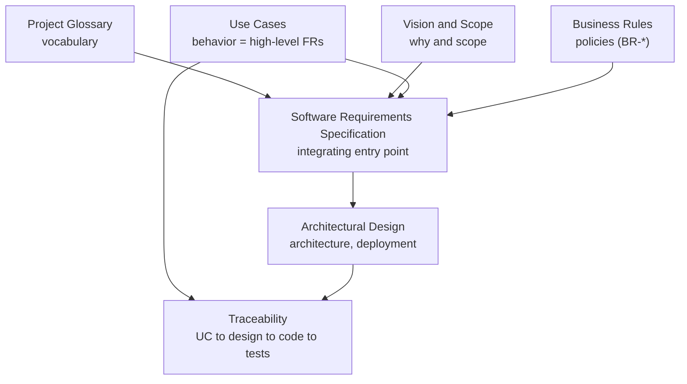
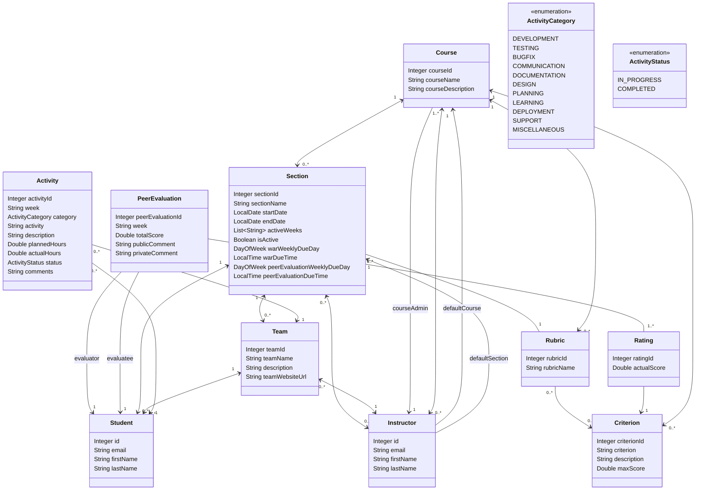
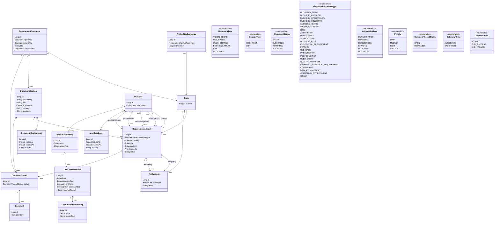

# **Project Pulse**

# **Software Requirements Specification**

# **Version 1.0**

# **Revision History**

| Date          | Version | Description | Author   |
| ------------- | ------- | ----------- | -------- |
| \<dd/mmm/yy\> | \<x.x\> | \<details\> | \<name\> |
|               |         |             |          |
|               |         |             |          |
|               |         |             |          |

# **Introduction**

## **The Purpose of the Project**

**Project Pulse** is the web application for the Department of Computer Science's senior design / capstone course at TCU. It manages course sections, teams, students, and instructors, and delivers two capability areas: the weekly activity report and peer evaluation workflows that track student performance, and **Requirements Authoring & Management (RAM)**, a graph-first, model-driven requirements IDE. The performance-tracking workflows replace a manual spreadsheet-and-LMS process with an integrated system that collects submissions and compiles scores and feedback automatically. RAM exists because students today author requirements in generic, document-centric tools (Microsoft Word, Google Docs) that cannot model the structure, relationships, or semantics of requirements engineering; it instead lets student teams author, link, validate, trace, and review requirements as a connected graph of typed artifacts, supported by Socratic AI assistants that coach rather than author and by instructors who configure the teaching context and review submissions. The system's users are students (authoring and submitting in teams), instructors, and course admins (configuring, reviewing, and grading). The full business motivation — the problem and opportunity, business objectives, stakeholders, and scope — lives in the Vision and Scope document and is referenced here rather than repeated (see the Vision and Scope section and [vision-and-scope.md](vision-and-scope.md)).

## **The Purpose of this Document**

This Software Requirements Specification describes the external behavior and quality attributes of Project Pulse for release 1.0, across both of its capability areas — the weekly activity report and peer evaluation workflows and the Requirements Authoring & Management (RAM) environment. The behavioral specification for both areas is carried by the use cases ([use-cases.md](use-cases.md)), each of which is itself a high-level functional requirement. The non-use-case functional requirements, data model, external interfaces, and quality attributes in this document specify the system-level behaviors that fall outside any single use case; these are concentrated in the cross-cutting subsystems — authentication and access control, notifications, and the RAM-specific autosave, validation, and AI orchestration — because the performance-tracking workflows are specified almost entirely as use cases. It is the reference against which Project Pulse is built, tested, and maintained, and it aligns students, instructors, and developers on what the system does.

**How the requirements are organized.** The requirements are not one document but a set of linked documents that describe a single shared model of the system from complementary angles, each the source of truth for its own topic. The SRS is the integrating entry point: it specifies the requirements it owns and links to the others rather than restating them, so each topic is defined once. The documents, in reading order:

- **Project Glossary** ([project-glossary.md](project-glossary.md)) — the domain vocabulary; the canonical definition of every term the other documents use.
- **Vision and Scope** ([vision-and-scope.md](vision-and-scope.md)) — the business motivation: problem and opportunity, business objectives, stakeholders and user classes, risks, assumptions, and the major features in and out of scope.
- **Use Cases** ([use-cases.md](use-cases.md)) — the behavioral specification: each user-initiated workflow as a use case, which is itself a high-level functional requirement.
- **Business Rules** ([business-rules.md](business-rules.md)) — the cross-cutting policies, constraints, and access rules (`BR-*`) that the use cases and this SRS enforce.
- **Software Requirements Specification** (this document) — the integrating specification: it orients the reader (the Overall Description section), then specifies the non-use-case functional requirements, the data model, external interfaces, and quality attributes, citing the documents above rather than repeating them.
- **Architectural Design** ([../design/architectural-design.md](../design/architectural-design.md)) — the single arc42/C4 architecture-of-record, sitting below this SRS: the shared software architecture, conventions, and deployment that the RAM module inherits, plus the component views for the foundation and performance-tracking features and for RAM, and cross-cutting subsystems.
- **Traceability** ([../traceability.md](../traceability.md)) — the spec→code map: one row per use case linking it to the requirements and design it realizes and the code and tests that implement it.

The arrows read "is referenced by": the Project Glossary, Vision and Scope, Use Cases, and Business Rules documents are integrated by this SRS; the Architectural Design document sits below the SRS; and Traceability maps each use case, through the design, to the code and tests that realize it.

## **Document Conventions**

- Identifier schemes are stable, append-only handles, independent of heading position. Business objectives use `BO-<AREA>-<slug>` ([vision-and-scope.md](vision-and-scope.md)); non-use-case functional requirements use `FR-<AREA>-<slug>` (e.g., `FR-SAVE-autosave-active`); use cases use `UC-<AREA>-<slug>` ([use-cases.md](use-cases.md)); business rules use `BR-<slug>` ([business-rules.md](business-rules.md)). Product-generated artifact keys (e.g., `BO-3`, `RI-1`, `AS-6`, `UC-5`) follow a per-type running sequence, unique within a team, as defined under artifact key in the Project Glossary. SRS-local identifiers label its interface, data, and quality items: the External Interface Requirements codes (`UI-*`, `SI-*`, `CI-*`), the Data Requirements codes (`DI-*`), and the Quality Attributes codes (`USE-*`, `PER-*`, `SEC-*`, `SAF-*`, `AVL-*`, `ROB-*`, `SCA-*`, `INT-*`, `MNT-*`). The operating environment (`OE-*`), design and implementation constraints (`CO-*`), and architecture-level assumptions and dependencies (`AS-*`, one team-wide set shared with Vision and Scope, and `DE-*`) are defined in the Overall Description section below.
- Non-use-case functional requirements are written as EARS-style "shall" statements. A use case is itself a high-level functional requirement, so its steps and Associated Information are its detailed specification and are not restated as separate functional requirements.
- Markdown is the canonical format and cross-references are live links. Square-bracketed italic passages are template author-guidance, not requirements.
- This document does not duplicate content owned by another document: each topic has a single source of truth and is referenced here (for example, the Project Glossary, Vision and Scope, Use Cases, and Business Rules documents are linked here rather than copied in).

## **References**

- Project Glossary: [project-glossary.md](project-glossary.md)
- Vision and Scope: [vision-and-scope.md](vision-and-scope.md)
- Use Cases: [use-cases.md](use-cases.md)
- Business Rules: [business-rules.md](business-rules.md)
- Architectural Design (architecture-of-record): [../design/architectural-design.md](../design/architectural-design.md)
- User Interface Wireframe/Prototypes: URL (N/A)
- API Document: [API Doc 1](https://app.swaggerhub.com/apis/Washingtonwei/project-pulse/1.0.0), [API Doc 2](https://app.swaggerhub.com/apis/Washingtonwei/RAM/1.0.0)

# **Overall Description**

This section orients the reader to Project Pulse's context, users, environment, and the constraints and assumptions under which it is built. Where another document is the source of truth — the product positioning and stakeholder profiles in Vision and Scope, the architecture views in the Architectural Design document — this section points to it rather than restating it. The operating environment, design and implementation constraints, and architecture-level assumptions and dependencies are specified here because requirements throughout this SRS — in Data Requirements, External Interface Requirements, and Quality Attributes — cite them by ID.

## **Product Perspective**

Project Pulse is a single web application that delivers two capability areas over one shared architecture — a Vue.js single-page application, a Java/Spring Boot REST API, and a relational database, with one authentication mechanism and one notification service. The first capability area is the weekly activity report and peer evaluation workflows that track student performance; the second is the Requirements Authoring & Management (RAM) environment, a module within the same application rather than a parallel system, reusing that shared architecture. The system context and container views are in the architecture-of-record ([Context and Scope](../design/architectural-design.md#context-and-scope), [Containers](../design/architectural-design.md#containers)); the product positioning and competitive alternatives are in Vision and Scope ([Product Perspective](vision-and-scope.md#product-perspective)).

## **User Classes and Characteristics**

Project Pulse has three user classes — student, instructor, and course admin — profiled in Vision and Scope ([Stakeholder Profiles and User Descriptions](vision-and-scope.md#stakeholder-profiles-and-user-descriptions)). Students are the favored user class: where their needs conflict with another class's, the student's learning outcome governs (consistent with the educational-value priority that drives the AI assistant design).

## **Operating Environment**

OE-supported-browsers: Project Pulse shall run in the current released versions of Google Chrome, Mozilla Firefox, Microsoft Edge, and Apple Safari.

OE-server-stack: The Project Pulse server shall run on a supported Java Virtual Machine and serve the single-page application to standard web browsers over the network; the technology stack it is built on — the Vue.js client, the Java/Spring Boot REST API, and the relational database — is mandated by CO-vue-spring-stack and CO-relational-persistence rather than restated here.

OE-https-access: Users shall access RAM over HTTPS from the public internet, requiring no client software beyond a web browser.

OE-external-services: Project Pulse operates alongside two external systems it must reach over the network — the external LLM service over HTTPS and the Gmail system over SMTP — for AI-assisted review and email notifications, respectively. How those calls are made (the server-side AI proxy, the Gmail SMTP integration) is mandated by CO-server-side-llm-proxy and CO-gmail-smtp.

## **Design and Implementation Constraints**

CO-single-application: Project Pulse shall be a single application sharing one Vue.js single-page application, one Java/Spring Boot REST API, and one relational database across both capability areas; the RAM environment shall be implemented as a module within that codebase rather than as a separate system.

CO-vue-spring-stack: The client shall be implemented in Vue.js and the backend in Java using the Spring Boot framework.

CO-relational-persistence: Requirement artifacts, links, documents, and document sections shall be persisted in the Project Pulse relational database.

CO-single-auth: Project Pulse shall provide a single JWT-based authentication mechanism for all users across both capability areas; the RAM environment shall reuse it rather than implementing a separate login.

CO-ferpa: Project Pulse shall comply with FERPA when storing and transmitting student educational records.

CO-server-side-llm-proxy: All calls to the external LLM service shall be routed through the REST API's AI proxy so that service credentials remain server-side and are never exposed to the browser.

CO-gmail-smtp: Email notifications shall be sent through the Gmail SMTP integration.

## **Assumptions and Dependencies**

Assumptions and dependencies form one team-wide set authored in two homes: the business-level assumptions in Vision and Scope ([Business Assumptions and Dependencies](vision-and-scope.md#business-assumptions-and-dependencies)) and the architecture-level assumptions below. Both share the single `AS-*` namespace and dependencies the `DE-*` namespace, each carrying a name-based key (e.g., `AS-supported-browser`, `DE-llm-service`), so an assumption or dependency can be added in either home without renumbering.

AS-supported-browser: Users have a supported web browser and a reliable internet connection.

AS-llm-api-stable: The external LLM service remains available and its API contract stays stable for the integration RAM relies on.

AS-shared-data-current: Project Pulse's course, course section, team, and user data is accurate and current; the RAM environment reads this shared data rather than maintaining its own copy.

DE-llm-service: AI-assisted requirement review depends on the external LLM service; if it is unavailable, the AI features are unavailable while the rest of Project Pulse continues to operate.

DE-gmail-smtp: Email notifications depend on the Gmail SMTP integration.

# **Project Glossary**

The Project Glossary is available here: [project-glossary.md](project-glossary.md).

# **Vision and Scope**

The Vision and Scope document is available here: [vision-and-scope.md](vision-and-scope.md).

# **Functional Requirements**

## **Use Cases**

The Use Cases document is available here: [use-cases.md](use-cases.md).

Each **use case is itself a functional requirement**, expressed at a high level: it states a user goal and the system's behavior in achieving it. Within a use case, the individual steps whose subject is "the system" — together with the use case's **Associated Information** (validation rules, duplication rules, search and display strategies, deletion strategies, notifications, and the like) — are the **finer-grained functional requirements** that detail that behavior. The use cases therefore carry the full functional specification for every user-initiated workflow, and those requirements are deliberately **not restated** here; doing so would duplicate the specification and create two copies to keep in sync. The Non-Use Case Functional Requirements section below complements the use cases by capturing the remaining functional behaviors that are _not_ user-initiated workflows (system-driven, event-driven, global, or background). Together, the use cases and the non-use-case functional requirements define the complete set of functional requirements for Project Pulse, including a small number of capabilities deferred to a future release, which are labeled as such.

## **Non-Use Case Functional Requirements**

Not all functional behaviors of Project Pulse are best expressed as use cases. This section captures system-driven, event-driven, global, or background behaviors using structured "shall" statements following principles inspired by the EARS (Easy Approach to Requirements Syntax) format.

These requirements describe system-level functions that support or enable the use cases but are not user-initiated workflows. They span both capability areas: security and authorization (`FR-SEC-*`) and notifications (`FR-NOT-*`) are system-wide, while autosave, validation, AI orchestration, templates, terminology invariants, and authorship metadata are the cross-cutting subsystems of the RAM environment. (Section locking is specified by BR-edit-lock-required / BR-lock-expiry and the editing use cases' own steps; real-time collaboration by UC-COL-collaborative-edit and the PER-collab-latency / ROB-no-overwrite targets; and document export and project-source import by their use cases and the External Interface Requirements — so none carries separate non-use-case FRs.)

### *Autosave and Persistence Requirements*

**FR-SAVE-autosave-active (State-Driven):** While a student is actively editing an authoring destination, the system shall automatically save the authoring destination's content at the autosave cadence specified in PER-autosave-cadence. (Immediate persistence when the student navigates away is part of the editing use cases — UC-DOC-edit-document, UC-DOC-edit-use-case; the edit-loss and autosave-retry robustness bounds are ROB-edit-loss-bound and ROB-autosave-retry.)

### *Real-Time Collaboration Requirements*

*Post-MVP, and specified by its use case rather than by separate FRs.* Real-time collaboration — live collaborator presence, join/disconnect notification, and live broadcast of saved changes and lock state — is deferred beyond the initial release. Its behavior is the flow of UC-COL-collaborative-edit: presence and lock-state display, join and disconnect notification, and live broadcast are its system steps, and its POST-2 is the no-overwrite guarantee — so it carries no separate non-use-case FRs (the same complement-don't-duplicate rule applied to section locking, export, and import). The timing and robustness targets are PER-collab-latency and ROB-no-overwrite, and the no-overwrite invariant is BR-collab-no-overwrite. The MVP collaboration model is comment threads (UC-COL-add-comment, UC-COL-resolve-comment) over pessimistic section-level locking (BR-edit-lock-required, BR-lock-expiry; UC-DOC-edit-document, UC-DOC-edit-use-case); concurrent authoring is serialized by locks rather than merged live.

### *Validation and Consistency Requirements (ReqLint)*

The on-demand ReqLint behavior — the engine that evaluates a requirement document against the applicable deterministic validation rules and returns a structured list of issues, each classified by severity (ERROR, WARNING, INFO) and tied to the document section or item it concerns, including the specific checks it applies (required document sections present, ambiguous/unverifiable/subjective wording flagged, naming and "shall"-structure rules) — is specified by UC-VAL-run-validation, which is itself a high-level functional requirement, and is not restated here. Unique identifiers for requirements, document sections, glossary terms, and use cases are assigned and kept unique by the create use cases (UC-ART-create-artifact, UC-DOC-create-use-case) under BR-artifact-key-unique and DI-artifact-key-assignment, not by a separate validation requirement. This section therefore holds only the one validation behavior that is **not** a user-initiated workflow: the background re-evaluation that runs automatically while a student edits.

**FR-VAL-background-recheck (State-Driven, Optional):** While a student edits a document section, the system shall periodically re-evaluate that document section using the same ReqLint checks that UC-VAL-run-validation runs on demand — flagging missing required fields, ambiguous wording, and stylistic violations — so that issues surface during authoring rather than only on an explicit validation run. _(Supports BO-RAM-requirement-quality, BO-RAM-instructor-workload, BO-RAM-consistency.)_

### *AI/LLM Integration Requirements*

RAM's AI assistance is delivered through Socratic assistants whose primary purpose is educational: to train students to author high-quality requirements rather than to hand them finished text. Where a design choice trades productivity against educational value, educational value governs.

Each assistant's per-request behavior is specified by its own use case (the `UC-AI-*` family — elicitation, client role-play, structuring, critique, tutor, drafting, project assistant, whole-project review) and is not restated here; this section holds only the cross-cutting invariants that span the assistants — the Socratic guardrails (no auto-edit, distinguish suggestions, instructive rationale; explicit per-item acceptance, the "no accept all" rule, is governed by BR-explicit-acceptance and specified by UC-AI-review-proposal), enablement, graceful degradation, and the per-request context the proxy assembles (teaching context, assistant instructions, project source material; see SI-llm-context).

**FR-AI-no-auto-edit (Ubiquitous):** The system shall not modify student-authored content with assistant-generated text without an explicit confirmation action by the student. _(Supports BO-RAM-learning-outcomes.)_

**FR-AI-distinguish-suggestions (Ubiquitous):** The system shall visually distinguish assistant-generated suggestions from student-authored content until the student accepts them.

**FR-AI-teaching-context (Ubiquitous):** The system shall include the course section's teaching context in the context provided to every assistant so that assistant feedback reflects the standards, common mistakes, and thinking order it defines.

**FR-AI-enablement (State-Driven):** While an instructor has disabled a given assistant for a course section, the system shall make that assistant's corresponding feature unavailable to that course section's students; the drafting assistant shall be disabled by default.

**FR-AI-rationale (Ubiquitous):** The system shall accompany every assistant finding or proposal with an instructive rationale phrased for student learning. _(Supports BO-RAM-requirement-quality.)_

**FR-AI-degradation (State-Driven):** While the external LLM service is unavailable, the system shall make AI features unavailable and shall keep the rest of Project Pulse operational.

**FR-AI-source-material-context (Ubiquitous):** Where a team has imported project source material, the system shall make it available to the AI assistants as context for elicitation, critique, and drafting.

**FR-AI-assistant-instructions (Ubiquitous):** The system shall include each assistant's instructor-authored assistant instructions in the context provided to that assistant so that the assistant's role, persona, and boundaries reflect the instructor's per-assistant configuration.

### *Template and Standards Enforcement Requirements*

The initial release ships fixed, built-in templates, and the enforcement requirements (FR-TPL-enforce-structure, FR-TPL-section-keys) apply to them. Template customization — letting a course admin or instructor author or edit templates (FR-TPL-customize) — is **deferred to a future release and is not part of the MVP scope** (see Vision and Scope, [Template Management](vision-and-scope.md#template-management)). FR-TPL-customize is retained here, with its ID, so the intent is not lost.

**FR-TPL-enforce-structure (Ubiquitous):** The system shall enforce the structure, required document sections, and metadata defined by the active template. _(Supports BO-RAM-requirement-quality.)_

**FR-TPL-customize (Deferred — future release):** When an authorized user (a course admin or instructor) updates a template, the system shall apply the updated structure to new documents but shall not retroactively modify existing documents without that user's approval.

**FR-TPL-section-keys (Ubiquitous):** The system shall apply the numbering and section-key scheme defined by the active template to all document sections within a document. _(Supports BO-RAM-requirement-quality.)_

### *Terminology and Glossary Requirements*

**FR-GLO-reference-linking (Event-Driven):** When a glossary term is created or updated, the system shall ensure that references in documents link to the term. _(Supports BO-RAM-consistency.)_

**FR-GLO-term-suggestion (State-Driven):** While a student is writing or editing text, the system shall suggest existing glossary terms when there is a match. _(Supports BO-RAM-consistency.)_

### *Authorship Metadata and Document Versioning Requirements*

Authorship metadata (FR-HIS-authorship-metadata) is in scope for the initial release and is relied on by the authoring use cases. Document versioning — checkpointing, restoring, and retaining prior versions (FR-HIS-checkpoint, FR-HIS-restore, FR-HIS-retention) — is **deferred to a future release and is not part of the MVP scope** (see Vision and Scope, [Major Features / Scope](vision-and-scope.md#major-features--scope); tracked as OI-4). The three deferred requirements are retained here, with their IDs, so the intent is not lost.

**FR-HIS-checkpoint (Deferred — future release):** When a document section is saved, the system shall create a version checkpoint containing the user, timestamp, and diff.

**FR-HIS-restore (Deferred — future release):** The system shall allow authorized users to restore a previous version of a document section.

**FR-HIS-retention (Deferred — future release):** The system shall preserve historical versions for at least one academic term.

**FR-HIS-authorship-metadata (Ubiquitous):** The system shall record, for every authored item (glossary term, requirement artifact, use case, document section, artifact link, and comment), the identity of its creator and creation timestamp and the identity of its last editor and last-modified timestamp. For a use case, this authorship metadata is carried by the use case's paired requirement artifact audit record; the use case's constituent main steps and extensions do not carry separate authorship metadata. _(Cross-cutting; relied on by the authoring use cases — the create, edit, rename, and resolve flows across the glossary, documents, artifacts, links, and comments.)_

### *Security and Authorization Requirements*

**FR-SEC-authentication (Ubiquitous):** The system shall authenticate users via its JWT-based authentication mechanism before granting access to protected resources.

**FR-SEC-authorization (Ubiquitous):** The system shall enforce role-based access control (student, instructor, course admin).

**FR-SEC-deny-unauthorized (Event-Driven):** When an unauthorized user attempts to access a protected resource, the system shall deny access and provide an appropriate error message.

### *Notification Requirements*

**FR-NOT-review-workflow (Event-Driven):** When a requirement document is submitted for review, returned for revision, or accepted, the system shall raise a review-workflow notification to the designated recipients, delivered as specified by CI-review-emails. _(Supports UC-REV-submit-for-review, UC-REV-review-documents.)_

**FR-NOT-suppress-routine (Ubiquitous):** The system shall not raise persistent (in-app) notifications for routine authoring changes (creating, editing, or deleting glossary terms, requirement artifacts, artifact links, document sections, use cases, and comments), and shall suppress their email per CI-no-routine-email; such changes are propagated to connected collaborators in real time per the real-time collaboration model (UC-COL-collaborative-edit) instead.

**FR-NOT-weekly-reminder (Event-Driven):** On a course section's configured weekly due day for weekly activity reports or peer evaluations, the system shall email each student in that course section a submission reminder listing the item(s) due that day and their due times, delivered through the Gmail SMTP integration. The reminder job runs only for course sections eligible for reminders in the current week and may be disabled by configuration. _(Supports BO-PERF-submission-rate, BO-PERF-faster-completion.)_

# **Business Rules**

The Business Rules document is available here: [business-rules.md](business-rules.md). That catalog defines the `BR-*` identifiers cited by the Business Rules fields in the Use Cases document.

# **Data Requirements**

## **Business Domain Model**

Project Pulse's domain spans both capability areas, modeled below as two diagrams: the performance-tracking domain and the requirements graph that the RAM environment adds. The two share the course / course section / team / user backbone — RAM scopes its requirements content to those same teams (BR-team-scoped-access) — but are otherwise independent.

### *Performance-tracking domain*

This diagram covers the shared foundation — course sections and their teams, students, and instructors — together with the performance-tracking entities: the rubrics and criteria used for assessment, each student's weekly activity report, and the peer evaluations students submit about one another. It predates this specification; field-level detail lives with the schema in the design docs ([../design/](../design/)).

Here `Section` is the course section entity — the enrollment unit students join and that groups them into teams — not a document section. There is no standalone weekly-activity-report entity: a student's weekly activity report is her `Activity` rows for a given `week`. A course section's `warWeeklyDueDay` / `peerEvaluationWeeklyDueDay` and the paired due times drive the weekly submission reminders (FR-NOT-weekly-reminder). `ActivityCategory` and `ActivityStatus` are enumerations (shown above); `DayOfWeek`, `LocalDate`, and `LocalTime` are `java.time` types. `Student` and `Instructor` share the platform's user identity fields (id, email, name).

### *RAM requirements graph*

The RAM environment persists requirements as a team-scoped graph of typed requirement artifacts connected by typed artifact links, surfaced through requirement documents and their document sections — directly realizing the graph-first model described in the Project Glossary and Vision and Scope. The entities fall into four groups: ownership and documents, the requirements graph, use-case structure, and collaboration.

**Ownership and documents**

- **Team** — the ownership boundary for all requirements content (per BR-team-scoped-access); a team owns its documents, artifacts, and links.
- **RequirementDocument** — a document of a given `DocumentType`, with a `documentKey`, `title`, and a `status` (`DRAFT` → `SUBMITTED` → `RETURNED` or `ACCEPTED`) that drives the review-and-submission workflow (BR-review-lock, BR-review-authority, UC-REV-\*): a submitted document is either returned for revision (`RETURNED`, editable again) or accepted (`ACCEPTED`, final and read-only).
- **DocumentSection** — a section of a document, identified by its `sectionKey` (the section key), with a `title`, a `type` (`RICH_TEXT` narrative or a `LIST` of artifacts), authored `content`, and template `guidance`.
- **DocumentSectionLock** — the exclusive edit lock held on a document section while a student edits it (`lockedAt`, `expiresAt` for the lock-expiry timeout, `reason`), realizing BR-edit-lock-required / BR-lock-expiry for document-section authoring destinations (the lock lifecycle is specified by the steps of UC-DOC-edit-document).

**The requirements graph**

- **RequirementArtifact** — the atomic graph node: its `type` (`RequirementArtifactType`), `artifactKey` (the artifact key, e.g., `FR-1`, `UC-5`), `title`, `content`, `priority`, and `notes`. An artifact is grouped under a source `DocumentSection`; the section determines where the artifact appears in a requirement document.
- **ArtifactLink** — a typed, directed edge between two artifacts (the artifact's `outgoing` and `incoming` links): its `type` (`ArtifactLinkType`) and optional `notes`. This is the requirement link of the glossary.
- **ArtifactKeySequence** — a per-team, per-artifact-type sequence counter that assigns the next product-generated `artifactKey` while preserving the artifact-key uniqueness and stability rules (BR-artifact-key-unique).
- Enumerations: `RequirementArtifactType` (the authoritative artifact taxonomy), `ArtifactLinkType` (`DERIVES_FROM`, `REALIZES`, `REFERENCES`, `IMPACTS`, `MITIGATES`, `MOTIVATES` — matching the glossary's artifact link type), and `Priority` (`LOW`, `MEDIUM`, `HIGH`, `CRITICAL`).

**Use-case structure**

- **UseCase** — the structured behavioral spec (`trigger`, plus its flows below), paired **1:1 with a RequirementArtifact** of type `USE_CASE` so a use case participates in the graph (links, traceability) like any other artifact while keeping its detailed behavioral fields.
- **UseCaseLock** — the exclusive edit lock held on a use case while a student edits it (`lockedAt`, `expiresAt` for the lock-expiry timeout, `reason`), realizing BR-edit-lock-required / BR-lock-expiry for use-case authoring destinations (the lock lifecycle is specified by the steps of UC-DOC-edit-use-case).
- **UseCaseMainStep**, **UseCaseExtension**, **UseCaseExtensionStep** — the ordered decomposition of a use case's normal flow and its alternative/exception extensions and their steps. Preconditions and postconditions are represented as associated `RequirementArtifact` nodes of type `PRECONDITION` and `POSTCONDITION`, so they remain part of the requirements graph.

**Collaboration**

- **CommentThread** — a discussion (`status` `OPEN` / `RESOLVED`) attachable to a `RequirementDocument`, a `DocumentSection`, or a `RequirementArtifact`; realizes UC-COL-add-comment / UC-COL-resolve-comment.
- **Comment** — one message within a thread (`content`).

**Mapping to the conceptual model.** `RequirementArtifact` is the glossary's requirement artifact and `artifactKey` its artifact key (the per-type running sequence `FR-1`, `UC-5`); `ArtifactKeySequence` implements the team-scoped running sequence for each artifact type; `ArtifactLink` / `ArtifactLinkType` are the requirement link / artifact link type; `DocumentSection.sectionKey` is the section key; `DocumentSectionLock` and `UseCaseLock` realize the locking rules (BR-edit-lock-required / BR-lock-expiry) for the two authoring destination types; `DocumentStatus` drives the review lock (BR-review-lock); `RequirementArtifact` associations on `UseCase` represent the primary actor, secondary actors, preconditions, and postconditions; and `CommentThread` / `Comment` back the commenting use cases (UC-COL-add-comment / UC-COL-resolve-comment).

**Notes.**

- The built-in templates that provision a team's documents and sections (UC-TPL-provision-documents) are the _provisioning_ layer and are not shown in this domain diagram; the MVP ships fixed, built-in templates.
- `RequirementArtifactType` is the authoritative artifact taxonomy and is reconciled one-to-one with the glossary's requirement artifact list. `OTHER` is an implementation fallback, not a domain concept. A single `RISK` type is the umbrella over business/adoption, technical/feasibility, and security/safety risks (the earlier `BUSINESS_RISK`/`RISK` pair was collapsed into `RISK`); `DEPENDENCY` is a tracked artifact.
- User stories are a **deferred** concept: the `USER_STORY` artifact type and the `USER_STORIES` `DocumentType` are retained so a future, optional User Stories document can be enabled without a schema change, but no User Stories document, template, or use case ships in the MVP.

**Artifact type → authoring home.** Each artifact type is authored in a specific document section, which determines where it appears in a document. In the MVP the student authors an artifact in the document section she is in, which fixes its type (UC-ART-create-artifact); the map below is the canonical placement (and the basis for the future requirements-graph "add by type" path):

| Artifact type                               | Document → Section                                                                                                                                                                             |
| ------------------------------------------- | ---------------------------------------------------------------------------------------------------------------------------------------------------------------------------------------------- |
| `GLOSSARY_TERM`                             | Glossary → term list                                                                                                                                                                           |
| `BUSINESS_PROBLEM`, `BUSINESS_OPPORTUNITY`  | Vision and Scope → Business Opportunity/Problem Statement                                                                                                                                 |
| `BUSINESS_OBJECTIVE`, `SUCCESS_METRIC`      | Vision and Scope → Business Objectives                                                                                                                                                    |
| `VISION_STATEMENT`                          | Vision and Scope → Vision Statement                                                                                                                                                       |
| `RISK`                                      | Vision and Scope → Risks                                                                                                                                                                  |
| `ASSUMPTION`, `DEPENDENCY`                  | Vision and Scope → Business Assumptions and Dependencies (business-level) **and** SRS → Assumptions and Dependencies (architecture-level, e.g., `DE-shared-foundation`/`DE-llm-service`) — these two types are authored in either document's Assumptions-and-Dependencies section |
| `STAKEHOLDER`                               | Vision and Scope → Stakeholder Profiles                                                                                                                                                   |
| `FEATURE`                                   | Vision and Scope → Major Features / Scope                                                                                                                                                 |
| `USE_CASE`, `PRECONDITION`, `POSTCONDITION` | Use Cases → the use case (preconditions/postconditions are its constituents)                                                                                                                   |
| `BUSINESS_RULE`                             | Business Rules → the rule list                                                                                                                                                                 |
| `FUNCTIONAL_REQUIREMENT`                    | SRS → Functional Requirements                                                                                                                                                             |
| `EXTERNAL_INTERFACE_REQUIREMENT`            | SRS → External Interface Requirements                                                                                                                                                       |
| `DATA_REQUIREMENT`                          | SRS → Data Requirements                                                                                                                                                                     |
| `QUALITY_ATTRIBUTE`                         | SRS → Quality Attributes                                                                                                                                                                    |
| `CONSTRAINT`                                | SRS → Design and Implementation Constraints (CO-\*)                                                                                                                                            |
| `OPERATING_ENVIRONMENT`                     | SRS → Operating Environment (OE-\*)                                                                                                                                                            |
| `USER_STORY`                                | _(deferred — a future, optional User Stories document)_                                                                                                                                        |
| `OTHER`                                     | _(fallback — no fixed home)_                                                                                                                                                                   |

## **Data Dictionary**

The Business Domain Model above names the system's entities, their fields, and their enumerations. Field-level definitions — data type, length, format, required/optional, and allowed values — are maintained with the database schema in the design docs ([../design/](../design/)), not restated here, so that a single source defines each field and the SRS does not drift from the implementation. Format-bearing fields that are themselves requirements (the `artifactKey`, `sectionKey`, and `documentKey` schemes and the document/comment status values) are specified where they are introduced: artifact key, section key, and the artifact-key uniqueness and stability rules in the Project Glossary and Business Rules (BR-artifact-key-unique, BR-deletion-integrity), and the `DRAFT` → `SUBMITTED` → `RETURNED` status values in the Business Domain Model above.

## **Reports**

The performance-tracking capability generates reports: peer evaluation reports for students and instructors (UC-EVA-view-own-evaluation, UC-EVA-section-evaluation-report, UC-EVA-student-evaluation-report) and weekly activity report summaries for teams and individual students (UC-WAR-team-war-report, UC-WAR-student-war-report); each is specified by its use case, including its report parameters and generating algorithm. The RAM environment generates no reports in release 1.0 — completeness-metric, progress, and requirement-quality dashboards over a team's requirements graph are a deferred RAM capability (future release). Document export — PDF, DOCX, or Markdown rendered to the template structure — is a formatted document, not a report, and is specified by UC-EXP-export-document and under External Interface Requirements (SI-export-formats, SI-export-fidelity).

## **Data Acquisition, Integrity, Retention, and Disposal**

DI-acquire-shared-data: RAM shall acquire user identity, role, course section, team membership, and team ownership data from the rest of Project Pulse rather than maintaining a separate copy (DE-shared-foundation, SI-foundation-auth, SI-foundation-data).

DI-persist-graph: RAM shall persist requirement documents, document sections, requirement artifacts, artifact links, use cases, locks, comment threads, comments, and artifact-key sequences in the Project Pulse relational database (CO-relational-persistence, SI-foundation-persist).

DI-team-scoping: RAM shall scope persisted RAM content by team wherever the entity represents team-owned requirements content, and shall enforce that students can access only their own team's requirements graph, documents, project source material, comments, and locks (BR-team-scoped-access, FR-SEC-authorization).

DI-artifact-key-assignment: RAM shall assign product-generated artifact keys from the team's `ArtifactKeySequence` for the artifact type, shall keep assigned artifact keys stable across edits, and shall not reuse keys after deletion (BR-artifact-key-unique, BR-deletion-integrity).

DI-referential-integrity: RAM shall preserve graph integrity by preventing deletion of glossary terms or requirement artifacts while active artifact links or references still depend on them, unless those references are removed or repointed first (BR-deletion-integrity).

DI-soft-delete-retention: RAM shall retain logically deleted glossary terms and requirement artifacts for audit, excluding them from normal active authoring and search results while preserving their identifiers and audit metadata (BR-deletion-integrity).

DI-authorship-metadata: RAM shall record authorship metadata for authored RAM items as specified by FR-HIS-authorship-metadata; known implementation gaps are tracked in OI-19.

DI-concurrency-control: RAM shall use optimistic version fields and exclusive edit locks for document sections and use cases to protect concurrent edits, and shall treat expired locks as releasable according to the locking rules (BR-edit-lock-required, BR-lock-expiry).

DI-no-version-history: RAM shall not retain document-section version checkpoints for release 1.0; document version history is deferred to a future release (FR-HIS-checkpoint, FR-HIS-restore, FR-HIS-retention).

DI-backup-disposal: RAM shall rely on the Project Pulse database backup, recovery, and disposal policies for physical retention and disposal of persisted RAM data, except where RAM-specific business rules require stronger logical retention for audit.

# **External Interface Requirements**

## **User Interfaces**

UI-spa-views: Project Pulse is delivered as a single Vue.js single-page application; the RAM environment's user interface shall be a set of views within it, conforming to the application's shared layout, navigation, and styling conventions (per CO-single-application, CO-vue-spring-stack, INT-single-application). Detailed UI design is maintained with the SPA, not in this document.

UI-wcag-aa: Project Pulse shall conform to WCAG 2.1 Level AA for color contrast, keyboard navigation, and screen-reader support (per USE-wcag-aa; addresses risk RI-accessibility).

UI-section-editor-layout: The requirement-document editor shall present a two-column layout — a document-and-section outline alongside the selected section's editor — with per-section locking; a list section shall provide an "Add Requirement" action for authoring artifacts within it. The Use Cases document editor shall expose equivalent per-use-case locking when a student edits a use case.

## **Software Interfaces**

**External LLM Service (via the AI proxy)**

SI-llm-proxy-only: RAM shall call the external LLM service only through the REST API's server-side AI proxy; the Vue single-page application shall never call the LLM service directly (per CO-server-side-llm-proxy, SEC-llm-proxy).

SI-llm-context: For each assistant request, the AI proxy shall send the assembled assistant context — the assistant's system prompt, the course section's teaching context and per-assistant assistant instructions, the document and requirements-graph content relevant to the session's scope (for a session targeting a document section or use case, that target and the applicable template context; for a project-wide session, the project's current requirements coverage across its documents), and, where enabled, the team's project source material — and shall return the assistant's response to the requesting feature (per FR-AI-teaching-context, FR-AI-source-material-context, FR-AI-assistant-instructions).

SI-llm-json: Requests to and responses from the LLM service shall use JSON; an assistant that returns candidate artifacts shall use a structured (tool/JSON) schema so the response is machine-parseable.

SI-llm-credentials: LLM service credentials shall be held server-side and shall never be exposed to the browser (per CO-server-side-llm-proxy, SEC-llm-proxy).

SI-llm-degradation: While the LLM service is unavailable or a request times out, the AI proxy shall report the condition to the requesting feature so that AI features become unavailable while the rest of Project Pulse continues to operate (per FR-AI-degradation, AVL-llm-degradation, PER-ai-response-time).

**Project Pulse shared foundation**

SI-foundation-auth: The RAM environment shall obtain the authenticated user's identity and role (course admin, instructor, student) from Project Pulse's authenticated session and shall not implement its own login (per CO-single-auth, SEC-authentication).

SI-foundation-data: The RAM environment shall read course, course section, team, and membership data from Project Pulse's shared data model rather than maintaining its own copy (per DE-shared-foundation; AS-shared-data-current).

SI-foundation-persist: The RAM environment shall persist its requirements graph — artifacts, links, documents, document sections, locks, comment threads, and comments — in the Project Pulse relational database (per CO-relational-persistence).

SI-foundation-email: The RAM environment shall send email notifications through Project Pulse's Gmail SMTP integration (per CO-gmail-smtp, DE-gmail-smtp); the triggering conditions and message content are specified in the Communications Interfaces section.

**Document export**

SI-export-formats: RAM shall generate an exported document as a PDF, DOCX, or Markdown file consistent with the template-defined structure (realizes UC-EXP-export-document; honors BR-team-scoped-access), and shall package all of a team's documents as a single bundle on request (UC-EXP-export-bundle).

SI-export-fidelity: Exported documents shall preserve table of contents, heading hierarchy, numbering, and formatting consistency (realizes UC-EXP-export-document).

**Project source material import**

SI-import-allowlist: RAM shall accept PDF (`.pdf`) and PowerPoint (`.pptx`, `.ppt`) uploads as project source material and shall reject any file whose type is not on this allowlist or whose size exceeds a configurable per-file limit (default 25 MB) (realizes UC-AI-import-source-material).

SI-import-extraction: RAM shall extract the text content of an imported file for use as assistant context and shall report when extraction is incomplete, for example for image-only or scanned files (realizes UC-AI-import-source-material).

## **API Document**

The API document is available on SwaggerHub: [RAM API](https://app.swaggerhub.com/apis/Washingtonwei/RAM/1.0.0).

## **Hardware Interfaces**

No hardware interfaces have been identified.

## **Communications Interfaces**

CI-review-emails: RAM shall deliver each review-workflow notification raised by FR-NOT-review-workflow as email through Project Pulse's Gmail SMTP integration (per CO-gmail-smtp, DE-gmail-smtp; supports UC-REV-submit-for-review, UC-REV-review-documents).

CI-no-routine-email: RAM shall send no email for the routine authoring changes suppressed by FR-NOT-suppress-routine.

CI-llm-https: RAM shall communicate with the external LLM service over HTTPS (per OE-external-services, SEC-llm-proxy).

CI-browser-https: Project Pulse shall conduct all browser-to-server communication over HTTPS.

# **Quality Attributes**

These quality attributes apply to Project Pulse as a whole. Some — accessibility, security, availability, and transport security — are system-wide; others name behaviors specific to the RAM environment's features (autosave and edit-loss bounds, ReqLint and AI response times, real-time collaboration) and are scoped to RAM accordingly.

## **Usability**

USE-wcag-aa: Project Pulse shall follow WCAG 2.1 Level AA guidelines for color contrast, keyboard navigation, and screen-reader support. (Addresses risk RI-accessibility.)

USE-keyboard-operable: Project Pulse shall be fully operable using the keyboard alone, including all RAM authoring, navigation, validation, and review actions.

USE-actionable-findings: RAM shall present every ReqLint validation finding and AI critique finding with the specific document location it refers to and an instructive rationale, so that a student can act on it without external help.

USE-first-session-success: A new student shall be able to open a document section, edit and save content, run validation, and submit for review during her first session without prior training. _(Target: 95% of new students succeed without assistance in usability testing.)_

## **Performance**

PER-collab-latency: While up to 100 users are editing concurrently, RAM shall propagate collaborator presence and lock-state events (join, disconnect, lock acquire/release) within 1 second for 95% of events. _(Post-MVP — depends on the deferred real-time collaboration; see the Real-Time Collaboration Requirements section.)_

PER-autosave-cadence: RAM shall autosave an actively edited authoring destination at least every 10 seconds and persist its latest content immediately when the student navigates away. (Realized by FR-SAVE-autosave-active and the navigate-away extension of UC-DOC-edit-document / UC-DOC-edit-use-case.)

PER-validation-speed: RAM shall return ReqLint validation results for a single requirement document within 3 seconds for 95% of runs.

PER-ai-response-time: RAM shall present an AI assistant response, or a clear "working" / timeout indication, within 15 seconds of a student's request.

## **Security**

SEC-authentication: Project Pulse shall authenticate every user through its JWT-based authentication mechanism before granting access to any protected resource, per CO-single-auth and FR-SEC-authentication.

SEC-authorization: Project Pulse shall enforce role-based access control across the course admin, instructor, and student roles, and the RAM environment shall restrict each student to her own team's requirements graph, documents, and project source material, per BR-team-scoped-access, BR-role-based-access, and FR-SEC-authorization.

SEC-ferpa: Project Pulse shall store and transmit student educational records in compliance with FERPA, per CO-ferpa.

SEC-llm-proxy: RAM shall route all calls to the external LLM service through the server-side AI proxy and shall never expose LLM service credentials to the browser, per CO-server-side-llm-proxy.

SEC-https: Project Pulse shall encrypt all traffic between the browser and the server over HTTPS, per OE-https-access.

## **Safety**

SAF-not-applicable: RAM is a web-based requirements-authoring tool with no physical actuation or safety-critical functions; no safety hazards have been identified, and no safety requirements apply.

## **Availability**

AVL-uptime: Project Pulse shall be available at least 99% of each academic term, excluding scheduled maintenance windows, with availability prioritized near assignment deadlines.

AVL-llm-degradation: While the external LLM service is unavailable, Project Pulse shall keep all non-AI functionality operational and clearly indicate that AI assistance is temporarily unavailable, per FR-AI-degradation and DE-llm-service.

## **Robustness**

ROB-edit-loss-bound: In the event of a browser crash, disconnection, or power failure, RAM shall lose no more than 10 seconds of a student's edits. (Bounds the autosave behavior of FR-SAVE-autosave-active.)

ROB-autosave-retry: When an autosave fails, RAM shall notify the student and retry in the background without interrupting editing. (The failure-handling behavior of the autosave in FR-SAVE-autosave-active.)

ROB-no-overwrite: RAM shall ensure that real-time collaborative updates never overwrite or corrupt content already saved by another collaborator, per BR-collab-no-overwrite and UC-COL-collaborative-edit (POST-2). _(Post-MVP — applies to the deferred real-time collaboration; in the MVP, section-level locking prevents concurrent overwrites.)_

## **Scalability and Interoperability**

SCA-cohort-load: Project Pulse shall sustain its performance and availability targets under peak concurrent load near assignment deadlines for a Senior Design cohort of approximately 70 students (about 75 total users including instructors and course admins), whose peak concurrent editing stays within the 100-concurrent performance envelope specified in PER-collab-latency (cf. risk RI-scalability).

INT-single-application: Project Pulse shall operate as a single application across both capability areas; the RAM environment shall reuse its single-page application, REST API, relational database, authentication, and notification services rather than introducing a parallel system, per CO-single-application.

## **Maintainability**

MNT-service-layer: RAM shall access its requirements graph behind a service layer so that new artifact types and artifact link types can be added without reworking unrelated features, consistent with its module structure within Project Pulse (per CO-single-application, INT-single-application).

**Priority of attributes:** where quality attributes conflict, the intended priority order is **security and data integrity → availability → usability → performance**. Educational value governs trade-offs in the AI assistant features specifically (see [AI/LLM Integration Requirements](#aillm-integration-requirements)).

# **Internationalization and Localization Requirements**

N/A for release 1.0. Project Pulse targets TCU software-engineering courses and ships in U.S. English only; no multi-language, multi-currency, or locale-specific formatting requirements apply. (Accessibility is in scope but is a usability requirement — see USE-wcag-aa / WCAG 2.1 AA in the Usability section — not an internationalization one.)

# **Other Requirements**

Project Pulse introduces no additional requirements beyond those specified elsewhere; the cross-cutting concerns that would otherwise appear here are referenced rather than restated, and the content areas that do not apply are marked so explicitly:

- Regulatory and compliance: FERPA handling of student educational records — CO-ferpa and SEC-ferpa (Security).
- Security and access control: platform authentication and role-based access — FR-SEC-* (Security and Authorization Requirements) and the Security quality attributes.
- Authorship and audit trail: creator/editor identity and timestamps on every authored item — FR-HIS-authorship-metadata (Authorship Metadata and Document Versioning Requirements); logical (soft) deletion that retains items for audit — BR-deletion-integrity.
- Installation, configuration, and startup/shutdown: Project Pulse is deployed as a single application (see the [Deployment View](../design/architectural-design.md#deployment-view)).
- Memory and capacity: Project Pulse sets no RAM-specific storage or capacity limit for release 1.0; RAM content persists in the shared Project Pulse relational database and is sized for the cohort in SCA-cohort-load (the per-team artifact-count design target is ~1,000 artifacts — quality scenario QS-7 in the architecture-of-record).
- Portability: N/A for release 1.0. Project Pulse is a single hosted web application on a fixed server stack (OE-server-stack, CO-vue-spring-stack), reached through a standard web browser (OE-supported-browsers, OE-https-access); no requirement to run on multiple operating systems or to be ported to another platform applies.
- Site adaptation: Project Pulse ships a single application configuration with no per-installation site-adaptation files; per-deployment adaptation is instead realized as per-course-section configuration — a course section's teaching context, per-assistant enablement and assistant instructions, cross-document review criteria, and weekly due days (UC-CFG-\*, FR-AI-enablement, FR-AI-assistant-instructions, FR-NOT-weekly-reminder).
